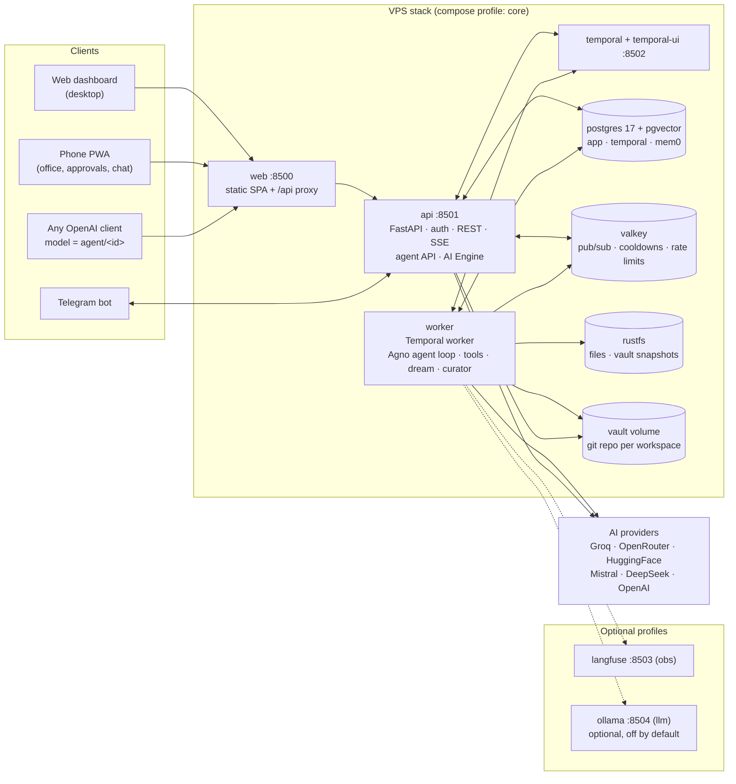
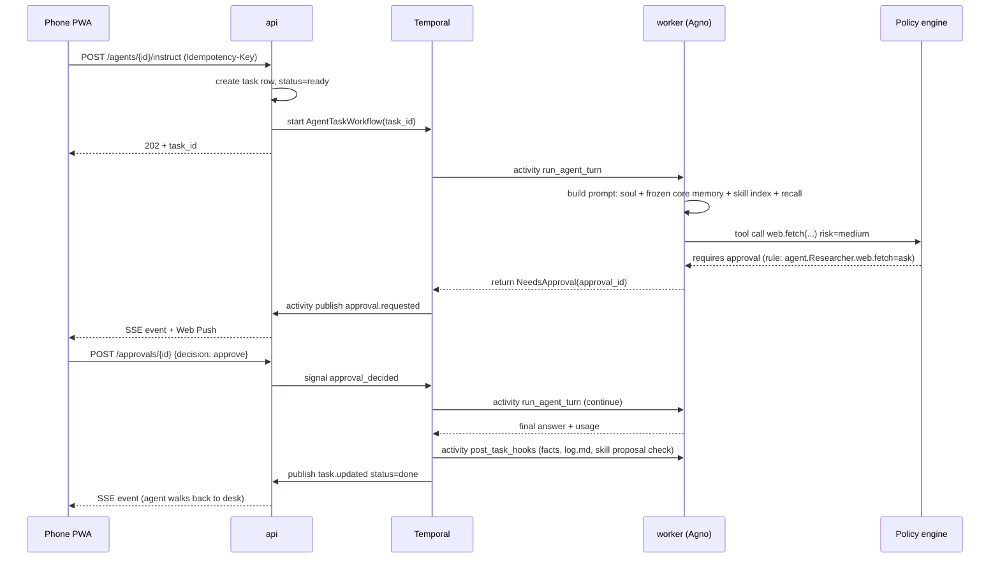

# Architecture

## 1. Services



| Service | Image | Role |
|---|---|---|
| `web` | `nginxinc/nginx-unprivileged:alpine` + built SPA | Serves the PWA, proxies `/api` and `/api/events` (SSE, buffering off). The only port the shared Caddy needs. |
| `api` | `agentic-py` (shared image) | FastAPI. Auth, REST commands, SSE fan-out, AI Engine admin, OpenAI-compatible agent endpoint, webhook + Telegram ingress. Starts Temporal workflows, never runs long agent loops itself. |
| `worker` | `agentic-py` (same image, different command) | Temporal worker. Runs every agent step as an activity, plus the dream, curator, optimizer and provider-health workflows. Scale with `--scale worker=N`. |
| `temporal` | `temporalio/server` (pinned) | Durable workflows, signals, schedules. Persistence on the shared Postgres. |
| `temporal-ui` | `temporalio/ui` (pinned) | Admin-only, bound to 127.0.0.1, reached over Tailscale. |
| `postgres` | `pgvector/pgvector:pg17` | App DB, Temporal DBs, Mem0 tables, vectors, FTS. |
| `valkey` | `valkey/valkey:8-alpine` | Event fan-out to SSE, provider cooldowns, rate limits, idempotency keys. |
| `rustfs` | `rustfs/rustfs:1.0.0` | S3-compatible files: uploads, attachments, vault snapshots, exported traces. Same image CrawlOps already runs. |
| `langfuse` | profile `obs` | Optional deep tracing. Our own token log works without it. |
| `ollama` | profile `llm` | Optional local models; off by default. The default plan runs on hosted APIs only. |

## 2. Layers inside the Python package

```
agentic/
  api/            FastAPI routers: auth, workspaces, agents, tasks, approvals, skills,
                  brain, ai_engine, channels, events, audit, openai_compat
  core/           settings, db (SQLAlchemy 2), crypto, policy engine, idempotency
  engine/         AI gateway (ported from CrawlOps): providers, routing, cooldowns, usage
  agents/         Agno agent factory: builds an Agno Agent from an AgentDefinition row
                  (soul, frozen core memory, skill index, tools, model group)
  tools/          tool registry with risk levels: brain.search, brain.write, web.fetch,
                  web.search, files.*, tasks.delegate, skills.manage, notify.*
  brain/          Mem0 adapter, vault (git), hybrid index, recall, dream jobs
  skills/         SKILL.md store, loader, proposals, curator, evals
  workflows/      Temporal workflows + activities
  events/         event envelope, publisher (Valkey), SSE replay (events table)
  channels/       Telegram, web push, bindings
```

## 3. Core flows

### 3.1 Instruct an agent and approve a step



### 3.2 Nightly dream (memory consolidation)

Temporal Schedule `dream-nightly` at 02:00 workspace time, cheap model group `bulk`:

1. Dedupe and merge near-duplicate vault pages and facts.
2. Detect contradictions, mark stale facts `valid_to = now()` (never delete).
3. Score salience, decay confidence of unused facts.
4. Rebuild `index.md` summaries.
5. Promote repeated successful procedures to skill **proposals**.
6. Write `DREAMS/YYYY-MM-DD.md` diary. A human reviews it in Brain > Dream diary.

### 3.3 Skill self-improvement

See [SKILLS-SELF-IMPROVEMENT.md](SKILLS-SELF-IMPROVEMENT.md). Short version: post-task hook asks "was this complex and reusable?", agent drafts or patches a `SKILL.md`, proposal lands in the review queue with a diff, approved skills get versioned, the curator merges overlaps nightly, the weekly optimizer suggests prompt improvements from traces.

### 3.4 Provider test connection

See [AI-ENGINE.md](AI-ENGINE.md) section 4.

## 4. Real-time contract

Server to client: one SSE stream per user, `GET /api/events?since=<seq>`. Every event is persisted to `events` with a monotonic `seq` so a reconnecting phone can replay.

```json
{
  "seq": 1042,
  "ts": "2026-10-01T09:12:03Z",
  "workspace_id": "ws_01",
  "type": "agent.status",
  "agent": {
    "id": "ag_researcher",
    "role": "researcher",
    "status": "waiting_approval",
    "desk": "research-2",
    "current_task": { "id": "tk_19", "title": "Compare vector DBs", "progress": 0.6 },
    "approval_id": "ap_88"
  }
}
```

Event types: `snapshot`, `agent.upsert`, `agent.status`, `agent.log`, `agent.removed`, `task.created`, `task.updated`, `approval.requested`, `approval.resolved`, `broadcast.sent`, `broadcast.ack`, `meeting.started`, `meeting.turn`, `meeting.ended`, `skill.proposed`, `skill.updated`, `dream.completed`, `budget.alert`, `provider.health`.

Client to server: plain REST with `Idempotency-Key` header (stored in Valkey 24 h).

| Command | Endpoint |
|---|---|
| Instruct | `POST /api/agents/{id}/instruct {text, attachments[]}` |
| Assign task | `POST /api/tasks/{id}/assign {agent_id}` |
| Create task | `POST /api/tasks {title, brief, assignee?, priority, due?}` |
| Broadcast | `POST /api/broadcasts {audience, mode, body, requires_ack}` |
| Interject in a meeting | `POST /api/meetings/{id}/interject {text}` |
| Decide approval | `POST /api/approvals/{id} {decision, reason, scope: once\|always}` |
| Pause / resume / cancel | `POST /api/agents/{id}/{pause\|resume\|cancel}` |
| Review skill | `POST /api/skills/proposals/{id} {decision, edits?}` |
| Chat (OpenAI-compatible) | `POST /api/v1/chat/completions {model: "agent/<id>"}` |

## 5. Why this shape

- **api and worker share one image.** One build, one set of pinned deps, half the disk.
- **Long work only in the worker.** The api stays fast and restartable; Temporal replays the worker after a crash.
- **Valkey for fan-out, Postgres for replay.** Live events go through Valkey pub/sub; the `events` table gives gap-free replay for phones that slept.
- **No message broker, no separate queue.** Temporal task queues are the queue.
