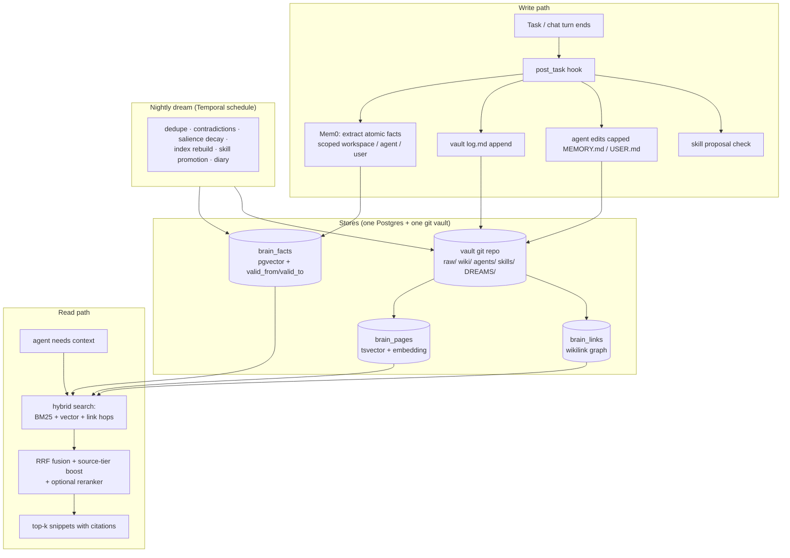

# Memory ("second brain") and token saving

## 1. Memory design in one picture



## 2. The five memory types

| Type | Holds | Store | Loaded how |
|---|---|---|---|
| **Core** | Who the agent is working for, standing preferences, top lessons | `agents/<slug>/MEMORY.md` (2,200 char cap), `USER.md` (1,400 char cap) | Frozen snapshot at session start (cache-friendly) |
| **Facts** | Atomic statements: "Supplier X invoices net-30", with validity window | `brain_facts` via Mem0 | Retrieved per turn by relevance |
| **Knowledge** | Pages people and agents can read: entities, decisions, how-tos, sources | Vault `wiki/` pages with `[[wikilinks]]`, indexed in `brain_pages` / `brain_links` | Hybrid search, link hops |
| **Episodic** | Past conversations and task transcripts | `messages` with Postgres FTS | "Session recall": search + summarise, never stuffed raw |
| **Procedural** | How to do things | `skills/*/SKILL.md` | Index only, body on demand (see SKILLS doc) |

## 3. Vault layout (Karpathy "LLM wiki", opens in Obsidian)

```
vault/<workspace>/
  AGENTS.md            shared operating rules + vault schema
  index.md             generated map of the wiki (rebuilt nightly)
  log.md               append-only activity log, one line per event
  raw/                 immutable sources (uploads, fetched pages), never edited
  wiki/
    entities/          people, companies, products
    topics/
    decisions/
    howto/
  agents/<slug>/       SOUL.md, MEMORY.md, USER.md
  skills/<name>/       SKILL.md + files
  DREAMS/YYYY-MM-DD.md nightly diary for human review
```

- Every write is a git commit with an author (`agent:researcher` or `user:fitri`). History, blame and revert come free.
- **Obsidian:** clone the vault repo on a laptop and use the Obsidian Git plugin. Graph view, backlinks and search work because we only use plain markdown, YAML frontmatter and `[[wikilinks]]`.
- The dashboard has its own Brain browser (tree, editor, backlinks, graph) so nobody needs Obsidian.

## 4. Retrieval (GBrain recipe on Postgres)

1. Keyword: `ts_rank_cd` over `tsvector` (simple config, works for Malay and English).
2. Vector: pgvector HNSW, cosine, `fastembed` multilingual small model (384 dims), CPU only.
3. Graph: from the top hits, follow 1 hop of `brain_links`.
4. Fuse with Reciprocal Rank Fusion (k = 60), boost by source tier (`decisions` > `wiki` > `raw` > `log`).
5. Optional cross-encoder rerank on the top 30 (small ONNX model), return top 8 with citations.

Everything is filtered by `workspace_id` (and agent visibility) in SQL, never by the LLM.

## 5. How it gets smarter

| When | What |
|---|---|
| After every task | Facts extracted; `log.md` line; agent may edit its capped core memory; skill check |
| Before context compaction | **Memory flush turn** (OpenClaw): the agent writes anything important to memory before old turns are summarised away |
| Nightly 02:00 | Dream workflow: merge duplicate pages and facts; contradicted facts get `valid_to` set (Graphiti-style, never deleted); salience scoring and confidence decay; rebuild `index.md`; promote recurring procedures to skill proposals; write `DREAMS/<date>.md` |
| Weekly | Reflection over traces: failure patterns become playbook updates or skill proposals (ACE / GEPA style) |
| On human review | Approving or rejecting dream changes and skill proposals is itself recorded, so the agent learns what the team accepts |

If Mem0 recall quality is not good enough after P3, swap the facts layer for **Hindsight** (MIT, retain / recall / reflect, Postgres-based). The API (`brain.remember`, `brain.recall`, `brain.reflect`) is designed so this is an adapter change.

## 6. Token-saving playbook

Ranked by payoff vs effort. Figures are from provider docs and published benchmarks; treat them as ranges.

| # | Technique | Typical saving | How we apply it |
|---|---|---|---|
| 1 | **Prompt caching** | 50-90 % of input cost on agent loops | Stable prefix order (section 1 of AGENT-RUNTIME), frozen core memory, append-only history. OpenAI and DeepSeek cache automatically; Anthropic / Gemini explicit caching when added |
| 2 | **Batch APIs** | 50 % flat | Dream, curator, evals, bulk extraction run as batch jobs where the provider supports it |
| 3 | **Retrieval and progressive disclosure** | 80-99 % on context-heavy tasks | Skills index not bodies; top-8 snippets not documents; session recall summaries not transcripts |
| 4 | **Routing and cascades** | 40-85 % | `fast` / `bulk` groups start on free Groq / OpenRouter / Mistral tiers or local Ollama, escalate only on failed validation |
| 5 | **Shorter outputs** | 20-60 % of output spend | JSON schema outputs, `max_tokens` per tool, "no preamble" rule in `AGENTS.md`, capped reasoning effort |
| 6 | **Local models** | ~100 % for that slice | Embeddings (fastembed, always local), classification, summarisation, dream jobs on Ollama |
| 7 | **Exact-match response cache** | 0-40 % | Valkey cache keyed on (model, normalized prompt hash) for deterministic single-turn calls only |
| 8 | **Prompt compression** | 2-5x on long contexts | LLMLingua-2 only where caching is impossible (later) |
| 9 | **Distil a small model** | 70-95 % for one narrow task | After 1-5k accepted examples exist (post v1) |

Semantic (fuzzy) response caching is **not** used for multi-turn agents: production hit rates are low and wrong-answer risk is real.

## 7. Token logging

Every model call writes one `llm_calls` row:

```
id, ts, workspace_id, agent_id, task_id, session_id, group, provider, model,
prompt_tokens, completion_tokens, cached_tokens, reasoning_tokens,
cost_usd, latency_ms, ttft_ms, status, error_class, cache_hit_local,
request_ref, response_ref        -- pointers to redacted bodies in rustfs (retention 30 days)
```

- Bodies are redacted (keys, tokens, emails optional) before storage and kept 30 days by default (setting).
- Aggregates roll up nightly into `llm_usage_daily` for fast charts.
- With profile `obs`, the same call is also exported as an OTel GenAI span to Langfuse for deep trace inspection, prompt versioning and datasets.

**From logs to a cheaper system (monthly routine):**
1. Sort prompts by spend; fix prefix order on the top 10 to raise cache hits.
2. Find agents with high output/input ratio; tighten their output schemas.
3. Export accepted runs per skill as eval datasets; run the optimizer.
4. When one task type has 1-5k accepted examples, consider fine-tuning a small local model for it.
