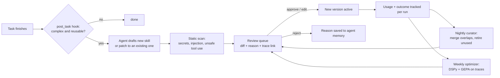

# Self-improving skills

Goal: an agent that did something hard once should do it faster and cheaper the second time, and a human should be able to read and approve exactly what it learned.

## 1. Skill format

Skills follow the open `SKILL.md` convention (agentskills.io, used by Hermes and Claude). One folder per skill in the vault:

```
skills/
  compare-vendor-quotes/
    SKILL.md          frontmatter + instructions
    checklist.md      optional supporting file, loaded only when referenced
    examples/         optional
```

```markdown
---
name: compare-vendor-quotes
description: Compare 2-10 supplier quotations into one table with totals, gaps and a recommendation.
version: 3
trust: official          # builtin | official | trusted | community
agents: [analyst, finance]
created_by: agent:analyst
approved_by: user:fitri
evals: evals/compare-vendor-quotes.yaml
---
## When to use
...
## Steps
...
## Output format
...
```

## 2. Progressive disclosure (token saving)

| Level | Loaded when | Approx. size |
|---|---|---|
| 1. Index | Every session: name + description of each allowed skill | ~30 tokens per skill |
| 2. Body | Agent calls `skills.load(name)` | 300-1,500 tokens |
| 3. Supporting files | Agent calls `skills.read(name, file)` | as needed |

An agent with 40 skills pays about 1,200 tokens for the index instead of 40,000 for full bodies.

## 3. The learning loop



**Trigger rule for the post-task hook** (deterministic first, LLM second): task used 6 or more tool calls, or took more than 2 correction turns, or the user said "remember how to do this". Then a cheap model is asked whether a skill would help next time.

**Patching instead of duplicating:** before drafting, the agent searches existing skills by embedding similarity; above 0.8 it must propose a patch to that skill, not a new one.

## 4. Review queue (dashboard: Skills > Proposals)

Each proposal shows:

- Side-by-side diff (`@git-diff-view/react`).
- Why the agent proposed it, linked to the task trace.
- Scan results.
- Eval results if the skill has an eval file (old version vs new version).
- Buttons: **Approve**, **Edit and approve**, **Reject with reason**.

Approved skills become a new git commit in the vault (`skills: v3 compare-vendor-quotes (approved by fitri)`), so every learned behaviour can be reverted.

## 5. Curator (nightly)

- Merge skills with overlapping descriptions (similarity > 0.85) into one proposal.
- Retire skills unused for 60 days (proposal, not automatic delete).
- Flag skills whose success rate dropped below 70 % over the last 20 uses.

## 6. Evals

`evals/<skill>.yaml` holds 3-20 input cases with checks (JSON schema, must-contain, numeric tolerance, LLM-judge rubric as last resort). Evals run:

- On every proposal (old vs new).
- Weekly on all active skills, results in Skills > Health.

## 7. Optimizer (P4+, weekly)

Hermes self-evolution pattern: collect traces of accepted and rejected runs per skill, run DSPy with the GEPA optimizer against the eval set, and emit the improved instructions as a **proposal**. Nothing changes without review.

## 8. Metrics on the Skills page

Uses, success rate, average tokens per use, tokens saved vs runs without the skill, last edited by, version history.

## 9. As built in P4 (2026-10-01)

| Piece | Where |
|---|---|
| Library, index, `use_skill` loading, proposals, approve/reject, usage + tokens | `apps/api/agentic/skills/store.py` |
| `SKILL.md` format and rules (kebab-case name, one-sentence description, 12k body cap) | `skills/format.py` |
| Safety scan: secrets, rule overrides, internal addresses (block); unknown tools, missing sections, too specific (warn) | `skills/scan.py` |
| Post-task reflection (trigger: 6+ tool calls, sent back 2+ times, or "remember how to do this") | `skills/reflect.py` |
| Evals: must/must-not contain, regex, number within tolerance, JSON keys, LLM rubric last | `skills/evals.py` |
| Curator in the nightly dream: merge (> 0.85 similar), retire (60 days unused), flag (< 70 % accepted) | `skills/curator.py` |
| Agent tools `use_skill`, `propose_skill` | `agents/tools.py` |
| Dashboard: Skills (library, proposals with split/unified diff, history), task timeline events | `apps/web/src/pages/skills/` |

Decisions made while building:

- **Who approves.** Owner, admin and approver (the `approvals.decide` permission). Their own
  edits go through the same propose-then-approve path, so every change still gets a version,
  a `skill_versions` row and a git commit. Operators can only propose.
- **The vault is not a side door.** `skills/*/SKILL.md` cannot be edited in the Brain editor,
  and agents cannot `write_page` there. A file edited in Obsidian becomes a proposal on the
  next sync; rejecting it restores the approved text in the vault.
- **Near-duplicates become patches.** A new proposal with an existing name, or similarity of
  0.8 or more to an existing skill, is turned into a patch of that skill.
- **Rejections teach.** The reason is saved as a private fact for the proposing agent, so it is
  recalled the next time the agent works on something similar.
- **Isolated companies keep their skills.** A skill learned by an agent of an isolated branch
  is visible only inside that branch.
- **Tokens saved** = 1 - (average tokens of accepted tasks that used the skill / tokens of the
  task the skill was learned from). It appears once the skill has been used.
- **Deferred:** the weekly DSPy + GEPA optimizer (section 7). It needs real accepted and
  rejected traces to be worth running; the eval harness it will use is in place.

Verified: 82 API tests (12 for skills), and an end-to-end run on the full stack. In that run,
a reconciliation that took six calculations (7,670 tokens) led the agent to propose
`reconcile-bank-statement`. The proposal passed the scan and its own test, and was approved.
The next month's reconciliation loaded it and finished in 2,154 tokens: **72 % fewer, measured**.

## P12 upgrades (from Hermes Agent)

- Reflection also runs when a person corrected the work (sent back with feedback) and, as a
  backstop, after every 8 finished tasks with real tool work; never when the agent already
  proposed a skill itself in that task.
- The reflect prompt puts a lesson, in order, into the skill used in the task, then an existing
  related skill, then a new class-level skill (never one named after a single client or
  error); corrections become Pitfalls of the governing skill; wrong text is fixed in place.
- It never captures transient failures, claims that a tool is broken, or unsolved dead ends.
- Skills unused for 21 days stay loadable but are listed by name only in the prompt index.
- Memory guidance: facts, not orders to yourself; how-to belongs in skills.

