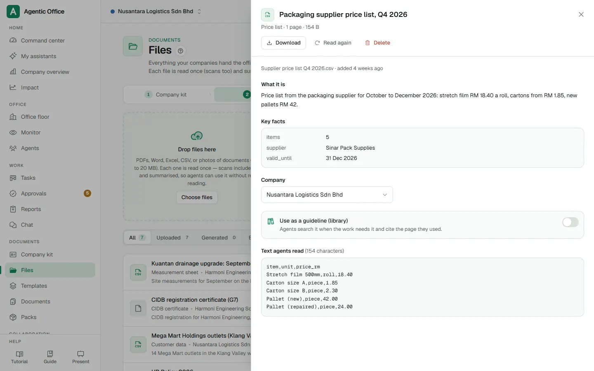

# Agentic Office user guide

<!-- Generated by apps/web/scripts/guide-to-md.mjs from apps/web/src/guide/content.ts. Edit that file, then run the script again. -->

Every page of the office: what it is for, what you can do there, and how, step by step. The same guide is in the app under **Help > Guide** (`/guide`), with highlighted screenshots and videos.

Screenshots: Sample companies (demo data), captured 2026-10-04. Numbers in the steps match the numbered boxes in the app's guide.

## Contents

- **Home**: [Command center](#command-center) · [My AI worker](#my-ai-worker) · [My assistants](#my-assistants) · [Company overview](#company-overview) · [Impact](#impact)
- **Office**: [Office floor](#office-floor) · [Monitor](#monitor) · [Agents](#agents)
- **Work**: [Tasks](#tasks) · [Approvals](#approvals) · [Reports](#reports) · [Chat](#chat)
- **Documents**: [Company kit](#company-kit) · [Files](#files) · [Templates](#templates) · [Documents](#documents) · [Packs](#packs)
- **Collaboration**: [Meetings](#meetings) · [Broadcasts](#broadcasts)
- **Knowledge**: [SOPs](#sops) · [Library](#library) · [Brain](#brain) · [Skills](#skills) · [Learning](#learning) · [Blueprints](#blueprints) · [Workflows](#workflows)
- **Operations**: [Schedules](#schedules) · [Logins](#logins) · [AI Engine](#ai-engine) · [MCP tools](#mcp-tools) · [Channels](#channels)
- **Admin**: [Organization](#organization) · [Activity](#activity) · [Members and settings](#members-and-settings)
- **Help**: [Tutorial](#tutorial)
- **Videos**: [Short recordings](#short-recordings)

---

## Home

### Command center

Opens at `/`.

Your start page: today at a glance. How many agents are working, what waits for you, whether the system is healthy and what to set up next.

**On this screen**

1. **System health**: System health: every service, running or down, checked every 15 seconds.
2. **Getting started checklist**: The four first steps for a new office, with a button for each.
3. **Shortcuts**: Quick links to Organization, Members and Agents.

**What you can do here**

- See four live counts: **Agents**, **Working now**, **Waiting on you** and **To review**. Click one to jump to that list.
- Answer agents that check in or hit a budget warning under **Agents asking**: **Give a task**, **See budget** or **Dismiss**.
- Watch **Spend vs budget**: every agent with a budget, and who is close to the limit.
- Follow the **Getting started** checklist: branches, members, AI providers and your first agent.
- Check the **System** panel: every part of the system, running or down. It refreshes every 15 seconds.
- Staff: create or open your AI twin from the **Meet your AI twin** card.

#### How to: Set up a new office in four steps

1. Find the **Getting started** card. It shows how many of the four steps are done. _(box 2)_
2. Click **Add branch** to create one branch for each company you run.
3. Click **Add member** to invite the people who will use the office.
4. Click **Connect** to add an AI provider. A free tier is enough to start.
5. Click **New agent** to build your first agent. The card ticks itself off as you go.

#### How to: Check that everything is running

1. Look at the pill under the greeting: **All systems running** means all is well.
2. If it says **Needs attention**, open the **System** panel to see which part is down. _(box 1)_
3. Tell your administrator which part is down. The panel refreshes by itself.

**Tips**

- The **Getting started** card is hidden for staff. Staff see their AI twin card instead.
- Budget warnings start at 80% of an agent's limit. At 100% the agent pauses and asks.

**Who can use it:** Everyone who can sign in. What you can change depends on your role.

**Related:** [Company overview](#company-overview) · [Approvals](#approvals) · [Tasks](#tasks) · [Organization](#organization)

### My AI worker

Opens at `/my-worker`. For: Staff.

Staff only: the home of the one AI worker you hired. See what it is doing, what waits for you, its duties and the hours it works.

**On this screen**

1. **What it is doing now**: What your worker is doing right now.
2. **Give a task, chat, change hours**: Give a task, chat with it, change its hours or add a duty.
3. **Its working week**: Its working week: working hours, breaks and rest days.

**What you can do here**

- Hire your AI worker in five short steps the first time you sign in: company, the worker, its job, working hours and the offer letter.
- See its status: **Working**, **Waiting for you**, **Paused**, on a break or **Free for work**.
- Use the quick actions: **Give a task**, **Chat**, **Change hours** and **Add a duty**.
- Answer what waits for you: approvals, questions and results to review.
- Follow today's timeline, its working week, its duties and its job.

#### How to: Hire your AI worker

_Welcome: First sign-in as staff: the Hire your AI worker steps (/welcome)._

1. On **My AI worker**, click **Start hiring**. The hiring steps open full screen.
2. **Your company**: pick your company and department. If you are not sure, choose **Not sure yet**; your manager can set it later.
3. **Meet your AI worker**: give it a name, a job title and say how it should work. Tick what it must ask you about first.
4. **Its job** (optional): pick a role blueprint, workflows it follows, recurring duties and a first task.
5. **Working hours**: pick a quick start such as **Office week**, or set the days, hours and breaks yourself.
6. **Offer letter**: read the letter of appointment and click **Hire**. Then click **Meet** to go to work.

#### How to: Give your worker a task

1. Click **Give a task** in the quick actions. _(box 2)_
2. Write what you need and what done looks like, then create the task.
3. Watch the status card change to **Working**. Results that need you appear under **Waiting for you**. _(box 1)_

#### How to: Change its working hours

1. Click **Change hours**, or **Change** on the **Its week** card. _(box 3)_
2. Set the working days, start and finish times and breaks.
3. Click **Save hours**. Work given outside the hours waits until it is back; chat always gets an answer.

**Tips**

- Your worker tells people it is an AI when it deals with others.
- You choose your company once. After that, only an admin can move you.
- A duty is written in plain words, such as "every Monday at 9am". The page reads it back so you can check it.

**Who can use it:** Staff. Managers and owners use Agents instead.

**Related:** [Tasks](#tasks) · [Approvals](#approvals) · [Chat](#chat) · [Schedules](#schedules)

### My assistants

Opens at `/assistants`.

Your own private AI assistants. Nobody else sees them. Ask about the whole company, let it draft Gmail replies you approve, and chase people on WhatsApp.

**On this screen**

1. **Chat with your assistant**: The conversation with your assistant.
2. **One-tap questions**: One-tap questions. Gmail and calendar ones appear once Google is connected.
3. **Gmail, Calendar and WhatsApp**: Gmail, Calendar and WhatsApp: what is connected.

**What you can do here**

- Create an assistant from a ready-made card: **Chief of Staff**, **Inbox Assistant**, **Company Analyst** or **My Assistant**.
- Chat with it, by typing or with the microphone.
- Use one-tap questions such as **What's happening today?**, **Where are we slacking?** or **Weekly report**.
- Review **Drafts**: emails and calendar changes it prepared. Nothing is sent or added until you approve it.
- Connect Gmail, Google Calendar and your WhatsApp.
- Change its name, how it works for you, how it thinks and what it may use in **Settings**.

#### How to: Create your first assistant

1. Pick a card, for example **Chief of Staff**, and click **Create**. Use **Customise** to change the name first.
2. In **Anything it should know about you**, add a line about your job if you like.
3. Ask a first question, or tap one of the one-tap questions. _(box 2)_

#### How to: Let it draft your email replies

1. Click **Connect Google** in the connections card and sign in to Google. _(box 3)_
2. Tap **Check my inbox** or **Draft my replies**. _(box 2)_
3. Open the **Drafts** tab. Edit the subject or text if needed.
4. Click **Send** to send it, or **Discard** to drop it. Nothing was sent before you clicked.

#### How to: Link your WhatsApp

1. Click **Link my WhatsApp**. You get a code that works for 10 minutes. _(box 3)_
2. From your phone, send **LINK** and the code to the office WhatsApp number. **Open WhatsApp** does this for you on a phone.
3. Your assistant can now reach you, and chase people for you, on WhatsApp.

**Tips**

- Gmail is drafts only: the assistant prepares replies, you send them.
- Calendar guests get an invitation only when you confirm the change in **Drafts**.
- Voice turns your speech into text in the message box. You can edit it before sending.

**Who can use it:** Everyone who can create work (all roles except approver and viewer). Each person's assistants are private to them.

**Related:** [Chat](#chat) · [Channels](#channels) · [Company overview](#company-overview)

### Company overview

Opens at `/overview`.

Every company side by side: work done, what is failing or waiting, and AI spend, with a short AI briefing.

**On this screen**

1. **Period**: The period every number on the page covers.
2. **Every company side by side**: Every company side by side. Click a column to sort.
3. **AI briefing**: A short AI summary of the numbers on this page.

**What you can do here**

- Pick a period: **Today**, **7 days**, **30 days** or **90 days**.
- Read the totals: agents, tasks done, failed, waiting on people, reports and AI spend.
- Compare companies in the **Branches compared** table. Click a column to sort, or a company to open its office.
- Ask for a **Briefing**: a short summary written from the numbers on the page.
- See what **Needs attention**: failures, long waits, incidents and budgets.

#### How to: Get a quick summary for a meeting

1. Choose the period, for example **7 days**. _(box 1)_
2. Click **Brief me** in the briefing card. It reads only the numbers on this page. _(box 3)_
3. Scroll to **Branches compared** to show the details behind it. _(box 2)_

**Tips**

- A briefing costs a fraction of a cent. A saved one is marked **(saved, no new cost)**.
- You only see the companies and departments your role covers.

**Who can use it:** Everyone who can sign in. What you can change depends on your role.

**Related:** [Impact](#impact) · [Office floor](#office-floor) · [Reports](#reports)

### Impact

Opens at `/impact`. For: Owners and managers.

What the AI team measurably did per company and department: tasks done, time freed against what it cost, and what it could do next.

**On this screen**

1. **Measured results**: Measured results, with estimates marked as estimates.
2. **ROI calculator**: Return on the AI spend, worked out from your own assumptions.
3. **Try it**: Example jobs per team. **Try it** opens a new task with an example brief.

**What you can do here**

- See measured results for **7 days**, **30 days** or **90 days**: tasks completed, approval turnaround and skills learned.
- See estimates, clearly marked **(est.)**: time freed and the value of staff time.
- Change the assumptions behind the estimates: minutes per task, staff cost per hour and time spent checking AI work.
- Work out the return on AI spend with the ROI calculator.
- Try what each AI team can do with **Try it**, and add a ready-made team to a company.

#### How to: Make the estimates fit your office

1. Open **Assumptions behind the estimates**.
2. Set **Minutes a person takes per task** and **Staff cost per hour** for your office.
3. The totals and the ROI calculator update at once. _(box 2)_
4. Click **Reset** to go back to the defaults. Your numbers are saved in this browser only.

#### How to: Try a new kind of work

1. Scroll to **What your AI team can do**. _(box 3)_
2. Click **Try it** on a card. A new task opens with an example brief.
3. Change the brief to fit your work and create the task. Nothing runs before you create it.

**Tips**

- Time freed and staff value are estimates from your assumptions; task counts and AI cost are measured.
- Treat forecasts as ranges, not promises.

**Who can use it:** Owners, admins, branch managers and heads of department.

**Related:** [Company overview](#company-overview) · [Organization](#organization) · [Learning](#learning)

---

## Office

### Office floor

Opens at `/office`.

A live office for each company. Every agent sits at a desk in its department, and you can see who is working, waiting or stuck.

**On this screen**

1. **The live office**: The live office: each agent at its desk, showing what it is doing.
2. **Pick a company**: Pick the company whose office you want to see.

**What you can do here**

- Switch company with the tabs at the top, and switch between **Map** and **List**.
- Zoom in and out, or click **Fit the office**.
- Click an agent to open its panel: **Give a task**, **Browse for me**, **Pause** or **Profile**.
- Hand out new tasks that have no agent yet: drag a card from **To hand out** onto an agent.
- See who is **Working**, **Waiting on you**, **In a meeting**, **In the breakroom**, **Stuck on an error** or **Paused**.

#### How to: See what an agent is doing

_Agent: Click an agent at its desk: its side panel opens._

1. Pick the company at the top. _(box 2)_
2. Click an agent at its desk. Its panel opens on the side. _(box 1)_
3. The **Monitor** tab shows its live steps; **Work** shows what it is working on and what it produced.
4. Anything waiting on you is pinned at the top of the panel. Decide it right there.

#### How to: Hand a task to an agent

1. New tasks without an agent wait in the **To hand out** tray.
2. Drag a card onto an agent, or use **Assign to…**. _(box 1)_
3. The task is assigned and started at once.

**Tips**

- On a phone, tap an agent in the strip along the bottom to move the view to it.
- Agents you can only watch cannot be given tasks.

**Who can use it:** Everyone who can sign in. What you can change depends on your role.

**Related:** [Monitor](#monitor) · [Agents](#agents) · [Tasks](#tasks)

### Monitor

Opens at `/monitor`.

Watch agents work live: their steps, every tool they use, and their browser screen.

**On this screen**

1. **Agents working now**: Everyone at work, and each agent. Pick one to follow it.
2. **Live screen and steps**: The agent's live screen and its steps as they happen.

**What you can do here**

- See **Everyone at work** as a wall of live screens, refreshed every 2 seconds.
- Pick one agent to see its current task, its live screen and a **Step by step** list.
- See what it cost in the last 24 hours and which helpers are on the job.

#### How to: Follow one agent live

1. Pick the agent in the list. _(box 1)_
2. Watch its screen and the **Step by step** list update as it works. _(box 2)_
3. Click **Profile** to open the agent's own page.

**Tips**

- An eye icon means you can only watch that agent; a lock means it is private.
- When nobody is working, the wall says **Nobody is working right now**.

**Who can use it:** Everyone who can sign in. What you can change depends on your role.

**Related:** [Office floor](#office-floor) · [Agents](#agents) · [Tasks](#tasks)

### Agents

Opens at `/agents`.

Your AI team: create agents, place them in a department, set what they may do, and see who reports to whom.

**On this screen**

1. **New agent**: Start the six-step agent builder.
2. **An agent card**: An agent: its model, role and pills such as **Auto** or **Budget**.
3. **Org chart view**: Switch to the org chart to see and change who reports to whom.

**What you can do here**

- Create an agent in six steps with **New agent**: template, placement, identity, SOPs, permissions and review.
- Browse agents **By department** or as an **Org chart**.
- Open an agent to chat, give tasks, set its budget, edit its permissions and SOPs, or pause and retire it.
- Change who reports to whom by dragging in the org chart.

#### How to: Create an agent

_New: Click New agent: the builder (/agents/new)._

1. Click **New agent**. _(box 1)_
2. **Template**: pick a ready-made role, or **Blank agent**.
3. **Placement**: choose the company and department it works in.
4. **Identity**: give it a name, a job title, a colour and its way of working.
5. **SOPs**: the company and department SOPs apply by themselves; tick any extra ones from the library.
6. **Permissions**: pick a model group and set each tool to **Allow**, **Ask me** or **Never**.
7. **Review** what the agent will be told, then click **Create agent**.

#### How to: Set a budget for an agent

_Detail: Click an agent card: its detail page._

1. Click an agent card to open it. _(box 2)_
2. Open the **Team & budget** tab.
3. Fill in **Tokens per day** or **US dollars per month** and click **Save**.
4. At 80% you get a warning; at 100% the agent pauses and asks you.

#### How to: Change who reports to whom

1. Click **Org chart**. _(box 3)_
2. Drag an agent onto its new manager, or use the **Reports to** menu.
3. An agent cannot report to someone below it.

**Tips**

- **Ask me** means the agent stops and asks you before using that tool. **Never** removes the tool completely.
- **Work on auto** lets Ask-me tools run without asking, except high-risk ones.
- Retired agents leave the roster, but their past tasks and history stay.
- Staff have one AI twin instead of a New agent button.

**Who can use it:** Everyone can see agents. Owners, admins, branch managers and heads of department create and change them; staff have their own twin.

**Related:** [Blueprints](#blueprints) · [SOPs](#sops) · [Office floor](#office-floor) · [Chat](#chat)

---

## Work

### Tasks

Opens at `/tasks`.

A board of everything your agents are working on, from new to done.

**On this screen**

1. **New task**: Create a new task.
2. **Board columns**: The board: each column is a stage of the work.
3. **A task card**: One task: title, agent, priority and labels. Click it to open.
4. **Search**: Filter by title, agent or label.

**What you can do here**

- Create a task with **New task**: what you need, who does it, priority, files and whether you review the result.
- Follow every task through the columns: **Triage**, **Ready**, **Running**, **Waiting on you**, **In review** and **Done**.
- Drag a card between columns, for example from **In review** to **Done**.
- Open a card to see its plan, result, sub-tasks, timeline and the self-check.
- **Accept**, **Send back**, **Start**, **Retry**, **Cancel** or **Delete** a task, and call a **Meeting** about it.
- Search by title, agent or label, and retry all failed tasks at once.

#### How to: Give a task

_New: Click New task: the new-task form._

1. Click **New task**. _(box 1)_
2. Write a **Title** and a **Brief**: what you need and what done looks like.
3. Pick the agent in **Assign to**, and a **Priority**.
4. Add files with **Attach or upload** if the agent needs them.
5. Keep **I review the result** on, then click **Create and start**.

#### How to: Check and accept a result

_Sheet: Click a task card: its sheet with plan, result and timeline._

1. Find the card in the **In review** column. _(box 2)_
2. Click the card to open it, and read the **Result**. _(box 3)_
3. Click **Accept** if it is right. The task moves to **Done**.
4. If not, click **Send back**, write what should change, and the agent works on it again.

#### How to: Find a task quickly

1. Type part of the title, the agent's name or a label in the search box. _(box 4)_
2. Only matching cards stay on the board.

**Tips**

- **Running** and **Waiting on you** are moved by agents; you move the other columns.
- The plan shows if the self-check passed, or what it caught and fixed before hand-in.
- On a phone, press and hold a card to drag it, or use the column switcher.
- Deleting a task keeps the reports and files it produced.

**Who can use it:** Everyone can see tasks. Creating and acting on tasks needs a role that can create work (not approver or viewer).

**Related:** [Approvals](#approvals) · [Reports](#reports) · [Meetings](#meetings) · [Workflows](#workflows)

### Approvals

Opens at `/approvals`.

Decisions your agents are waiting on: tools they want to use, questions, and budgets that ran out.

**On this screen**

1. **A decision waiting**: A decision waiting: who asks, what for, the risk and why.
2. **Approve, always or deny**: Approve once, always allow, or deny.
3. **History**: Every past decision, who made it and when.

**What you can do here**

- See what is waiting in **Waiting**, and past decisions in **History**.
- For a tool request: **Approve once**, **Always allow** that agent, or **Deny** with a reason.
- For a question: tap a suggested answer or type your own, then **Send answer**.
- For a budget stop: **Allow more** or **Stop the task**.
- Decide from a phone notification too: it opens a one-screen page for that decision.

#### How to: Approve or deny a request

1. Read the card: which agent, which tool, and **Why**. _(box 1)_
2. Click **Approve once** to let it do this one thing. _(box 2)_
3. Or click **Always allow** so that agent need not ask again for this tool.
4. Or click **Deny** and, if you like, write a reason. The agent reads it.

#### How to: Look back at a decision

1. Open the **History** tab. _(box 3)_
2. Each card shows what was decided, by whom and when.

**Tips**

- **Always allow** is not offered for high-risk requests: those are asked every time.
- Turn on phone notifications in Channels to decide from anywhere.

**Who can use it:** Everyone can see approvals. Owners, admins, managers, supervisors, staff and approvers can decide.

**Related:** [Tasks](#tasks) · [Channels](#channels) · [Activity](#activity)

### Reports

Opens at `/reports`.

What agents wrote up for you: a summary first, then tables you can sort, filter and download.

**On this screen**

1. **Reports agents wrote**: Every report agents wrote, newest first.
2. **Search**: Search reports by title.

**What you can do here**

- Search reports by title.
- Open a report to read its **Summary** and tables.
- Sort a table by clicking a column, filter long tables, and download a table as **CSV**.
- Jump to the task that produced the report.

#### How to: Download a table to Excel

1. Find the report in the list, or search for it. _(box 2)_
2. Click it to open. _(box 1)_
3. Click **CSV** above the table. The file opens in Excel or Google Sheets.

**Tips**

- New reports appear in the list by themselves while the page is open.

**Who can use it:** Everyone who can sign in. What you can change depends on your role.

**Related:** [Tasks](#tasks) · [Company overview](#company-overview) · [Documents](#documents)

### Chat

Opens at `/chat`.

Talk to any agent directly. When something needs doing, turn the reply into a task.

**On this screen**

1. **Pick an agent**: Pick the agent you want to talk to.
2. **Type, or hold the microphone**: Type your message, or use the microphone.

**What you can do here**

- Pick an agent and chat with it.
- Speak instead of typing: click the microphone, talk, and your words appear in the box.
- Start a **New** conversation, or go back to an earlier one.
- Click **Make this a task** under a reply to turn it into a task.

#### How to: Ask an agent something

_Conversation: Pick an agent: the conversation opens._

1. Pick the agent in the list. _(box 1)_
2. Type your message and press Enter. Shift+Enter starts a new line. _(box 2)_
3. Under its reply you see which model answered and which tools it used.

#### How to: Speak instead of typing

1. Click the microphone next to the message box. _(box 2)_
2. Speak, then click **Stop**. Your words appear in the box.
3. Check the text and press Enter to send. Nothing is sent by itself.

#### How to: Turn a reply into a task

1. Click **Make this a task** under the agent's reply.
2. New task opens with the agent and the reply already filled in. Check it and create the task.

**Tips**

- Anything that needs approval is suggested as a task instead of done in chat.
- Voice needs a speech-to-text model; an admin adds one in AI Engine.

**Who can use it:** Everyone can open chat. Writing to agents needs a role that can create work.

**Related:** [Tasks](#tasks) · [Agents](#agents) · [My assistants](#my-assistants)

---

## Documents

### Company kit

Opens at `/company-kit`.

Each company's facts that every document reuses: legal name, registration, address, bank, signatory, logo.

**On this screen**

1. **Company facts**: The company facts every document reuses.
2. **Save**: Save the kit.

**What you can do here**

- Pick a company and fill in its identity, contact, bank, people, money and brand details.
- Upload the company logo and see a live letterhead preview.
- Add your own facts under **More facts**; templates can use them.
- See how complete the kit is.

#### How to: Fill in a company kit

1. Pick the company at the top.
2. Fill in the cards: identity, contact, bank, people, money and brand. _(box 1)_
3. Click **Upload logo** and check the letterhead preview.
4. Click **Save kit**. Every new quotation, invoice and letter for this company uses these facts. _(box 2)_

**Tips**

- Fill in the kit first: documents and packs pull from it.
- Only admins and the company's manager can change it.

**Who can use it:** Everyone can read it. Admins and that company's manager can change it.

**Related:** [Templates](#templates) · [Documents](#documents) · [Files](#files)

### Files

Opens at `/files`.

Certificates, statements, letters and photos the office keeps. Each one is read once (scans too) and summarised for agents.

**On this screen**

1. **Upload**: Drop files here, or choose them.
2. **Files**: Your files, with what was read from them and expiry warnings.
3. **Use as a guideline**: Make a file a guideline agents search and cite.

**What you can do here**

- Upload PDFs, Word, Excel, CSV and photos, up to 20 MB each.
- See what was read from a file: a summary, key facts such as **Valid until**, and the full text agents read.
- Spot files that are expired or expire within 60 days.
- Move a file to a company, download, open or delete it.
- Turn on **Use as a guideline (library)** so agents search it and cite the page.

#### How to: Upload a file

1. Drop the file on the upload area, or click **Choose files**. _(box 1)_
2. It shows **Reading…** while it is read. Scans are read too.
3. Click the file to see what was read from it. _(box 2)_

#### How to: Make a file a guideline

_Sheet: Click a file: what was read from it._

1. Click the file to open it.
2. Turn on **Use as a guideline (library)**. _(box 3)_
3. Pick **Who it is for**. Agents in that scope now search it and cite the page they used.

**Tips**

- Deleting a file shows it as missing in any pack that uses it.
- Use the **Expiring or expired** tile to renew certificates in time.

**Who can use it:** Everyone who can sign in. What you can change depends on your role.

**Related:** [Library](#library) · [Packs](#packs) · [Documents](#documents)

### Templates

Opens at `/templates`.

Quotations, invoices, letters, proposals and your own Word files, with {{placeholders}} that agents and people fill in.

**On this screen**

1. **New template**: Make a new template.
2. **Templates**: Starter templates and your own.

**What you can do here**

- Use a starter template, or make your own with **New template**.
- Upload your own Word file with **Word template**; its layout is kept.
- Insert company facts with one click: company name, address, document number, line items, total and more.
- Mark which fields must be filled and what type they are.
- Start a document from a template with **Use it**.

#### How to: Make a template

1. Click **New template**. _(box 1)_
2. Give it a **Name**, pick a **Kind** and a **Number prefix**, such as QT.
3. Write the **Text**. Click the chips to insert company facts, the total or a signature block.
4. Check **Fields to fill**: they are found from the {{placeholders}}. Mark the ones that are required.
5. Click **Save template**.

#### How to: Use your own Word file

1. Click **Word template** and pick a .docx file.
2. Give it a name and click **Make template**. To change the text later, edit it in Word and upload again.

**Tips**

- Document numbers count up by themselves, such as QT-2026-0001.

**Who can use it:** Everyone who can sign in. What you can change depends on your role.

**Related:** [Documents](#documents) · [Company kit](#company-kit) · [Packs](#packs)

### Documents

Opens at `/documents`.

Documents drafted by people or agents, checked automatically, approved, and exported to PDF, Word or Excel.

**On this screen**

1. **New document**: Create a new document.
2. **Documents and their checks**: Every document, its status and how many checks need fixing.

**What you can do here**

- Create a document: **Write it with AI**, start from a **Blank page**, or pick a template.
- Fill fields by hand, or with **Fill with AI** from a description or a file.
- Rewrite a selected part: shorter, more formal, friendlier, fix grammar, or translate to Bahasa Melayu or English.
- See checks: what must be fixed and what to look at. Ask for **Review with AI**.
- Send for review, approve (which locks it) and export to PDF, Word or Excel.
- Go back to an earlier version in **History**.

#### How to: Draft a quotation with AI

_Editor: Open a document: the editor with fields and preview._

1. Click **New document**. _(box 1)_
2. Pick the **Company**, and under **Start from** pick the quotation template.
3. Describe what it should say, and attach a file to work from if you have one.
4. Click **Create and fill**. The editor opens with fields and a preview on the letterhead.
5. Check every fact, fix anything the checks flag, and click **Save**.

#### How to: Approve and send a document

1. Open the document from the list. _(box 2)_
2. Click **Send for review**. A person with approval rights clicks **Approve** once all checks pass.
3. Use **Export** to download a PDF, Word or Excel file.

**Tips**

- AI uses only what you wrote and the files you attached; it never invents facts. Still check every fact before you send it.
- Approved documents are locked. Click **Reopen** to change one.
- Ctrl+S (Cmd+S on a Mac) saves.

**Who can use it:** Everyone can draft. Approving needs a role that decides approvals.

**Related:** [Templates](#templates) · [Company kit](#company-kit) · [Packs](#packs)

### Packs

Opens at `/packs`.

Submission packs, such as for a tender: a checklist matched to real files and documents, compiled into one PDF with a cover and contents.

**On this screen**

1. **New pack**: Start a new submission pack.
2. **Packs and their progress**: Your packs and how ready each one is.

**What you can do here**

- Create a pack with a checklist, written by you or drafted with AI.
- Match items to files automatically with **Auto-fill from files**, then confirm each match.
- Draft missing documents, such as a cover letter, with **Draft it**.
- Ask an agent to prepare the pack.
- Compile one PDF with **Compile PDF**, then open or download it.

#### How to: Prepare a submission pack

1. Click **New pack**. _(box 1)_
2. Give it a **Title**, pick the **Company** and say what it is for.
3. Click **Draft it with AI** for a checklist, edit the items, then **Create pack**.
4. Click **Auto-fill from files** and **Confirm** each match. Use **Add file** or **Draft it** for what is missing.
5. When everything required is ready, click **Compile PDF**.

**Tips**

- The office prepares the pack; a person checks it and submits it. Agents never submit anything.
- Expired files are flagged in the checklist.

**Who can use it:** Everyone who can sign in. What you can change depends on your role.

**Related:** [Files](#files) · [Documents](#documents) · [Company kit](#company-kit)

---

## Collaboration

### Meetings

Opens at `/meetings`.

Agents discuss a decision with each other and agree on one recommendation. You can watch and add a point.

**On this screen**

1. **Meetings**: Meetings happening now and past meetings.
2. **Start a meeting**: Start a new meeting.

**What you can do here**

- Start a meeting: the question, 2 to 5 agents and 1 to 4 rounds.
- Watch the live transcript and add a point while it runs.
- Read the outcome: the decision, options weighed, dissent and next steps.

#### How to: Ask agents to decide something together

1. Click **New meeting**. _(box 2)_
2. Write **What should they decide?**
3. Pick 2 to 5 agents in **Who attends**. The first one you pick chairs.
4. Choose the number of **Rounds** and click **Start meeting**.
5. Open it from the list to follow the transcript and read the decision. _(box 1)_

**Tips**

- Meetings recommend; they never approve anything. Any action still goes through approvals.
- You can also start a meeting from a task with the **Meeting** button.

**Who can use it:** Everyone can read meetings. Starting one needs a role that can create work.

**Related:** [Tasks](#tasks) · [Brain](#brain) · [Approvals](#approvals)

### Broadcasts

Opens at `/broadcasts`.

Send one message to every agent, a company, departments or chosen agents, and see who received it.

**On this screen**

1. **Write a broadcast**: Write and send a broadcast.
2. **Sent and acknowledged**: Sent broadcasts, and how many received them.

**What you can do here**

- Send to **Everyone**, or **Choose** companies, departments or individual agents.
- Send an **Announcement** agents keep in mind, or **A task for each** agent.
- Ask each agent to reply.
- See who received it, who replied and which tasks were made.

#### How to: Tell every agent about a change

1. In **New broadcast**, choose **Everyone** or pick who it is for. _(box 1)_
2. Pick **Announcement** and write the message.
3. Click **Send broadcast**.
4. Open it in the sent list to see who received it. _(box 2)_

**Tips**

- Announcements stay in each agent's mind for 30 days.
- With **A task for each**, the first line becomes the task title, and the tasks wait in Triage for you to start.

**Who can use it:** Everyone can read broadcasts. Sending needs a role that can create work.

**Related:** [Office floor](#office-floor) · [Tasks](#tasks) · [SOPs](#sops)

---

## Knowledge

### SOPs

Opens at `/sops`.

Written procedures your agents follow. Company and department SOPs apply by themselves; library SOPs are attached to chosen agents.

**On this screen**

1. **New SOP**: Write a new SOP.
2. **SOPs by scope**: SOPs grouped by who follows them.

**What you can do here**

- Write an SOP and choose who follows it: **Every company**, **One company**, **One department** or **Library**.
- Filter by who follows it, and search.
- Edit an SOP; every save becomes a new version.
- Delete an SOP; agents stop following it at once.

#### How to: Write an SOP

1. Click **New SOP**. _(box 1)_
2. Give it a **Title**, such as "Month-end close".
3. Under **Who follows it**, pick the scope and, if needed, the company or department.
4. Write the **Procedure**: purpose, steps, rules and output. Use **Preview** to check it.
5. Click **Create SOP**. Agents in scope follow it from their next step.

**Tips**

- Agents read SOPs before every step.
- You cannot change who follows an SOP after it is created; make a new one instead.

**Who can use it:** Everyone can read SOPs. Owners and admins write and change them.

**Related:** [Library](#library) · [Agents](#agents) · [Blueprints](#blueprints)

### Library

Opens at `/library`.

Guidelines, manuals and policies, plus every SOP. Agents search them when the work needs it and cite the page they used.

**On this screen**

1. **Upload guidelines**: Pick who it is for, then drop files.
2. **Sources and status**: Every guideline and SOP, and whether it is ready.
3. **Try a search**: Ask a question the way an agent would.

**What you can do here**

- Upload guidelines and choose who they are for: the whole company, one company or one department.
- See every source and whether it is ready (**Indexed**) or still being read.
- Try a search the way an agent would, and see the passage and citation it gets.
- Take a file out of the library; it stays in Files.

#### How to: Add a guideline

1. In **Add guidelines**, choose **Who it is for**. _(box 1)_
2. Drop the files. They show **Reading…**, then **Indexed** when agents can search them. _(box 2)_

#### How to: Check what an agent will find

1. Type a question in **Try a search** and click **Search**. _(box 3)_
2. Each result shows the page, heading and citation. Strong matches are marked **Agents get this unasked**.

**Tips**

- SOPs appear in the library by themselves.

**Who can use it:** Everyone can search. Adding and taking out files needs a role that can create work.

**Related:** [Files](#files) · [SOPs](#sops) · [Brain](#brain)

### Brain

Opens at `/brain`.

What the office knows: facts agents learned, wiki pages, and a nightly tidy-up called the dream.

**On this screen**

1. **Pages, facts, search, graph, dreams**: Pages, facts, search, graph and dreams.
2. **Search**: Search what the office knows.

**What you can do here**

- Read and write wiki pages, and see links between them and their history.
- Teach the office a fact, correct one, or make it forget one.
- Search what the office knows, in English or Malay, including past conversations.
- See the knowledge as a graph, and read what each nightly dream changed.

#### How to: Teach the office a fact

1. Open the **Facts** tab. _(box 1)_
2. Type the fact in **Teach the office a fact** and choose **Who knows it**.
3. Click **Add**. Agents can recall it from now on.

#### How to: Find what the office knows

1. Open the **Search** tab. _(box 1)_
2. Ask your question in English or Malay. _(box 2)_
3. Results come from facts, pages and, if you tick it, past conversations.

**Tips**

- The dream runs every night: it merges duplicates and settles contradictions (the newer fact wins).
- Correcting a fact keeps the old version under **Ended**.

**Who can use it:** Everyone can read. Editing needs a role that can create work; vault tools and dream undo are for owners and admins.

**Related:** [Library](#library) · [Skills](#skills) · [Learning](#learning)

### Skills

Opens at `/skills`.

Procedures agents learned from their work. Nothing is used until a person approves it.

**On this screen**

1. **Skills**: Skills agents can use, with how they perform.
2. **Proposals waiting**: Changes agents proposed, waiting for a person.
3. **Teach from a source**: Teach a skill from a link, a file or notes.

**What you can do here**

- Browse the skill library and see how often each skill is used and accepted.
- Review **Proposals**: new skills, updates, merges and retirements agents suggest.
- Teach a skill from a web page, a file or pasted notes with **Teach from a source**.
- Write tests for a skill, run them, and let **Improve with AI** try better versions.
- See every version, compare them, and restore an older one.

#### How to: Review a skill an agent proposed

1. Open the **Proposals** tab. _(box 2)_
2. Click a proposal. Read **Why**, the safety scan and the changes.
3. Click **Run tests** to compare the current and proposed versions.
4. Click **Approve**, **Edit and approve**, or **Reject**. When you reject, say why: the agent remembers.

#### How to: Test and improve a skill

_Sheet: Click a skill: steps, tests, versions, Improve with AI._

1. Click a skill in the library. _(box 1)_
2. Under **Tests**, click **Add**: a request, and what the answer must or must not contain.
3. Click **Run tests** to see how many pass.
4. Click **Improve with AI**. It rewrites from failing tests, tests each version and keeps the best.

#### How to: Teach a skill from a source

1. Click **Teach from a source**. _(box 3)_
2. Pick **Link**, **File** or **Paste text**, and say what it should learn.
3. Click **Draft the skill**. It is tested, then waits in Proposals.

**Tips**

- A safety scan checks every proposal; **Must fix** items block approval.
- A skill marked **Often sent back** has fewer than 70% of its results accepted.

**Who can use it:** Everyone can see skills. Approving and retiring need approval rights; tests and drafts need a role that can create work.

**Related:** [Learning](#learning) · [Brain](#brain) · [Agents](#agents)

### Learning

Opens at `/learning`.

What your agents learned, how each change was tested, what went live by itself, and what learning cost.

**On this screen**

1. **What was learned**: What was learned in the period.
2. **Autopilot and self-check**: How much may go live without a person, and the self-check.
3. **Recent decisions**: Recent learning decisions.

**What you can do here**

- See for 7, 30 or 90 days: skills learned, waiting for review, skill success, facts learned, test pass rate and learning spend.
- Choose the autopilot: review everything, let proven changes go live, or let clean changes go live.
- Turn on **Self-check before hand-in**: a second model reads finished work against the request first.
- Read recent decisions and the most used skills.

#### How to: Decide how much is automatic

1. Find the **Autopilot** card. _(box 2)_
2. Pick **Review everything** to approve every change yourself.
3. Or pick **Proven changes go live** (recommended): only changes with a clean safety scan whose tests pass at least as well.
4. Keep **Self-check before hand-in** on so agents fix gaps before you see the work.

**Tips**

- Only an owner or admin can change the autopilot.
- Click **Waiting for review** to go straight to the proposals.

**Who can use it:** Everyone can see it. Owners and admins change the autopilot.

**Related:** [Skills](#skills) · [Brain](#brain) · [Impact](#impact)

### Blueprints

Opens at `/blueprints`.

Reusable role packages: instructions, model, tools, SOPs and skills. Define a role once, then apply it to any agent.

**On this screen**

1. **New blueprint**: Create a new blueprint.
2. **Apply to an agent**: Apply a blueprint to an agent.

**What you can do here**

- Create a blueprint with instructions, model group, autonomy and tool scope.
- Pick the library SOPs and skills it brings.
- Apply it to an agent so it starts as a specialist.

#### How to: Create and apply a blueprint

1. Click **New blueprint**. _(box 1)_
2. Fill in **Name**, **Job title**, **Instructions** and **Model group**.
3. Choose **Ask before acting** or **Act on its own**, and set each tool to **Allow**, **Ask me** or **Never**.
4. Pick SOPs and skills, then click **Save blueprint**.
5. Click **Apply to an agent**, pick the agent and click **Apply**. _(box 2)_

**Tips**

- Applying replaces the agent's role, instructions, model, tools and SOPs with the blueprint's.
- Deleting a blueprint does not change agents already made from it.

**Who can use it:** Owners, admins, branch managers, heads of department and staff.

**Related:** [Agents](#agents) · [SOPs](#sops) · [Skills](#skills)

### Workflows

Opens at `/workflows`.

Draw how a job is done as connected steps, then run it: each step goes to its agent, and you take the decisions.

**On this screen**

1. **New workflow**: Create a new workflow.
2. **Workflows**: Your workflows, active or draft.
3. **Run**: Run a job through the workflow.

**What you can do here**

- Create a workflow three ways: **Draw it yourself**, **Ask AI to draft it**, or **Start from a template**.
- Pick from 12 templates, such as **Client enquiry to quotation**, **Leave request** or **Month-end close**.
- Add steps for AI work, communication, documents, the web and people, such as an **Approval**.
- See problems before you run it, and let **Improve with AI** suggest changes.
- Run a job through it, give it with a task, or make it an agent's standard way of working.

#### How to: Build a workflow from a template

_Editor: Open a workflow: the full-screen editor._

1. Click **New workflow** and choose **Start from a template**. _(box 1)_
2. Pick a template. The editor opens with its steps.
3. Click a step to set who does it, and whether you check it before it moves on.
4. Check the problems button says **Looks good**, then click **Save**.

#### How to: Run a job through a workflow

1. Open the workflow from the list. _(box 2)_
2. Click **Run**. _(box 3)_
3. Say what the job is, add files, and pick the agent for each step.
4. Click **Start**. Decisions, questions and reviews wait for you under **Needs you**.

**Tips**

- **Fill a web form** steps always wait for a person before submitting.
- **Draft email** steps prepare the email; a person sends it.
- Undo with Ctrl+Z in the editor.

**Who can use it:** Owners, admins, managers, heads of department, supervisors, staff and operators.

**Related:** [Tasks](#tasks) · [Schedules](#schedules) · [Agents](#agents)

---

## Operations

### Schedules

Opens at `/schedules`.

Recurring work for your agents, and a record of every run with its result.

**On this screen**

1. **New schedule**: Create a new schedule.
2. **Schedules and runs**: Your schedules and their last run.

**What you can do here**

- Create a schedule: which agent, what task, and when, such as **Every weekday at 9:00**.
- **Run now**, **Pause** or **Resume** a schedule.
- Read the **Run ledger**: every run, how long it took and its result.
- See **Incidents**: repeated failures with the same cause, grouped together.

#### How to: Schedule a weekly report

1. Click **New schedule**. _(box 1)_
2. Give it a **Name**, pick the **Agent** and write the **Task title** and **Brief**.
3. Under **When**, pick **Every Monday at 9:00**, or another time.
4. Keep **Send results for review** on if you want to check each result. Click **Create schedule**.
5. The schedule appears in the list. Click **Run now** to try it straight away. _(box 2)_

**Tips**

- Failed runs retry by themselves after 5, 15 and 30 minutes.
- Each run creates a fresh task with the date added to its title.

**Who can use it:** Everyone can see schedules. Creating and changing them needs a role that can create work.

**Related:** [Tasks](#tasks) · [Workflows](#workflows) · [My AI worker](#my-ai-worker)

### Logins

Opens at `/logins`.

Website logins your agents may use without ever seeing them, each locked to its own sites.

**On this screen**

1. **Add a login**: Save a new login.
2. **Logins, locked to their sites**: Saved logins, each locked to its sites.

**What you can do here**

- Save a login with the sites it may be used on.
- Choose who may use it: every company, one company, or only chosen agents.
- See when each login was last used.
- Change the sites, agents or password, or delete a login.

#### How to: Let agents sign in to a website

1. Click **Save a login**. _(box 1)_
2. Give it a name agents use, and the site address.
3. Type the username and password. They are encrypted and never shown again.
4. Choose who may use it, then click **Save login**. _(box 2)_

**Tips**

- Passwords are never sent to an AI model; the browser types them in, only on the listed sites.
- Sites that need a one-time code, a captcha or a signing PIN stay with a person: the agent stops and asks.
- Every use is in the activity log.

**Who can use it:** Owners, admins, branch managers, heads of department, and staff for their own logins.

**Related:** [Agents](#agents) · [Activity](#activity) · [Channels](#channels)

### AI Engine

Opens at `/ai-engine`. For: Owners and admins.

Connect the AI providers your agents use, decide which models answer first, and see what every call costs.

**On this screen**

1. **Providers, model groups, usage, playground**: Providers, model groups, usage, playground and settings.
2. **Add a provider**: Connect a new AI provider.

**What you can do here**

- Connect a provider with its key and test it.
- Arrange models into groups, such as Smart or Fast, in fallback order.
- See usage: calls, tokens, cost and errors per provider, model and kind of work.
- Try a prompt in the **Playground**.
- Set a safety limit on model calls per task.

#### How to: Connect an AI provider

1. On **Providers**, pick a provider under **Connect a provider**. _(box 2)_
2. Click **Get a key** to get one from the provider, then paste it.
3. Click **Test connection**, then **Save provider**.

#### How to: Choose which models answer first

1. Open **Model groups**. _(box 1)_
2. In a group, click **Add model**, and drag the handle to set the order.
3. The first model answers. If it is down or out of credit, the next one does.

**Tips**

- Keys are stored encrypted. Only the last four characters are ever shown again.
- Free tiers from Groq, OpenRouter, Mistral and HuggingFace are enough to start.
- Agents ask for a group, never a provider, so you can change models without touching agents.

**Who can use it:** Owners and admins change it. Operators, approvers and viewers can look.

**Related:** [Agents](#agents) · [MCP tools](#mcp-tools) · [Impact](#impact)

### MCP tools

Opens at `/mcp-servers`.

Connect outside tool servers (MCP), such as a tracker or a CRM. Agents reach their tools through a search bridge, and every call is approved.

**On this screen**

1. **Connect a server**: Connect a new tool server.

**What you can do here**

- Connect a server with its address and, if needed, a key.
- See which servers are reachable and which tools each one offers.
- Turn a server off, refresh its tools, or remove it.

#### How to: Connect a tool server

1. Click **Connect server**. _(box 1)_
2. Fill in **Name**, **URL** and, if the server needs one, the **Auth header**.
3. Click **Connect**. Its tools appear on the card.

**Tips**

- Only web (http or https) servers are supported; the office never runs programs on your computer.

**Who can use it:** Owners and admins.

**Related:** [AI Engine](#ai-engine) · [Approvals](#approvals) · [Agents](#agents)

### Channels

Opens at `/channels`.

Where the office reaches you: phone notifications, Telegram, WhatsApp, Gmail and API tokens, and which agent answers where.

**On this screen**

1. **WhatsApp**: WhatsApp for the office, and your own link.
2. **Telegram**: Telegram bot and your account.
3. **Phone notifications**: Notifications on this device.

**What you can do here**

- Turn on notifications on this device, and send a test.
- Link your Telegram or WhatsApp account so you get messages and can answer there.
- Connect Gmail so your assistant can draft replies you approve.
- Admins: connect the Telegram bot and WhatsApp, decide which agent answers where, and make API tokens.

#### How to: Get approvals on your phone

1. Open Channels on your phone. On an iPhone, first add the app to your Home Screen (Share, then Add to Home Screen). _(box 3)_
2. Turn on **Notifications on this device** and allow notifications.
3. Click **Send a test**. Tapping a notification opens the decision.

#### How to: Link your WhatsApp

1. In the WhatsApp card, click **Link my WhatsApp**. _(box 1)_
2. Send **LINK** and the code from your own WhatsApp to the office number before the countdown ends.

#### How to: Link your Telegram

1. In the Telegram card, click **Link my account**. _(box 2)_
2. Open Telegram and press **Start**, then click **I did it**.

**Tips**

- Admins choose between WAHA (quick, scan a QR code) and the official Meta WhatsApp Business API.
- An API token is shown only once. Copy it straight away.

**Who can use it:** Everyone links their own devices and accounts. Owners and admins set up the office channels.

**Related:** [Approvals](#approvals) · [My assistants](#my-assistants) · [Logins](#logins)

---

## Admin

### Organization

Opens at `/organization`.

Your companies (branches) and the departments inside them. Add a company with a ready-made AI team in one step.

**On this screen**

1. **Add company**: Add a new company.
2. **A company and its departments**: A company with its departments.

**What you can do here**

- Add a company: name, colour, industry and standard departments.
- Add a ready-made AI team for its industry: finance, sales, operations, HR and customer service, plus industry roles.
- Keep a company's knowledge private.
- Rename, add and remove departments.

#### How to: Add a company with a ready-made AI team

_New: Click Add company: industry and ready-made AI team._

1. Click **New branch**. _(box 1)_
2. Type the **Company name** and pick a colour.
3. Pick the **Industry**, such as Trading & retail.
4. Keep **Add a ready-made AI team** on and check **Who joins**.
5. Click **Create branch**. The company appears with its departments and agents. _(box 2)_

**Tips**

- Ready-made agents ask first before acting; change that per agent later.
- Adding a team to an existing company skips roles it already has.

**Who can use it:** Everyone can see it. Owners and admins change it.

**Related:** [Agents](#agents) · [Members and settings](#members-and-settings) · [Impact](#impact)

### Activity

Opens at `/activity`.

Every change made by people and agents, in a log that shows if anything was edited or deleted.

**On this screen**

1. **Filter**: Show one kind of change.
2. **Every change, in order**: Every change, newest first, grouped by day.

**What you can do here**

- Filter by **Sign-ins**, **People**, **Organization**, **Work**, **Agents** or **Other**.
- Read each change as a plain sentence: who, what and when.
- Click **Verify log** to check that nothing was changed.

#### How to: Check who changed something

1. Pick a filter, such as **People** or **Agents**. _(box 1)_
2. Scroll the list. Each line says who did what, and when. _(box 2)_
3. Click **Verify log** to confirm the log is intact.

**Tips**

- Entries are chained together, so editing or deleting one is detectable.

**Who can use it:** Owners and admins.

**Related:** [Members and settings](#members-and-settings) · [Approvals](#approvals) · [Logins](#logins)

### Members and settings

Opens at `/settings/members`.

The people in your workspace and their roles, plus your account and appearance.

**On this screen**

1. **Add member**: Add a new member.
2. **People and roles**: People and their roles.

**What you can do here**

- Add a member with a role, and a company or department for managers and staff.
- Change a member's role or place, reset a password, or remove someone.
- Read what every role can do.
- Change the theme: light, dark or match your device.

#### How to: Add a member

1. Click **Add member**. _(box 1)_
2. Type the **Name** and **Email**, and pick a **Role**.
3. For managers and staff, pick their company or department.
4. Copy the temporary password and give it to them. They choose their own at first sign-in. _(box 2)_

**Tips**

- The temporary password is shown only once.
- Only owners can make someone an owner.

**Who can use it:** Owners and admins manage everyone; branch managers and heads of department add people to their own team.

**Related:** [Organization](#organization) · [Activity](#activity)

---

## Help

### Tutorial

Opens at `/tutorial`.

Learn the system for your role, step by step: from your first agent to giving tasks and seeing results.

**On this screen**

1. **Your role's track**: Pick the track for your role.
2. **Next up**: The next lesson to do.

**What you can do here**

- Follow your role's track: **Owner**, **Management**, **Staff** or **Approver & viewer**.
- Open a lesson's steps, or click **Show me** to go to the right page.
- Lessons tick themselves off when the system sees you did them.
- Search lessons, the glossary and common questions.

#### How to: Take your role's tutorial

1. Pick your track at the top. _(box 1)_
2. Start with the **Next up** card. _(box 2)_
3. Click **Show me** to open the page, do the step, and come back.

**Tips**

- The User guide (this page) explains every screen; the Tutorial walks you through them in order.

**Who can use it:** Everyone who can sign in. What you can change depends on your role.

**Related:** [Command center](#command-center)

---

## Short recordings

### Create an agent

Build an agent from a template, place it in a department, set what it may do and create it.

Video (0:26, desktop): `../apps/web/public/guide-media/videos/create-agent.mp4`

- `0:00` Agents: your AI team, by department
- `0:03` Pick a starting point
- `0:07` Choose its company and department
- `0:09` Give it a name and a job title
- `0:15` SOPs it follows
- `0:17` What it may do, and what it must ask first
- `0:20` Review and create
- `0:23` The new agent joins the team

### Give a task and follow it

Give an agent a task, watch it plan and work, and accept the result.

Video (0:49, desktop): `../apps/web/public/guide-media/videos/give-task.mp4`

- `0:00` The task board
- `0:02` Say what you need
- `0:12` Pick the agent
- `0:15` Create and start
- `0:17` Follow the plan, live
- `0:42` The result waits for your review
- `0:47` Accept it

### Approve a decision

An agent asks before doing something important. Decide in one click.

Video (0:23, desktop): `../apps/web/public/guide-media/videos/approve.mp4`

- `0:00` Decisions waiting for you
- `0:02` Read what the agent wants to do, and why
- `0:04` Approve once
- `0:07` History keeps every decision
- `0:12` The agent carries on and hands in the result

### Add a company with a ready-made AI team

Add a company with its industry, and a ready-made AI team joins it.

Video (0:23, desktop): `../apps/web/public/guide-media/videos/add-company.mp4`

- `0:00` Your companies
- `0:02` Name the company
- `0:06` Pick its industry: the AI team to match
- `0:12` Create it
- `0:15` Its AI team is ready, desk by desk

### Staff: hire your AI worker

Staff hire their own AI worker in five short steps.

Video (0:35, mobile): `../apps/web/public/guide-media/videos/hire-worker.mp4`

- `0:00` Where you work (set by your manager)
- `0:03` Meet your AI worker
- `0:11` Give it a job
- `0:17` When it works and rests
- `0:22` The offer: check and hire
- `0:29` Its first day: working on your task

### On the phone

The whole office fits in your pocket: the tab bar, approvals and the More menu on a phone.

Video (0:27, mobile): `../apps/web/public/guide-media/videos/phone-tour.mp4`

- `0:00` Command center: how the office is doing
- `0:03` Approvals: decide from your phone
- `0:07` Tasks: the board, one column at a time
- `0:17` Office floor: who is working
- `0:22` Everything else is under More
