# Agentic Office user guide

<!-- Generated by apps/web/scripts/guide-to-md.mjs from apps/web/src/guide/content.ts. Edit that file, then run the script again. -->

Every page of the office: what it is for, what you can do there, and how, step by step. The same guide is in the app under **Help > Guide** (`/guide`), with highlighted screenshots and videos.

Screenshots: Sample companies (demo data), captured 2026-10-07. Numbers in the steps match the numbered boxes in the app's guide.

## Contents

- **Home**: [Command center](#command-center) · [My workspace](#my-workspace) · [My AI](#my-ai) · [My assistants](#my-assistants) · [My computers](#my-computers) · [Company overview](#company-overview) · [Impact](#impact)
- **Office**: [Office floor](#office-floor) · [Monitor](#monitor) · [Agents](#agents)
- **Work**: [Tasks](#tasks) · [Approvals](#approvals) · [Forms](#forms) · [Reports](#reports) · [Chat](#chat)
- **Documents**: [Company kit](#company-kit) · [Library: Browse](#library-browse) · [Templates](#templates) · [Documents](#documents) · [Packs](#packs)
- **Collaboration**: [Meetings](#meetings) · [Broadcasts](#broadcasts)
- **Knowledge**: [SOPs](#sops) · [Guidelines](#guidelines) · [Brain](#brain) · [Skills](#skills) · [Learning](#learning) · [Blueprints](#blueprints) · [Workflows](#workflows)
- **Operations**: [Schedules](#schedules) · [Logins](#logins) · [AI Engine](#ai-engine) · [MCP tools](#mcp-tools) · [Channels](#channels)
- **Admin**: [Organization](#organization) · [Activity](#activity) · [Members and settings](#members-and-settings)
- **Help**: [Tutorial](#tutorial) · [Demo: a working day with AI agents](#demo-a-working-day-with-ai-agents)
- **Videos**: [Short recordings](#short-recordings)

---

## Home

### Command center

Opens at `/`.

Your start page: today at a glance. How many agents are working, what waits for you, whether the system is healthy and what to set up next.

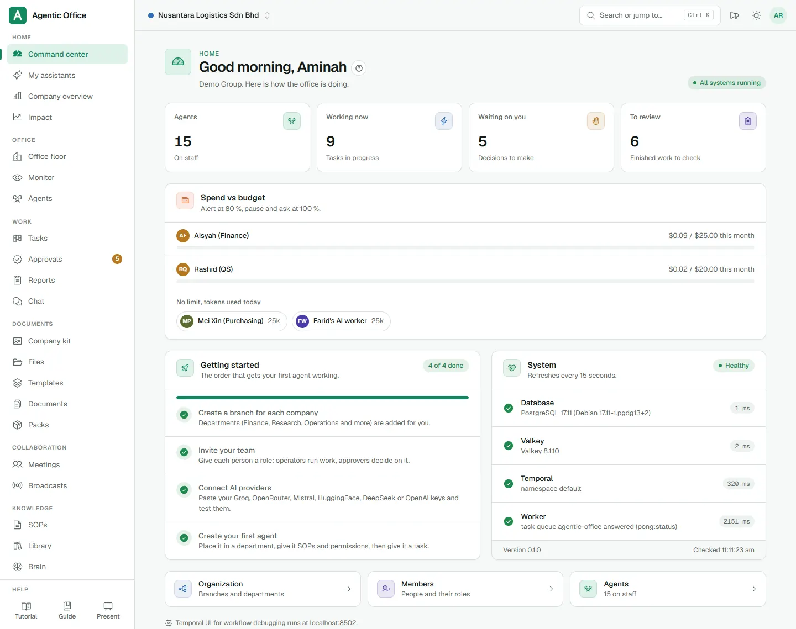
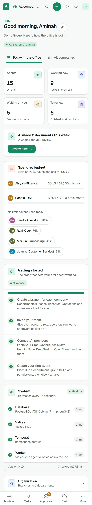

**On this screen**

1. **System health**: System health: every service, running or down, checked every 15 seconds.
2. **Getting started checklist**: The four first steps for a new office, with a button for each.
3. **Shortcuts**: Quick links to Organization, Members and Agents.

**What you can do here**

- See four live counts: **Agents**, **Working now**, **Waiting on you** and **To review**. Click one to jump to that list.
- Answer agents that check in or hit a budget warning under **Agents asking**: **Give a task**, **See budget** or **Dismiss**.
- Watch **Spend vs budget**: every agent with a budget, and who is close to the limit.
- Follow the **Getting started** checklist: branches, members, AI providers and your first agent.
- Check the **System** panel: every part of the system, running or down. It refreshes every 15 seconds.
- Staff: create or open your AI twin from the **Meet your AI twin** card.

#### How to: Set up a new office in four steps

1. Find the **Getting started** card. It shows how many of the four steps are done. _(box 2)_
2. Click **Add branch** to create one branch for each company you run.
3. Click **Add member** to invite the people who will use the office.
4. Click **Connect** to add an AI provider. A free tier is enough to start.
5. Click **New agent** to build your first agent. The card ticks itself off as you go.

#### How to: Check that everything is running

1. Look at the pill under the greeting: **All systems running** means all is well.
2. If it says **Needs attention**, open the **System** panel to see which part is down. _(box 1)_
3. Tell your administrator which part is down. The panel refreshes by itself.

**Tips**

- The **Getting started** card is hidden for staff. Staff see their AI twin card instead.
- Budget warnings start at 80% of an agent's limit. At 100% the agent pauses and asks.

**Who can use it:** Everyone who can sign in. What you can change depends on your role.

**Related:** [Company overview](#company-overview) · [Approvals](#approvals) · [Tasks](#tasks) · [Organization](#organization)

### My workspace

Opens at `/workspace`.

Your own desk, for everyone from staff to owners. Instead of going through Files, SOPs, Workflows, Tasks and Documents one by one, ask or search here, keep what you use often pinned, and find everything your work produced in one place. The other pages are still there to browse.

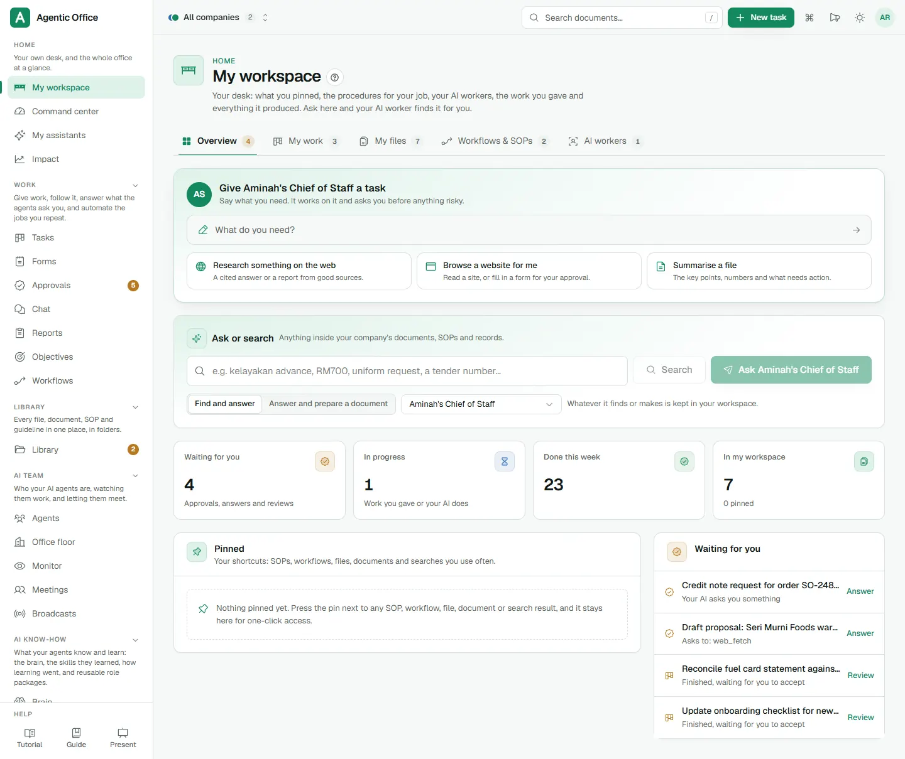
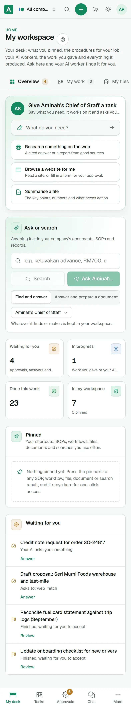

**On this screen**

1. **The workspace tabs**: Five tabs: **Overview**, **My work**, **My files**, **Workflows & SOPs** and **AI workers**.
2. **Ask or search**: Type a word, amount or reference number. **Search** shows matches here; **Ask** gives it to your AI worker.
3. **Your day in numbers**: What waits for you, what is in progress, what finished this week and how much is in your workspace.
4. **Pinned**: Your shortcuts. Workflows have **Run**, files have **Download**.
5. **My work**: Everything you asked for or your AI does, with the documents and files it made.
6. **My workspace files**: Files you uploaded here and everything your work produced. Filter by **Made by AI** or **Uploaded**.
7. **My AI workers**: Your AI worker and assistants: what each is doing, and quick ways to give them work.
8. **Waiting for you**: Questions, approvals and results that need you.
9. **My procedures**: The SOPs and workflows for your job: your department's first, then your company's.

**What you can do here**

- Ask or search anything inside the company's documents, SOPs and records, with suggestions as you type.
- Hand a question to your AI worker: it searches the documents, answers with the file and page it used and, if you ask, prepares a document.
- Pin SOPs, workflows, files, documents and searches, and open them in one click.
- Run a workflow again straight from **My procedures** or a pin.
- Follow **My work**: what you asked for, what your AI workers are doing, and the documents and files they made.
- Keep your own files in **My workspace files**, next to everything your AI made for you.
- Answer what waits for you: your AI's questions and approvals, and its work to review.

#### How to: Find something in the company's documents

1. Type in **Ask or search**, for example a word, an amount like RM700 or a tender number. Suggestions appear as you type. _(box 2)_
2. Click **Search**. The best matches appear under the box, with the page of the PDF where they were found.
3. Click **Open** to read it, or the pin to keep it on your workspace. Pin the whole search to run it again later.

#### How to: Ask your AI worker to find it and hand it over

1. Type your question in **Ask or search**, for example: how much advance can a guard with 8 working days get? _(box 2)_
2. Choose **Find and answer**, or **Answer and prepare a document** when you need a letter, quotation or report.
3. Click **Ask** followed by your AI worker's name. It searches the documents and SOPs, and asks colleagues when it needs to.
4. The answer appears under **My work**, with every source cited. A document it prepared is in **My workspace files** and waits for your review. _(box 5)_

#### How to: Keep your shortcuts and run a workflow again

1. Press the pin next to any SOP, workflow, file, document or search result, here or on its own page.
2. It appears under **Pinned**. Click it to open it. _(box 4)_
3. For a workflow, click **Run**, fill in the job and start it. You can also run one from **My procedures**. _(box 9)_

#### How to: Choose which AI follows a workflow, and when it works

1. Open the **Workflows & SOPs** tab and pick a workflow on the left. _(box 1)_
2. Read its steps, then under **Who follows it, and when they work** switch on the agents that should do this job this way. Each shows its working hours. _(box 9)_
3. Click **Run it now** to start a job through it. Work given outside an agent's hours waits for its next shift.
4. On the **AI workers** tab, each worker shows when it works and the workflows it follows. _(box 7)_

#### How to: Keep your own files on your workspace

1. Click **Upload to my workspace** and pick the files. _(box 6)_
2. They are read like any company file, so you and your AI worker can search inside them.
3. Only you and your managers see them. They are also in the Library under My workspace and your name.

**Tips**

- Anything your AI worker makes, or anyone makes on a task you gave, lands on your workspace by itself.
- Staff see only their own company's guidelines and their own work. Owners see their own desk too, not everyone else's.
- A pinned item that was deleted stays on your workspace, marked **No longer there**, until you unpin it.

**Who can use it:** Everyone. Asking your AI worker and uploading need a role that can create work.

**Related:** [My AI](#my-ai) · [Library: Browse](#library-browse) · [SOPs](#sops) · [Workflows](#workflows) · [Documents](#documents) · [Tasks](#tasks)

### My AI

Opens at `/my-worker`. For: Staff.

Staff only: My AI, the home of your one AI worker, your twin. Today shows what it is doing, what waits for you, its duties and the hours it works. Its tabs open the chat, its tasks, what it knows, teaching it and its profile.

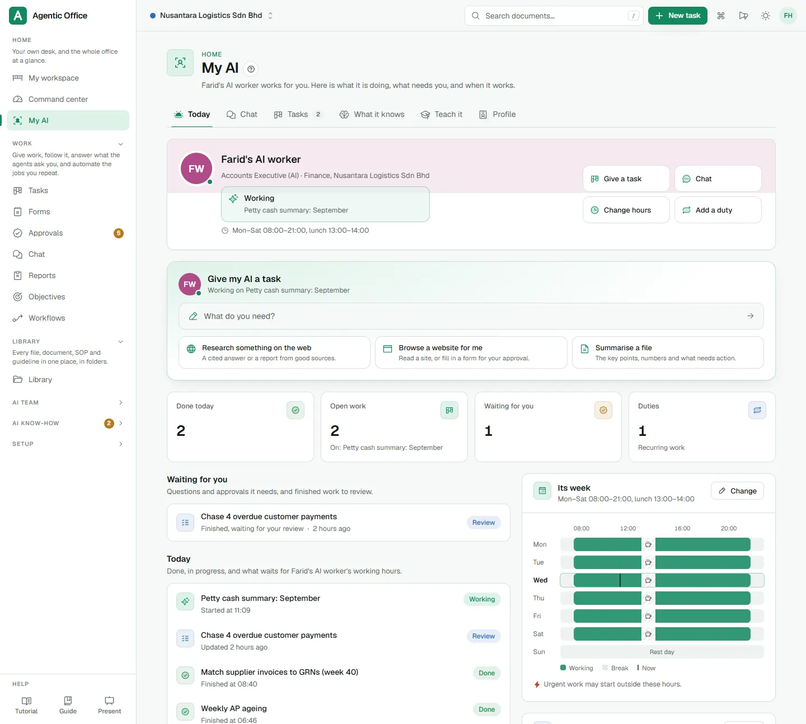
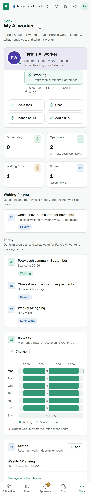

**On this screen**

1. **What it is doing now**: What your worker is doing right now.
2. **Give a task, chat, change hours**: Give a task, chat with it, change its hours or add a duty.
3. **Its working week**: Its working week: working hours, breaks and rest days.

**What you can do here**

- Hire your AI worker in five short steps the first time you sign in: company, the worker, its job, working hours and the offer letter.
- See its status: **Working**, **Waiting for you**, **Paused**, on a break or **Free for work**.
- Use the quick actions: **Give a task**, **Chat**, **Change hours** and **Add a duty**.
- Answer what waits for you: approvals, questions and results to review.
- Follow today's timeline, its working week, its duties and its job.

#### How to: Hire your AI worker

_Welcome: First sign-in as staff: the Hire your AI worker steps (/welcome)._

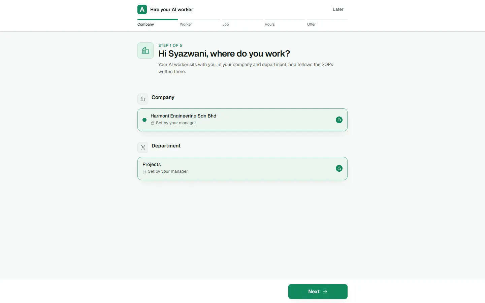

1. Sign in for the first time: the hiring steps open full screen. (Without a worker yet, **My AI** offers **Create my twin**.)
2. **Your company**: pick your company and department. If you are not sure, choose **Not sure yet**; your manager can set it later.
3. **Meet your AI worker**: give it a name, a job title and say how it should work. Tick what it must ask you about first.
4. **Its job** (optional): pick a role blueprint, workflows it follows, recurring duties and a first task.
5. **Working hours**: pick a quick start such as **Office week**, or set the days, hours and breaks yourself.
6. **Offer letter**: read the letter of appointment and click **Hire**. Then click **Meet** to go to work.

#### How to: Give your worker a task

1. Click **Give a task** in the quick actions. _(box 2)_
2. Write what you need and what done looks like, then create the task.
3. Watch the status card change to **Working**. Results that need you appear under **Waiting for you**. _(box 1)_

#### How to: Change its working hours

1. Click **Change hours**, or **Change** on the **Its week** card. _(box 3)_
2. Set the working days, start and finish times and breaks.
3. Click **Save hours**. Work given outside the hours waits until it is back; chat always gets an answer.

**Tips**

- Your worker tells people it is an AI when it deals with others.
- You choose your company once. After that, only an admin can move you.
- A duty is written in plain words, such as "every Monday at 9am". The page reads it back so you can check it.

**Who can use it:** Staff. Managers and owners use Agents instead.

**Related:** [Tasks](#tasks) · [Approvals](#approvals) · [Chat](#chat) · [Schedules](#schedules)

### My assistants

Opens at `/assistants`. For: Owners and managers.

Your own private AI assistants. Nobody else sees them. Ask about the whole company, let it draft Gmail replies you approve, and chase people on WhatsApp.

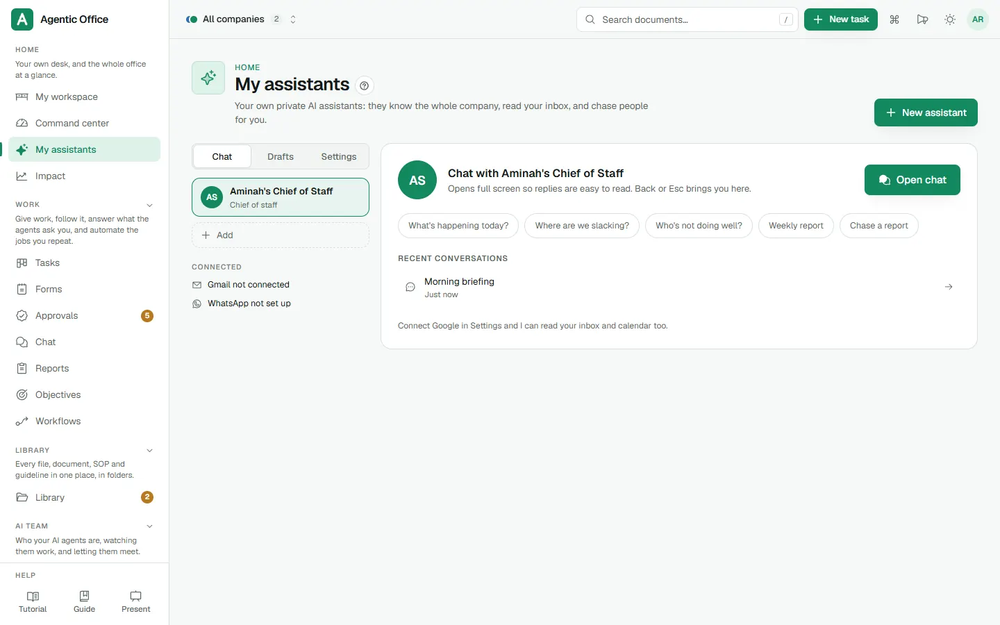
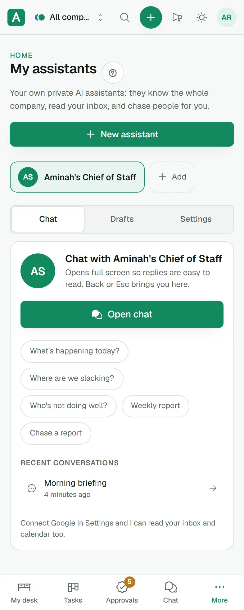

**On this screen**

1. **Chat with your assistant**: Open the chat with your assistant full screen, or pick up a recent conversation.
2. **One-tap questions**: One-tap questions. Gmail and calendar ones appear once Google is connected.
3. **Gmail, Calendar and WhatsApp**: Gmail, Calendar and WhatsApp: what is connected.

**What you can do here**

- Create an assistant from a ready-made card: **Chief of Staff**, **Inbox Assistant**, **Company Analyst** or **My Assistant**.
- Chat with it, by typing or with the microphone.
- Use one-tap questions such as **What's happening today?**, **Where are we slacking?** or **Weekly report**.
- Review **Drafts**: emails and calendar changes it prepared. Nothing is sent or added until you approve it.
- Connect Gmail, Google Calendar and your WhatsApp.
- Change its name, how it works for you, how it thinks and what it may use in **Settings**.

#### How to: Create your first assistant

1. Pick a card, for example **Chief of Staff**, and click **Create**. Use **Customise** to change the name first.
2. In **Anything it should know about you**, add a line about your job if you like.
3. Ask a first question, or tap one of the one-tap questions. _(box 2)_

#### How to: Let it draft your email replies

1. Click **Connect Google** in the connections card and sign in to Google. _(box 3)_
2. Tap **Check my inbox** or **Draft my replies**. _(box 2)_
3. Open the **Drafts** tab. Edit the subject or text if needed.
4. Click **Send** to send it, or **Discard** to drop it. Nothing was sent before you clicked.

#### How to: Link your WhatsApp

1. Click **Link my WhatsApp**. You get a code that works for 10 minutes. _(box 3)_
2. From your phone, send **LINK** and the code to the office WhatsApp number. **Open WhatsApp** does this for you on a phone.
3. Your assistant can now reach you, and chase people for you, on WhatsApp.

**Tips**

- Gmail is drafts only: the assistant prepares replies, you send them.
- Calendar guests get an invitation only when you confirm the change in **Drafts**.
- Voice turns your speech into text in the message box. You can edit it before sending.

**Who can use it:** People who manage others: owners, admins, branch managers, HODs and supervisors. Each person's assistants are private to them. Staff have one personal AI, their twin, in My AI.

**Related:** [Chat](#chat) · [Channels](#channels) · [Company overview](#company-overview)

### My computers

Opens at `/computers`. For: Anyone with their own AI (an AI twin or a private assistant).

Let your own AI work on your Windows or Mac computer: find and read files in the folders you choose, copy them into your workspace, and browse in a real window on your screen.

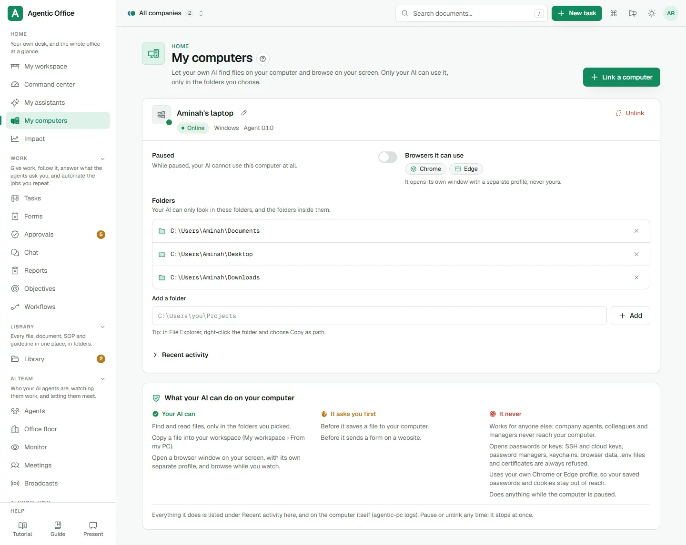
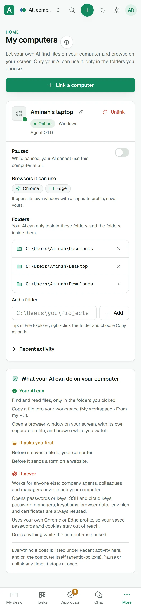

**On this screen**

1. **Link a computer**: Link another computer. The code in the line works once, for 10 minutes.
2. **A linked computer**: A linked computer: online or offline, paused or not, and which browsers it has.
3. **Folders your AI may see**: The only folders your AI may look in. Add or remove them here.
4. **What your AI did on it**: Every search, file read, copy, save and browser window, newest first.
5. **What it can and cannot do**: What your AI can do on your computer, and what it never touches.

**What you can do here**

- Link a computer with one line you copy into PowerShell (Windows) or Terminal (Mac). It installs a small program and links it with a one-time code.
- Choose the **Folders** your AI may see (by default Documents, Desktop and Downloads). Everything else on the computer stays out of reach.
- Ask your AI in chat, for example **Find my SSM certificate and put it in my workspace**.
- Give a **Browse a website** task and pick **On my computer**: a real Chrome or Edge window opens on your screen, from your own internet line.
- See everything it did under **Recent activity**, **Pause** it, or **Unlink** the computer. Both work at once.

#### How to: Link your computer

1. Click **Link a computer**. _(box 1)_
2. Copy the line for your computer (Windows or Mac).
3. Windows: open **PowerShell**, paste it and press Enter. Mac: open **Terminal**, paste it and press Enter.
4. Wait for **Linked** (about a minute). The page shows the computer as online. _(box 2)_

#### How to: Get a file from your computer

_Activity: Click Recent activity on a computer._

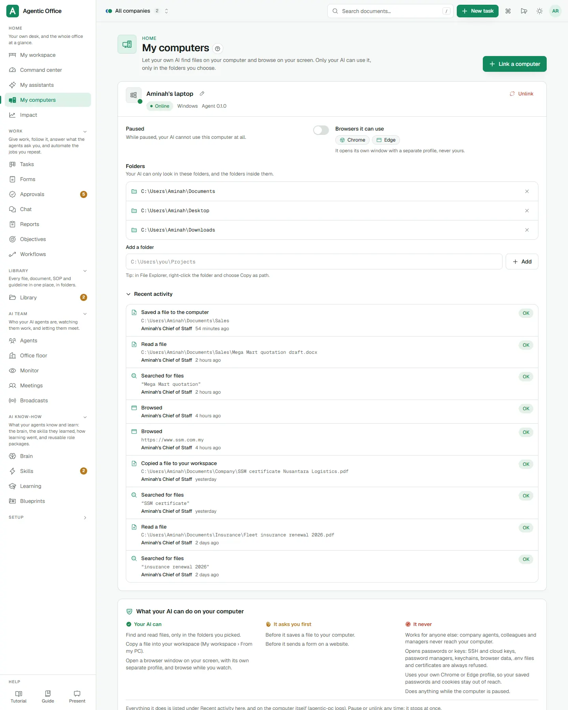

1. Open the chat with your own AI (My AI, or your private assistant).
2. Ask in plain words, for example **Find the Mega Mart quotation on my computer and save it to my workspace**.
3. It searches only your shared folders, then copies the file into **My workspace / From my PC**.
4. Check what it did under **Recent activity**. _(box 4)_

#### How to: Browse on your own computer

1. Give a task, choose **Browse a website** and enter the link.
2. Under **Where to browse**, pick **On my computer**.
3. A Chrome or Edge window opens with its own **Agent** profile, separate from your own browsing. Sending a form still waits for your approval.

**Tips**

- Only your own AI can use your computer. Company agents, colleagues and managers cannot.
- Passwords, keys, browser data and password managers are refused even inside a shared folder.
- Saving a file to your computer asks you first, every time. Programs and scripts are never saved.
- To remove it completely, run **agentic-pc uninstall** on the computer.

**Who can use it:** Anyone with their own AI: staff with an AI twin, and people who manage others with a private assistant. Each computer is private to its owner.

**Related:** [My AI](#my-ai) · [My assistants](#my-assistants) · [Chat](#chat)

### Company overview

Opens at `/overview`.

Every company side by side: work done, what is failing or waiting, and AI spend, with a short AI briefing.

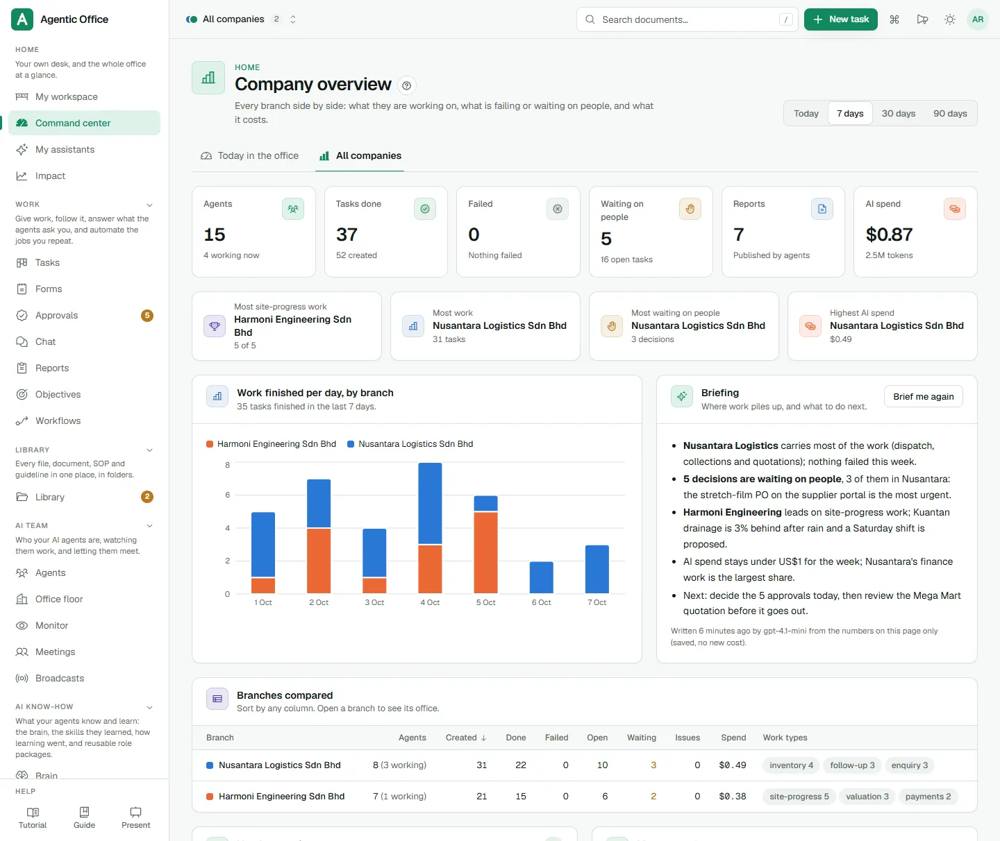
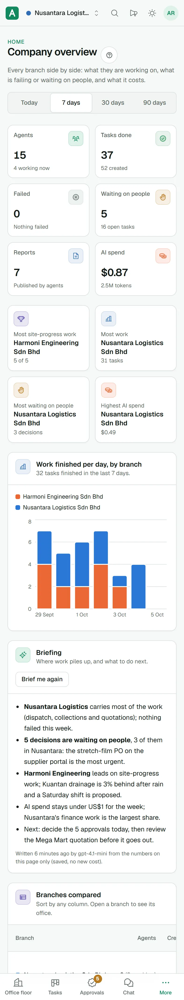

**On this screen**

1. **Period**: The period every number on the page covers.
2. **Every company side by side**: Every company side by side. Click a column to sort.
3. **AI briefing**: A short AI summary of the numbers on this page.

**What you can do here**

- Pick a period: **Today**, **7 days**, **30 days** or **90 days**.
- Read the totals: agents, tasks done, failed, waiting on people, reports and AI spend.
- Compare companies in the **Branches compared** table. Click a column to sort, or a company to open its office.
- Ask for a **Briefing**: a short summary written from the numbers on the page.
- See what **Needs attention**: failures, long waits, incidents and budgets.

#### How to: Get a quick summary for a meeting

1. Choose the period, for example **7 days**. _(box 1)_
2. Click **Brief me** in the briefing card. It reads only the numbers on this page. _(box 3)_
3. Scroll to **Branches compared** to show the details behind it. _(box 2)_

**Tips**

- A briefing costs a fraction of a cent. A saved one is marked **(saved, no new cost)**.
- You only see the companies and departments your role covers.

**Who can use it:** Everyone who can sign in. What you can change depends on your role.

**Related:** [Impact](#impact) · [Office floor](#office-floor) · [Reports](#reports)

### Impact

Opens at `/impact`. For: Owners and managers.

What the AI team measurably did per company and department: tasks done, time freed against what it cost, and what it could do next.

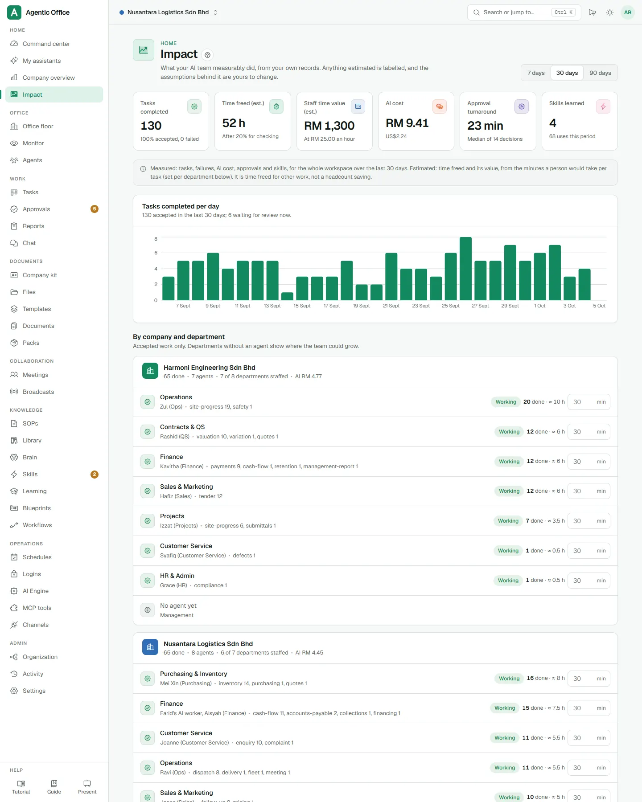
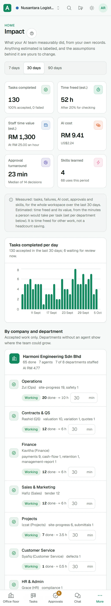

**On this screen**

1. **Measured results**: Measured results, with estimates marked as estimates.
2. **ROI calculator**: Return on the AI spend, worked out from your own assumptions.
3. **Try it**: Example jobs per team. **Try it** opens a new task with an example brief.

**What you can do here**

- See measured results for **7 days**, **30 days** or **90 days**: tasks completed, approval turnaround and skills learned.
- See estimates, clearly marked **(est.)**: time freed and the value of staff time.
- Change the assumptions behind the estimates: minutes per task, staff cost per hour and time spent checking AI work.
- Work out the return on AI spend with the ROI calculator.
- Try what each AI team can do with **Try it**, and add a ready-made team to a company.

#### How to: Make the estimates fit your office

1. Open **Assumptions behind the estimates**.
2. Set **Minutes a person takes per task** and **Staff cost per hour** for your office.
3. The totals and the ROI calculator update at once. _(box 2)_
4. Click **Reset** to go back to the defaults. Your numbers are saved in this browser only.

#### How to: Try a new kind of work

1. Scroll to **What your AI team can do**. _(box 3)_
2. Click **Try it** on a card. A new task opens with an example brief.
3. Change the brief to fit your work and create the task. Nothing runs before you create it.

**Tips**

- Time freed and staff value are estimates from your assumptions; task counts and AI cost are measured.
- Treat forecasts as ranges, not promises.

**Who can use it:** Owners, admins, branch managers and heads of department.

**Related:** [Company overview](#company-overview) · [Organization](#organization) · [Learning](#learning)

---

## Office

### Office floor

Opens at `/office`.

A live office for each company. Every agent sits at a desk in its department, and you can see who is working, waiting or stuck.

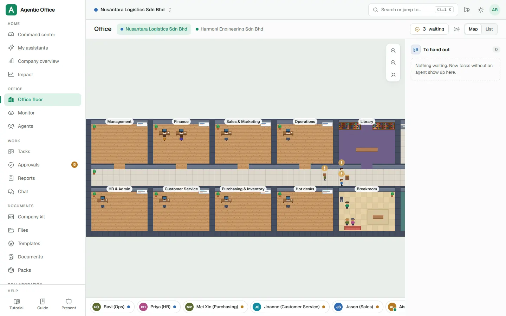
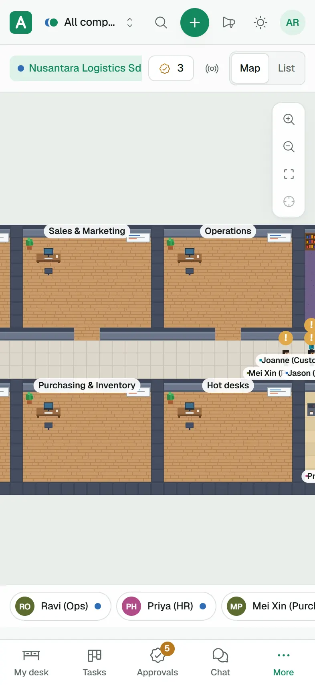

**On this screen**

1. **The live office**: The live office: each agent at its desk, showing what it is doing.
2. **Pick a company**: Pick the company whose office you want to see.

**What you can do here**

- Switch company with the tabs at the top, and switch between **Map** and **List**.
- Zoom in and out, or click **Fit the office**.
- Click an agent to open its panel: **Give a task**, **Browse for me**, **Pause** or **Profile**.
- Hand out new tasks that have no agent yet: drag a card from **To hand out** onto an agent.
- See who is **Working**, **Waiting on you**, **In a meeting**, **In the breakroom**, **Stuck on an error** or **Paused**.

#### How to: See what an agent is doing

_Agent: Click an agent at its desk: its side panel opens._

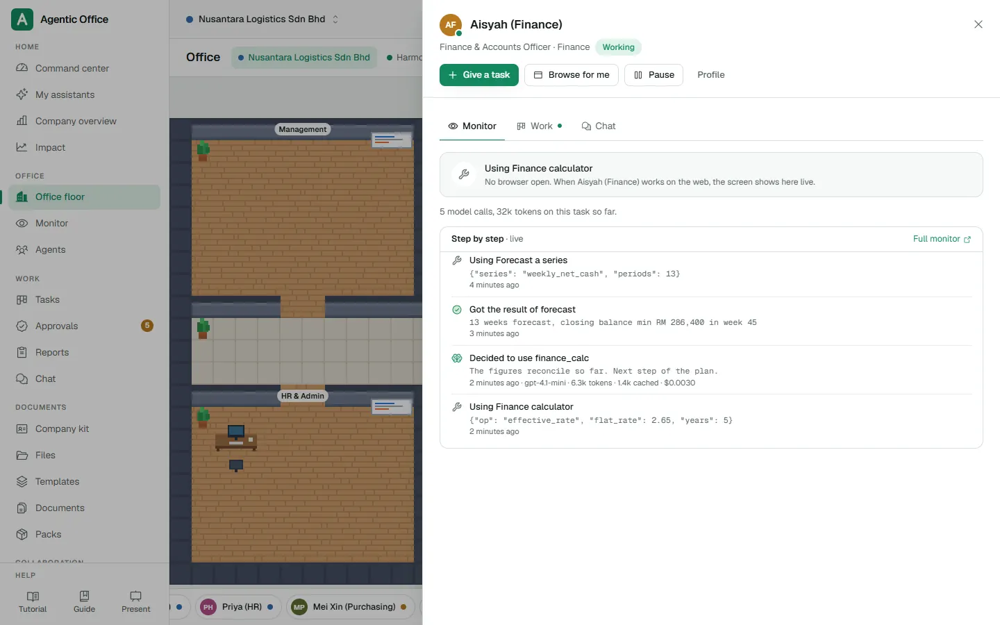

1. Pick the company at the top. _(box 2)_
2. Click an agent at its desk. Its panel opens on the side. _(box 1)_
3. The **Monitor** tab shows its live steps; **Work** shows what it is working on and what it produced.
4. Anything waiting on you is pinned at the top of the panel. Decide it right there.

#### How to: Hand a task to an agent

1. New tasks without an agent wait in the **To hand out** tray.
2. Drag a card onto an agent, or use **Assign to…**. _(box 1)_
3. The task is assigned and started at once.

**Tips**

- On a phone, tap an agent in the strip along the bottom to move the view to it.
- Agents you can only watch cannot be given tasks.

**Who can use it:** Everyone who can sign in. What you can change depends on your role.

**Related:** [Monitor](#monitor) · [Agents](#agents) · [Tasks](#tasks)

### Monitor

Opens at `/monitor`.

Watch agents work live: their steps, every tool they use, and their browser screen.

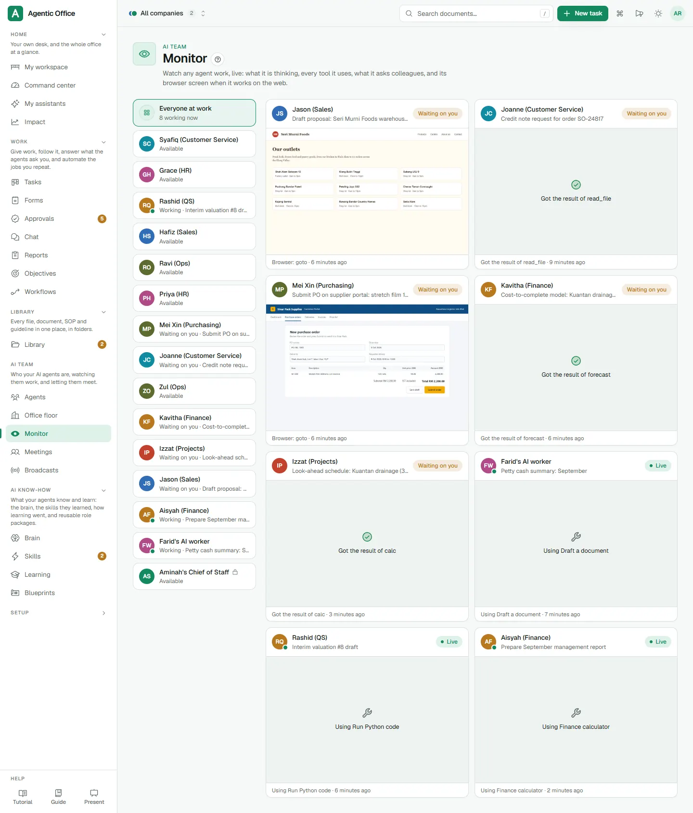
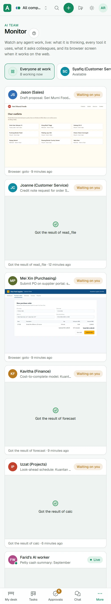

**On this screen**

1. **Agents working now**: Everyone at work, and each agent. Pick one to follow it.
2. **Live screen and steps**: The agent's live screen and its steps as they happen.

**What you can do here**

- See **Everyone at work** as a wall of live screens, refreshed every 2 seconds.
- Pick one agent to see its current task, its live screen and a **Step by step** list.
- See what it cost in the last 24 hours and which helpers are on the job.

#### How to: Follow one agent live

1. Pick the agent in the list. _(box 1)_
2. Watch its screen and the **Step by step** list update as it works. _(box 2)_
3. Click **Profile** to open the agent's own page.

**Tips**

- An eye icon means you can only watch that agent; a lock means it is private.
- When nobody is working, the wall says **Nobody is working right now**.

**Who can use it:** Everyone who can sign in. What you can change depends on your role.

**Related:** [Office floor](#office-floor) · [Agents](#agents) · [Tasks](#tasks)

### Agents

Opens at `/agents`.

Your AI team: create agents, place them in a department, set what they may do, and see who reports to whom.

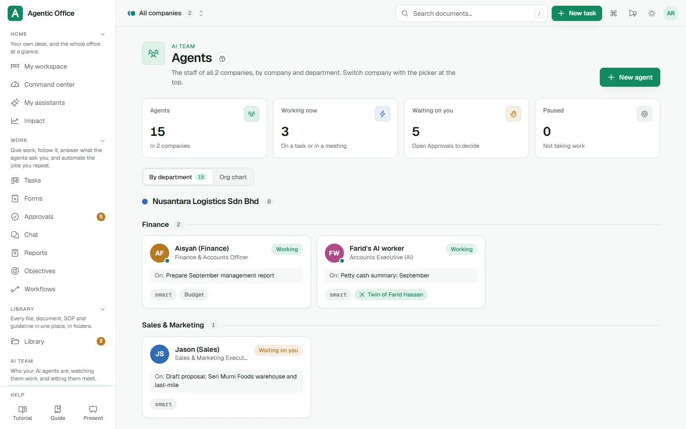
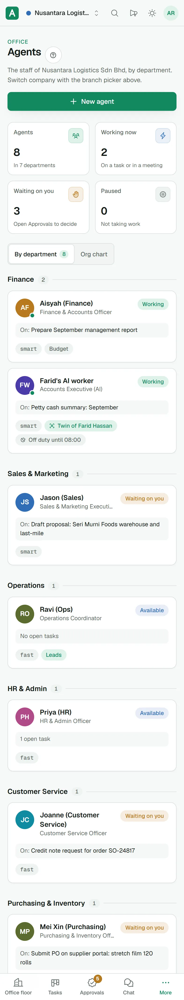

**On this screen**

1. **New agent**: Start the six-step agent builder.
2. **An agent card**: An agent: its model, role and pills such as **Auto** or **Budget**.
3. **Org chart view**: Switch to the org chart to see and change who reports to whom.

**What you can do here**

- Create an agent in six steps with **New agent**: template, placement, identity, SOPs, permissions and review.
- Browse agents **By department** or as an **Org chart**.
- Open an agent to chat, give tasks, set its budget, edit its permissions and SOPs, or pause and retire it.
- Change who reports to whom by dragging in the org chart.

#### How to: Create an agent

_New: Click New agent: the builder (/agents/new)._

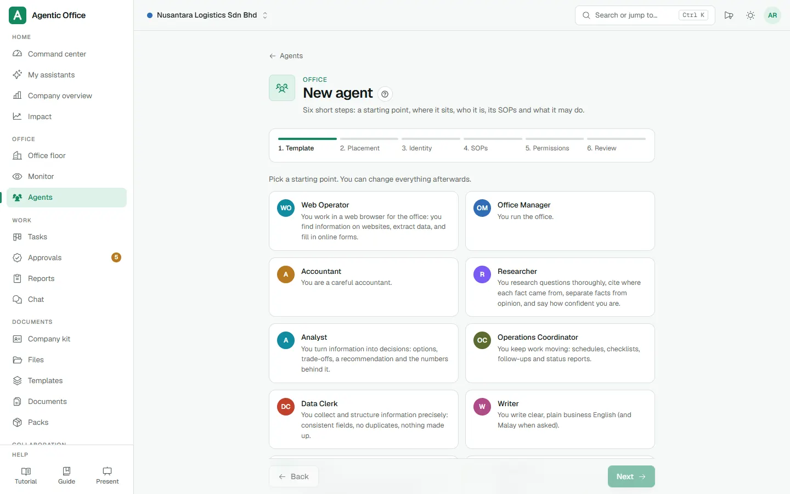

1. Click **New agent**. _(box 1)_
2. **Template**: pick a ready-made role, or **Blank agent**.
3. **Placement**: choose the company and department it works in.
4. **Identity**: give it a name, a job title, a colour and its way of working.
5. **SOPs**: the company and department SOPs apply by themselves; tick any extra ones from the library.
6. **Permissions**: pick a model group and set each tool to **Allow**, **Ask me** or **Never**.
7. **Review** what the agent will be told, then click **Create agent**.

#### How to: Set a budget for an agent

_Detail: Click an agent card: its detail page._

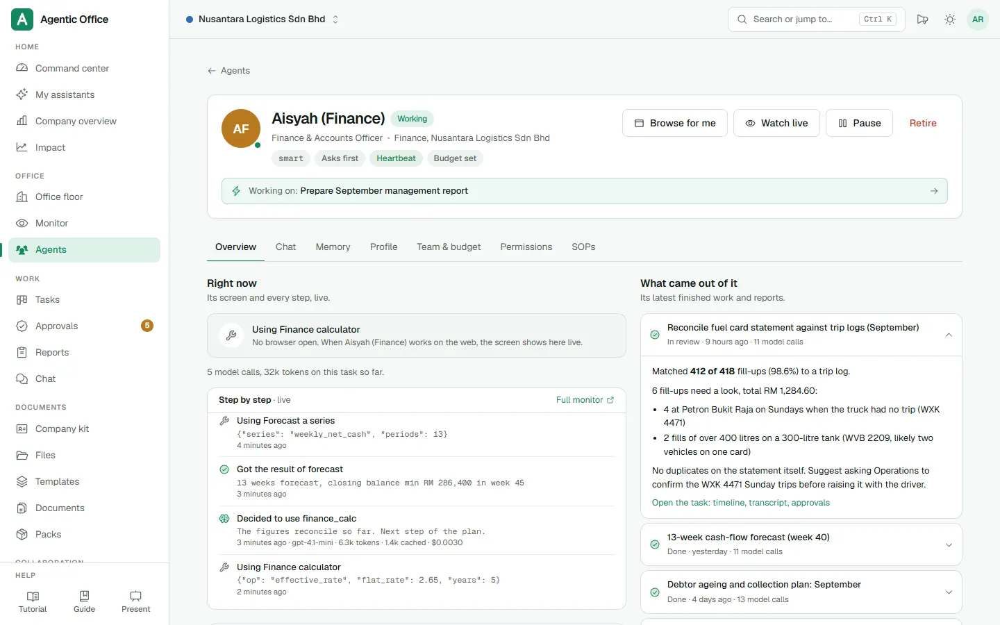

1. Click an agent card to open it. _(box 2)_
2. Open the **Team & budget** tab.
3. Fill in **Tokens per day** or **US dollars per month** and click **Save**.
4. At 80% you get a warning; at 100% the agent pauses and asks you.

#### How to: Change who reports to whom

1. Click **Org chart**. _(box 3)_
2. Drag an agent onto its new manager, or use the **Reports to** menu.
3. An agent cannot report to someone below it.

**Tips**

- **Ask me** means the agent stops and asks you before using that tool. **Never** removes the tool completely.
- **Work on auto** lets Ask-me tools run without asking, except high-risk ones.
- Retired agents leave the roster, but their past tasks and history stay.
- Staff have one AI twin instead of a New agent button.

**Who can use it:** Everyone can see agents. Owners, admins, branch managers and heads of department create and change them; staff have their own twin.

**Related:** [Blueprints](#blueprints) · [SOPs](#sops) · [Office floor](#office-floor) · [Chat](#chat)

---

## Work

### Tasks

Opens at `/tasks`.

A board of everything your agents are working on, from new to done.

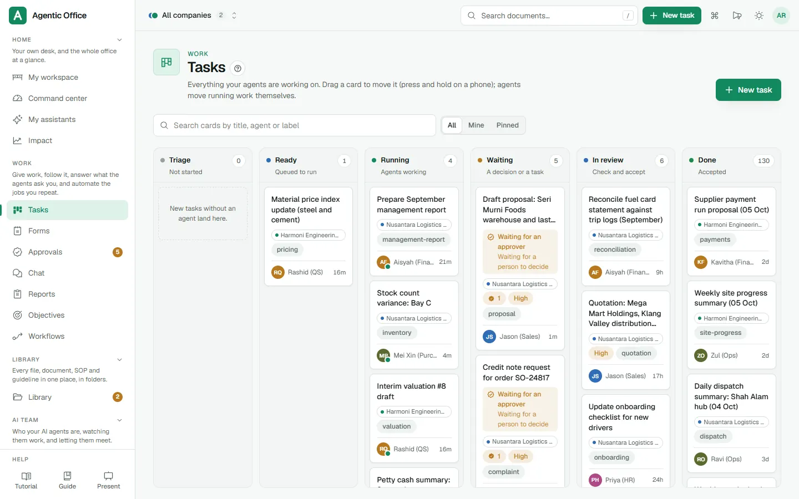
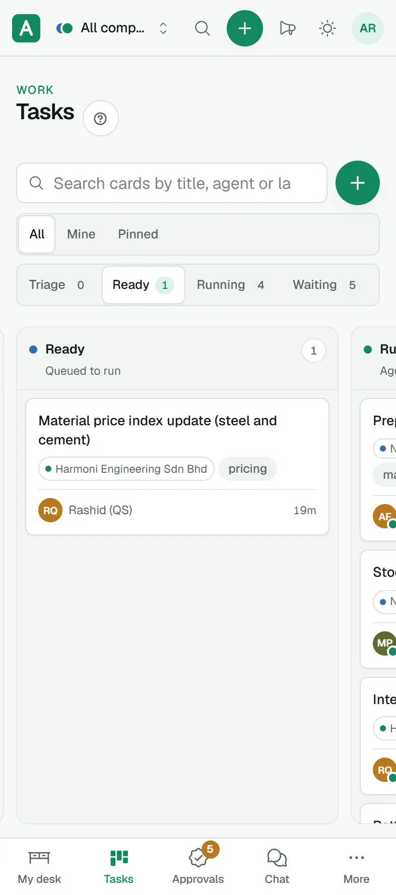

**On this screen**

1. **New task**: Create a new task.
2. **Board columns**: The board: each column is a stage of the work.
3. **A task card**: One task: title, agent, priority and labels. Click it to open.
4. **Search**: Filter by title, agent or label.

**What you can do here**

- Create a task with **New task**: say what you need, pick how (a task, web research, a website or a workflow), who does it and when (now or on repeat).
- Follow every task through the columns: **Triage**, **Ready**, **Running**, **Waiting**, **In review** and **Done**.
- Drag a card between columns, for example from **In review** to **Done**.
- Open a card to see its plan, result, sub-tasks, timeline and the self-check.
- **Accept**, **Send back**, **Start**, **Retry**, **Cancel** or **Delete** a task, and call a **Meeting** about it.
- Search by title, agent or label, and retry all failed tasks at once.

#### How to: Find your own cards, pin them, and share a task

1. Type in the search box to find cards by title, agent or label. _(box 4)_
2. Choose **Mine** for the work you gave or your own AI does, or **Pinned** for the cards you pinned to your workspace.
3. Open a card and press **Pin to my workspace**: it stays on your workspace for one-click access.
4. Managers and owners: under **Who can see it**, share the task with its department, the whole company or everyone. Others can look at it but not change it.

#### How to: Give a task

_New: Click New task: the task composer opens (what you need, how, who and when)._

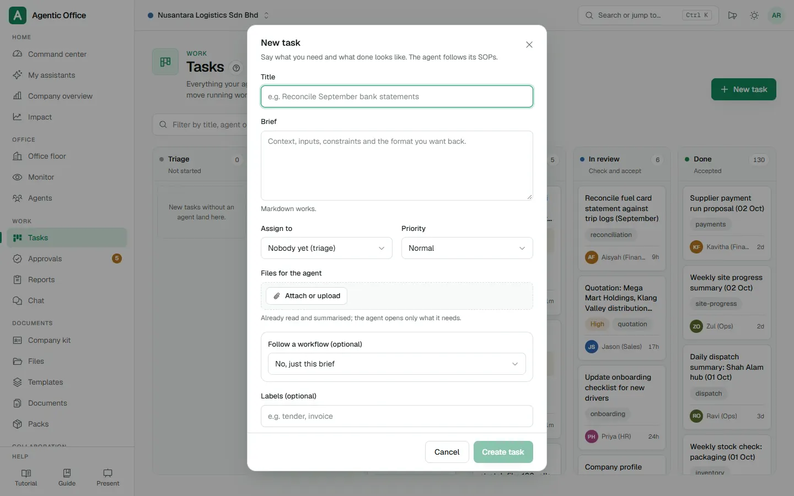

1. Click **New task** in the header, or **Give a task** from an agent, the office or a chat. The task composer opens. _(box 1)_
2. Under **What do you need?**, type or speak what you need and what done looks like.
3. Pick **How**: a general task, **Research the web**, **Browse a website** or **Follow a workflow**.
4. Pick **Who** does it, and under **When** choose **Now** or **Repeat** to put it on a schedule.
5. Open **More options** for files, priority and review, then click **Start task**.

#### How to: Check and accept a result

_Sheet: Click a task card: its sheet with plan, result and timeline._

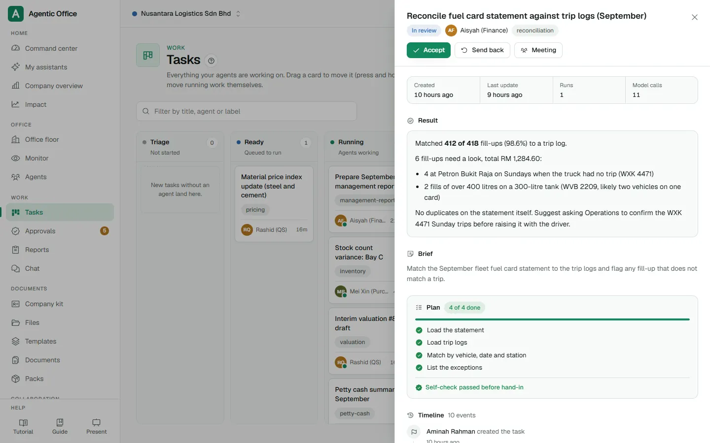

1. Find the card in the **In review** column. _(box 2)_
2. Click the card to open it, and read the **Result**. _(box 3)_
3. Click **Accept** if it is right. The task moves to **Done**.
4. If not, click **Send back**, write what should change, and the agent works on it again.

#### How to: Find a task quickly

1. Type part of the title, the agent's name or a label in the search box. _(box 4)_
2. Only matching cards stay on the board.

**Tips**

- **Running** and **Waiting** are moved by agents; you move the other columns.
- The plan shows if the self-check passed, or what it caught and fixed before hand-in.
- On a phone, press and hold a card to drag it, or use the column switcher.
- Deleting a task keeps the reports and files it produced.
- Open a task's **More** menu to **Reassign** it, **Run again**, **Repeat on a schedule**, or **Turn into a workflow** from how it was done.

**Who can use it:** Everyone can see tasks. Creating and acting on tasks needs a role that can create work (not approver or viewer).

**Related:** [Approvals](#approvals) · [Reports](#reports) · [Meetings](#meetings) · [Workflows](#workflows)

### Approvals

Opens at `/approvals`.

Decisions your agents are waiting on: tools they want to use, questions, and budgets that ran out.

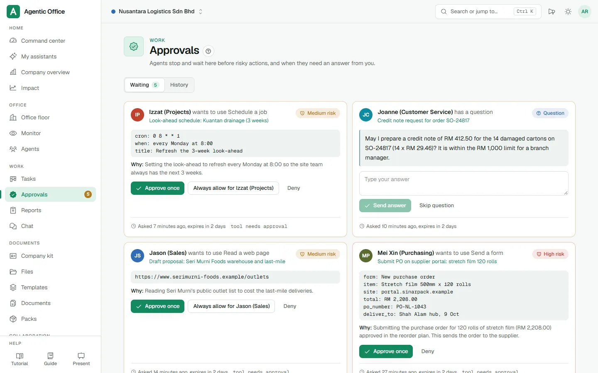
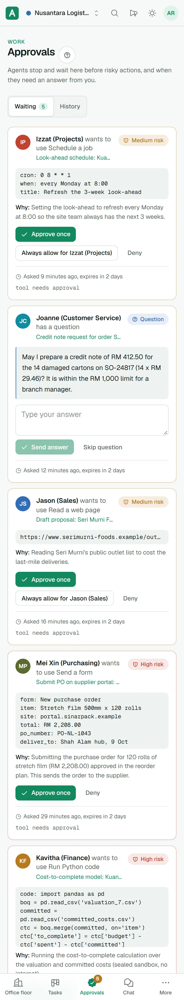

**On this screen**

1. **A decision waiting**: A decision waiting: who asks, what for, the risk and why.
2. **Approve, always or deny**: Approve once, always allow, or deny.
3. **History**: Every past decision, who made it and when.

**What you can do here**

- See what is waiting in **Waiting**, and past decisions in **History**.
- For a tool request: **Approve once**, **Always allow** that agent, or **Deny** with a reason.
- For a question: tap a suggested answer or type your own, then **Send answer**.
- For a budget stop: **Allow more** or **Stop the task**.
- Decide from a phone notification too: it opens a one-screen page for that decision.

#### How to: Approve or deny a request

1. Read the card: which agent, which tool, and **Why**. _(box 1)_
2. Click **Approve once** to let it do this one thing. _(box 2)_
3. Or click **Always allow** so that agent need not ask again for this tool.
4. Or click **Deny** and, if you like, write a reason. The agent reads it.

#### How to: Look back at a decision

1. Open the **History** tab. _(box 3)_
2. Each card shows what was decided, by whom and when.

**Tips**

- **Always allow** is not offered for high-risk requests: those are asked every time.
- Turn on phone notifications in Channels to decide from anywhere.

**Who can use it:** Everyone can see approvals. Owners, admins, managers, supervisors, staff and approvers can decide.

**Related:** [Tasks](#tasks) · [Channels](#channels) · [Activity](#activity)

### Forms

Opens at `/forms`.

The company's own forms in one place: claims, advances, monthly records, requests and yearly counts. Each has its blank to download and a window to hand it in. Fill it yourself, or let your AI worker fill it from what you tell it and the receipts you attach.

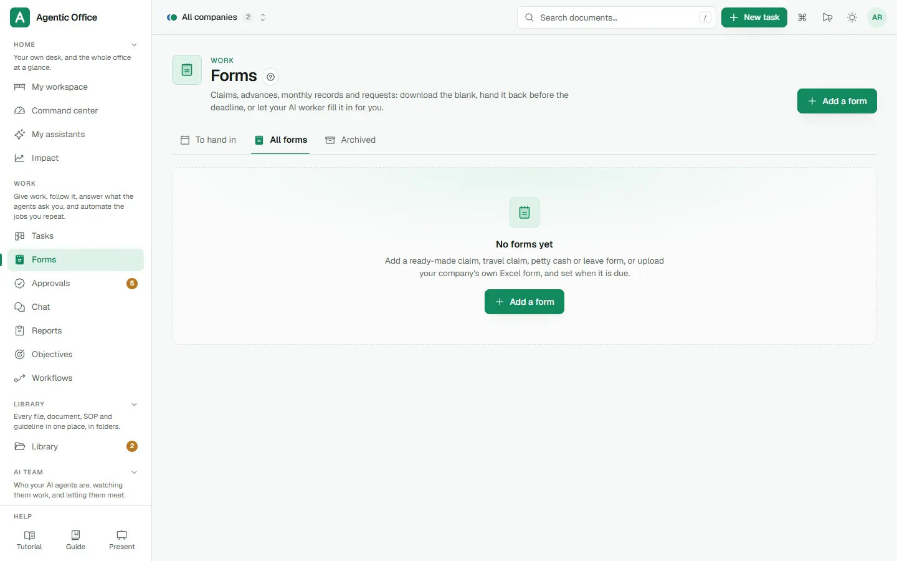
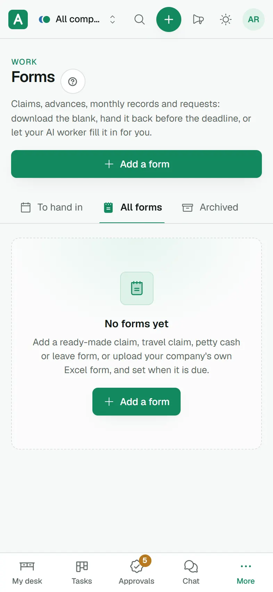

**On this screen**

1. **To hand in and all forms**: **To hand in** lists what still needs you; **All forms** lists every form for you; managers also see **Archived**.
2. **The company's forms**: Each form shows when it is due, where you stand, and buttons to download, hand in or ask your AI.

**What you can do here**

- See what you still have to hand in under **To hand in**, most urgent first: late, due soon, returned to fix, then open.
- Click **Download blank** for the company's own form, fill it in and hand it back with **Hand in**, with receipts, photos or any other files.
- Click **Ask AI to fill it**: say what goes in and attach receipts. Your AI worker fills the company's form, keeping its layout and formulas, and leaves it as your draft.
- Managers: **Add a form** from the ready-made ones (expense claim, travel claim, petty cash, leave, item request, attendance, stock count) or upload your own Excel, Word or PDF form, and set when it opens and is due.
- Managers: see **Who handed in** each round, open their files, **Accept** them or **Return** them with what to fix.

#### How to: Hand in a claim before the deadline

_Handin: Click Hand in on a form: upload the filled form and receipts._

1. Open **To hand in** and find the form. Its pill says **Open**, **Due soon** or **Late**. _(box 2)_
2. Click **Download blank** and fill it in on your computer or phone.
3. Click **Hand in**, choose the filled form and your receipts or photos, and add a note if you like.
4. Click **Hand in** again. Your manager sees it straight away, and it shows **Handed in**.

#### How to: Let your AI worker fill it in

_Ask: Click Ask AI to fill it on a form._

1. Click **Ask AI to fill it** on the form. _(box 2)_
2. Write what goes in, for example each trip with its date and amount, and attach the receipts.
3. Your AI worker reads the company's form and fills it in. It comes back as **AI draft to check**.
4. Open the draft, check every line, then click **Check and hand in**. Nothing is handed in until you do.

#### How to: Add a form and see who handed in

1. Click **Add a form**. Pick a ready-made one and click **Add**, or switch to **Our own form** and upload yours.
2. Set **When it is handed in**: every month between two days, every year in a month, once by a date, or whenever needed.
3. Pick the company and who fills it in: everyone, or one department. They see it under Forms and on their workspace. _(box 1)_
4. Click **Who handed in** on the form. **Accept** each one, or **Return** it with what to fix.

**Tips**

- A form that runs into the next month, for example from the 30th to the 3rd, counts for the month it opened in.
- A missed round stays on the list as **Late** for a few days, so it is not forgotten.
- Everything handed in is also kept in the person's workspace files, so the AI and managers can search inside it.

**Who can use it:** Everyone sees the forms for their company and department. Owners, admins and managers add forms and review them.

**Related:** [My workspace](#my-workspace) · [Library: Browse](#library-browse) · [My AI](#my-ai) · [Tasks](#tasks)

### Reports

Opens at `/reports`.

What agents wrote up for you: a summary first, then tables you can sort, filter and download.

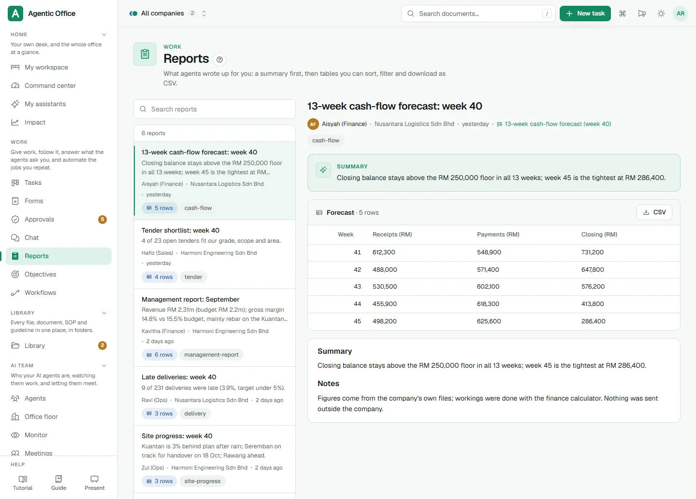
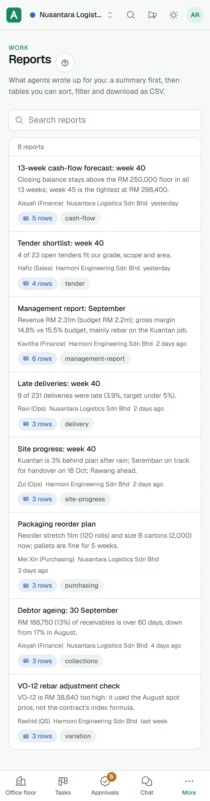

**On this screen**

1. **Reports agents wrote**: Every report agents wrote, newest first.
2. **Search**: Search reports by title.

**What you can do here**

- Search reports by title.
- Open a report to read its **Summary** and tables.
- Sort a table by clicking a column, filter long tables, and download a table as **CSV**.
- Jump to the task that produced the report.

#### How to: Download a table to Excel

1. Find the report in the list, or search for it. _(box 2)_
2. Click it to open. _(box 1)_
3. Click **CSV** above the table. The file opens in Excel or Google Sheets.

**Tips**

- New reports appear in the list by themselves while the page is open.

**Who can use it:** Everyone who can sign in. What you can change depends on your role.

**Related:** [Tasks](#tasks) · [Company overview](#company-overview) · [Documents](#documents)

### Chat

Opens at `/chat`.

Talk to any agent directly. The chat opens full screen, with your conversations beside it and a wide, easy-to-read column. When something needs doing, turn a reply into a task.

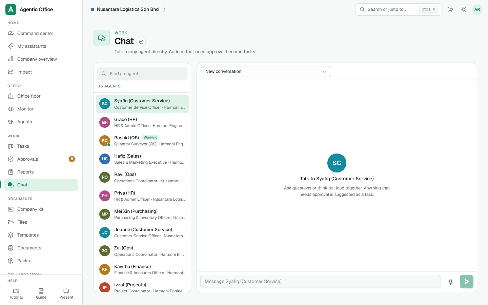
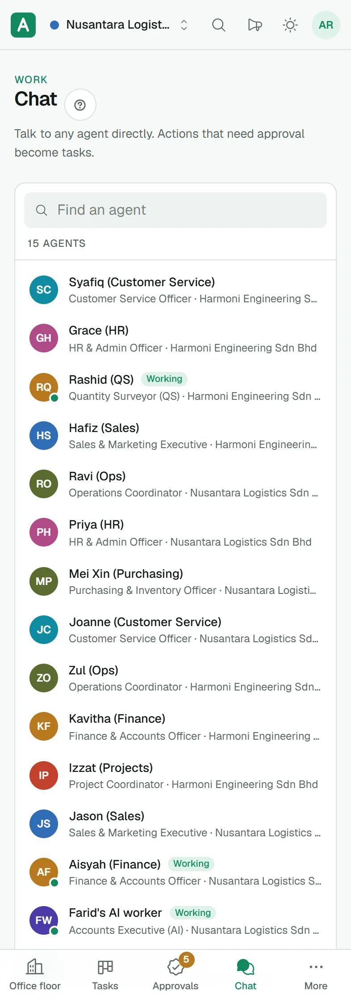

**On this screen**

1. **Pick an agent**: Pick the agent you want to talk to.
2. **Type, or hold the microphone**: Type your message, or use the microphone.

**What you can do here**

- Pick an agent, or pick up a recent conversation: the chat opens full screen, with your conversations beside it. **Back** or Esc returns you.
- Read each reply in a wide column, with the tools it used shown underneath.
- **Copy** a reply, or click **Make this a task** to hand the work to the agent.
- Give the agent work without leaving the chat with **Give a task**.
- Speak instead of typing: click the microphone, talk, and your words appear in the box.
- Start a **New** conversation, switch between conversations, or delete one.

#### How to: Ask an agent something

_Conversation: Pick an agent: the full-screen conversation opens._

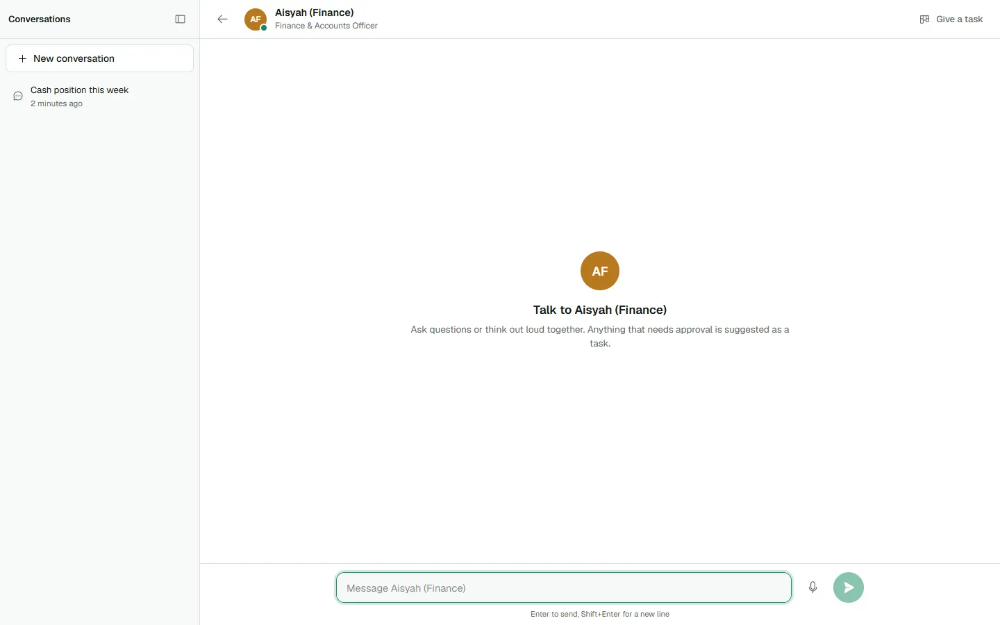

1. Pick the agent, or a recent conversation. It opens full screen. _(box 1)_
2. Type your message and press Enter. Shift+Enter starts a new line. _(box 2)_
3. Under each reply you see which model answered and which tools it used. **Copy** it if you like.

#### How to: Speak instead of typing

1. Click the microphone next to the message box. _(box 2)_
2. Speak, then click **Stop**. Your words appear in the box.
3. Check the text and press Enter to send. Nothing is sent by itself.

#### How to: Turn a reply into a task

1. Click **Make this a task** under the agent's reply.
2. The task composer opens with the agent and the reply filled in. Check it, then **Start task**. Tasks made here show as live cards in the chat.

**Tips**

- Anything that needs approval is suggested as a task instead of done in chat.
- Voice needs a speech-to-text model; an admin adds one in AI Engine.

**Who can use it:** Everyone can open chat. Writing to agents needs a role that can create work.

**Related:** [Tasks](#tasks) · [Agents](#agents) · [My assistants](#my-assistants)

---

## Documents

### Company kit

Opens at `/company-kit`.

The Library's Company kit tab: each company's facts that every document reuses: legal name, registration, address, bank, signatory, logo.

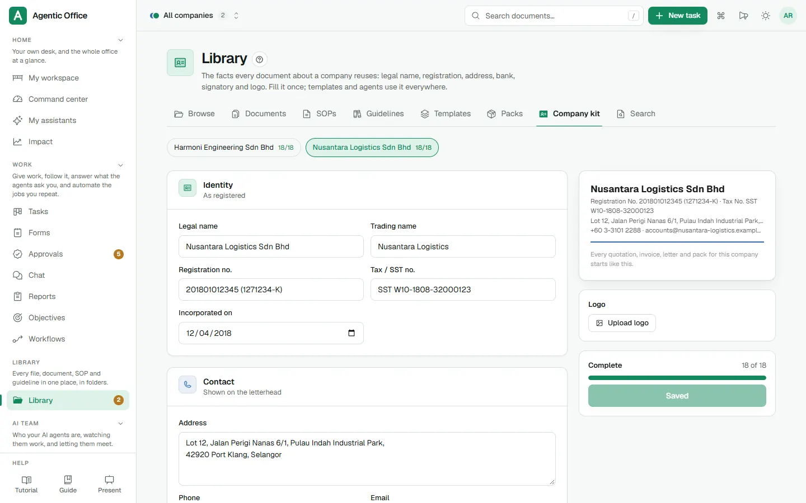
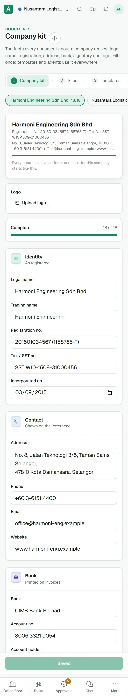

**On this screen**

1. **Company facts**: The company facts every document reuses.
2. **Save**: Save the kit.

**What you can do here**

- Pick a company and fill in its identity, contact, bank, people, money and brand details.
- Upload the company logo and see a live letterhead preview.
- Add your own facts under **More facts**; templates can use them.
- See how complete the kit is.

#### How to: Fill in a company kit

1. Pick the company at the top.
2. Fill in the cards: identity, contact, bank, people, money and brand. _(box 1)_
3. Click **Upload logo** and check the letterhead preview.
4. Click **Save kit**. Every new quotation, invoice and letter for this company uses these facts. _(box 2)_

**Tips**

- Fill in the kit first: documents and packs pull from it.
- Only admins and the company's manager can change it.

**Who can use it:** Everyone can read it. Admins and that company's manager can change it.

**Related:** [Templates](#templates) · [Documents](#documents) · [Library: Browse](#library-browse)

### Library: Browse

Opens at `/files`.

The Library's Browse tab: every file in folders, one place per company for all its documents. Drop a whole folder or zip and its folders are kept, every file is read and sorted, and how-to documents go to the guidelines for agents.

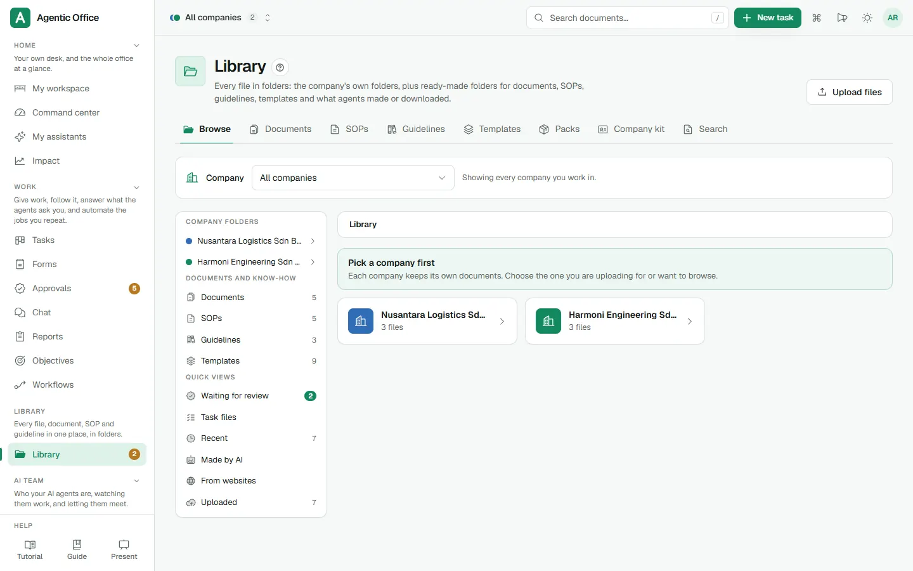
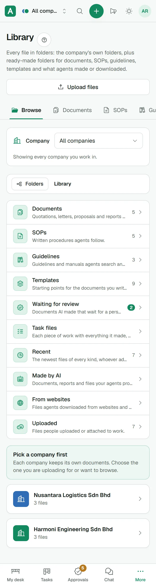

**On this screen**

1. **Pick the company**: The company these documents belong to. Uploads and downloads are for this company only.
2. **Upload files, folders or a zip**: Drop files, a whole folder or a zip here, or choose them.
3. **Upload report**: One upload: its progress, then its report with flagged files and AI suggestions.
4. **Folders**: The company's folders, with file counts and held-back files.
5. **Search and filters**: Search, and filter by department or kind.
6. **Files**: The files in the folder, with kind, department, status and library.
7. **Download a folder**: Download the folder you are in as a zip.
8. **Download everything**: Download every file this company has as a zip.
9. **Use as a guideline**: Make a file a guideline agents search and cite.
10. **Search inside every document**

**What you can do here**

- Pick the company under **Company**, then drop files, whole folders or a .zip on the upload area.
- Follow each upload as it is unpacked, read and sorted, then read its report: what was found, what went to the library and what was held back.
- Browse the company's folders, search, filter by kind or department, or group the list **By kind** or **By department**.
- Open a file to see a preview, its summary, kind, department and folder, and change any of them.
- Download one file, a folder, everything for the company, or just the files you ticked, as a zip.
- Turn a procedure into an SOP or a workflow with **Make an SOP** or **Build a workflow**.
- Managers: **Release** a held-back file after checking it, or **Hold back** one yourself.

#### How to: Company documents: where to upload

1. Open **Library**, stay on **Browse**, and pick the company under **Company**. _(box 1)_
2. What to upload: SOPs, guides, checklists, flowcharts, forms, templates, certificates and contracts. A whole zip of the company's documents is fine.
3. Drop the zip, the files or a whole folder on the upload area, or click **Choose files** or **Choose a folder**. _(box 2)_
4. Wait while it shows **Unpacking**, **Reading** and **Sorting**. You can leave the page; the work carries on.
5. When it shows **Ready**, read the report: files by kind and department, how many went to the library, and what was held back. _(box 3)_

#### How to: What happens to an upload by itself

1. Folders are kept as they were, so a file in TENDER/CARTA ALIR stays in that folder. _(box 4)_
2. Every file is read (scans too), given a kind such as SOP, form or certificate, and matched to a department.
3. How-to documents such as SOPs, guides and checklists go to the library, so agents search them and cite the page.
4. Files with passwords or staff ID numbers are **Held back**: kept and downloadable, but agents cannot read them until a manager checks them and clicks **Release**.

#### How to: View or download a file, a folder or everything

_Sheet: Click a file: its preview and what was read from it._

1. Pick a folder on the left, or tap **Folders** on a phone. _(box 4)_
2. Click a file to open it: a preview, what it is and where it sits. **Download** gives you the original. _(box 6)_
3. Click **Download folder** to get the folder you are in as a zip. _(box 7)_
4. Click **Download everything** to get all of the company's files. _(box 8)_
5. To download a few, tick them and click **Download zip**.

#### How to: Turn a procedure into an SOP or a workflow

_Sheet: Click a file: its preview and what was read from it._

1. Open the document, or tick several that belong together.
2. Click **Make an SOP** for written steps agents follow, or **Build a workflow** to run the job step by step.
3. Check the draft before you save it. The upload report also lists **AI suggestions** you can start from.

#### How to: Make a file a guideline

_Sheet: Click a file: its preview and what was read from it._

1. Click the file to open it.
2. Turn on **Use as a guideline (library)**. _(box 9)_
3. Pick **Who it is for**. Agents in that scope now search it and cite the page they used.

#### How to: Search inside every document

1. Click the search box at the top of any page, or press **/**, and start typing. On a phone, tap the magnifier. _(box 10)_
2. Pick a suggestion: a word from your own documents, a title, a heading, or one of your recent searches. The ↑ ↓ and Enter keys work too.
3. Press Enter for **Search all documents**: every file page by page, SOPs, documents, templates and wiki pages, with the matching words marked.
4. Put words in quotes for an exact phrase, like "load system calculation". Amounts and dates work as people write them: RM700, RM 700.00, 16hb. Reference numbers, like a PO or tender number, complete as you type.
5. Click a result: a file opens in the Library at the page that matched. You only find what you may open, and never a held-back file.

**Tips**

- A held-back file never reaches agents until a manager releases it. The report says why in plain words and never shows the secret itself.
- Deleting a file shows it as missing in any pack that uses it.
- Certificates show **Valid until**, so you can renew them in time.

**Who can use it:** Everyone can browse and download. Uploading and changing files needs a role that can create work; releasing held-back files needs a manager.

**Related:** [Guidelines](#guidelines) · [SOPs](#sops) · [Workflows](#workflows) · [Packs](#packs)

### Templates

Opens at `/templates`.

The Library's Templates tab: quotations, invoices, letters, proposals and your own Word files, with {{placeholders}} that agents and people fill in.

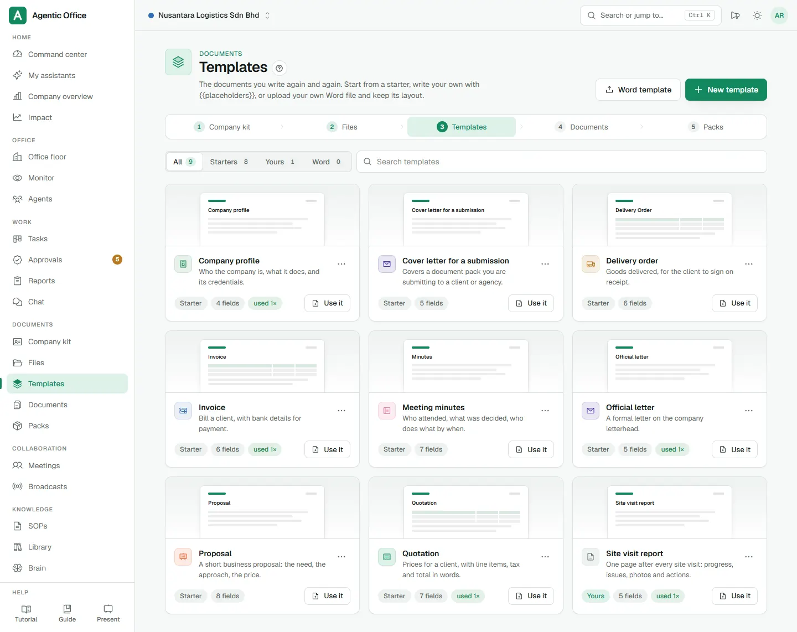
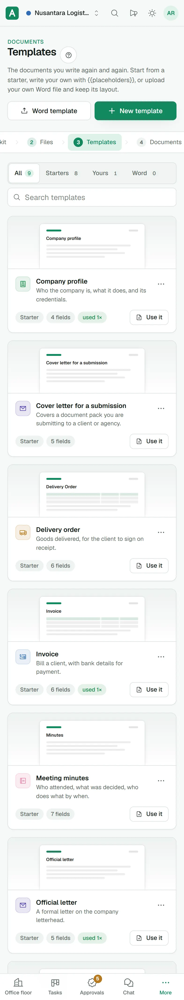

**On this screen**

1. **New template**: Make a new template.
2. **Templates**: Starter templates and your own.

**What you can do here**

- Use a starter template, or make your own with **New template**.
- Upload your own Word file with **Word template**; its layout is kept.
- Insert company facts with one click: company name, address, document number, line items, total and more.
- Mark which fields must be filled and what type they are.
- Start a document from a template with **Use it**.

#### How to: Make a template

1. Click **New template**. _(box 1)_
2. Give it a **Name**, pick a **Kind** and a **Number prefix**, such as QT.
3. Write the **Text**. Click the chips to insert company facts, the total or a signature block.
4. Check **Fields to fill**: they are found from the {{placeholders}}. Mark the ones that are required.
5. Click **Save template**.

#### How to: Use your own Word file

1. Click **Word template** and pick a .docx file.
2. Give it a name and click **Make template**. To change the text later, edit it in Word and upload again.

**Tips**

- Document numbers count up by themselves, such as QT-2026-0001.

**Who can use it:** Everyone who can sign in. What you can change depends on your role.

**Related:** [Documents](#documents) · [Company kit](#company-kit) · [Packs](#packs)

### Documents

Opens at `/documents`.

The Library's Documents tab: documents drafted by people or agents, checked automatically, approved, and exported to PDF, Word or Excel.

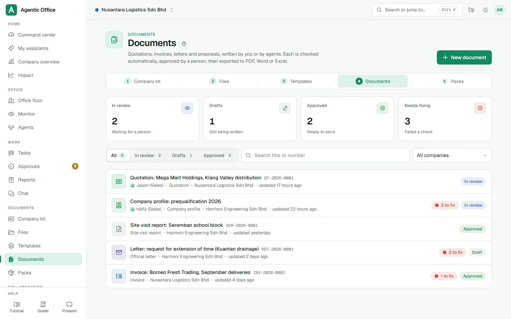
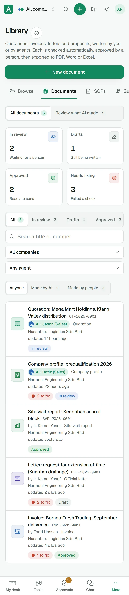

**On this screen**

1. **New document**: Create a new document.
2. **Documents and their checks**: Every document, its status and how many checks need fixing.

**What you can do here**

- Create a document: **Write it with AI**, start from a **Blank page**, or pick a template.
- Fill fields by hand, or with **Fill with AI** from a description or a file.
- Rewrite a selected part: shorter, more formal, friendlier, fix grammar, or translate to Bahasa Melayu or English.
- See checks: what must be fixed and what to look at. Ask for **Review with AI**.
- Send for review, approve (which locks it) and export to PDF, Word or Excel.
- Go back to an earlier version in **History**.

#### How to: Draft a quotation with AI

_Editor: Open a document: the editor with fields and preview._

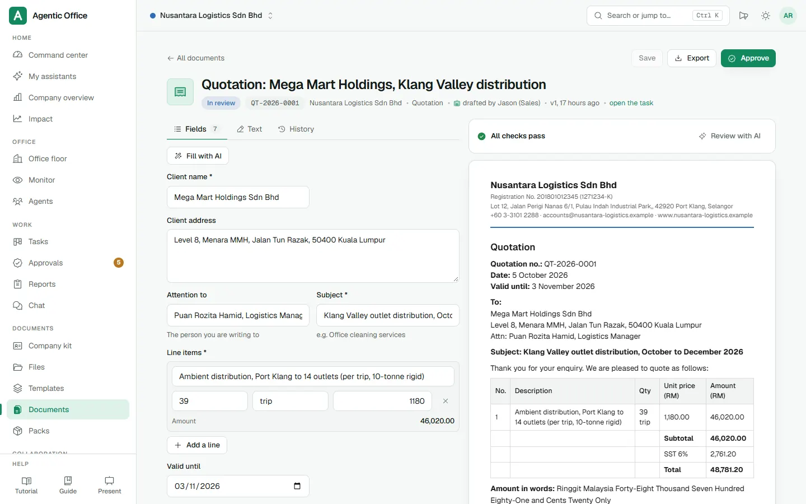

1. Click **New document**. _(box 1)_
2. Pick the **Company**, and under **Start from** pick the quotation template.
3. Describe what it should say, and attach a file to work from if you have one.
4. Click **Create and fill**. The editor opens with fields and a preview on the letterhead.
5. Check every fact, fix anything the checks flag, and click **Save**.

#### How to: Approve and send a document

1. Open the document from the list. _(box 2)_
2. Click **Send for review**. A person with approval rights clicks **Approve** once all checks pass.
3. Use **Export** to download a PDF, Word or Excel file.

**Tips**

- AI uses only what you wrote and the files you attached; it never invents facts. Still check every fact before you send it.
- Approved documents are locked. Click **Reopen** to change one.
- Ctrl+S (Cmd+S on a Mac) saves.

**Who can use it:** Everyone can draft. Approving needs a role that decides approvals.

**Related:** [Templates](#templates) · [Company kit](#company-kit) · [Packs](#packs)

### Packs

Opens at `/packs`.

The Library's Packs tab: submission packs, such as for a tender, with a checklist matched to real files and documents, compiled into one PDF with a cover and contents.

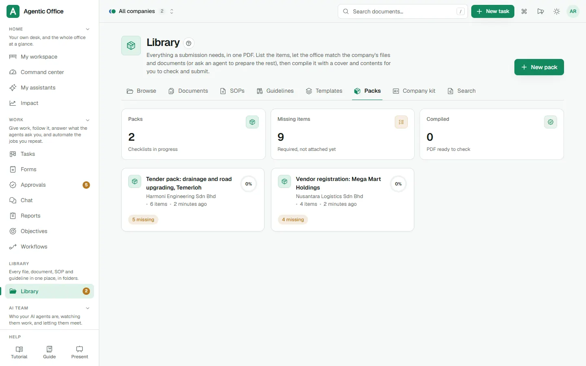
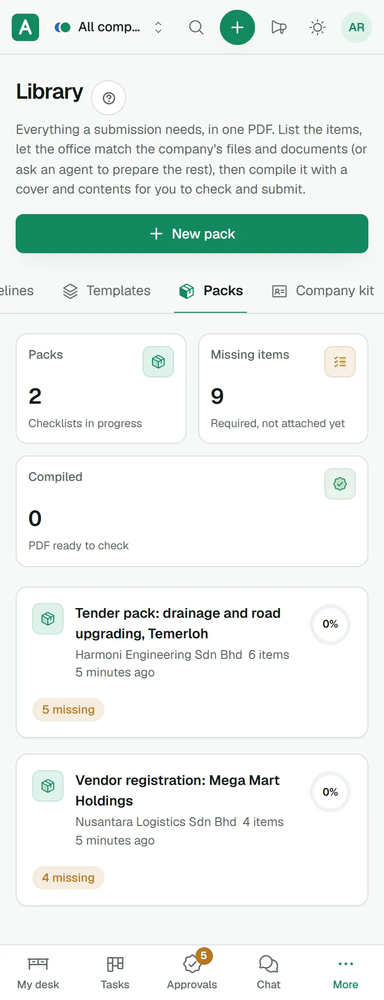

**On this screen**

1. **New pack**: Start a new submission pack.
2. **Packs and their progress**: Your packs and how ready each one is.

**What you can do here**

- Create a pack with a checklist, written by you or drafted with AI.
- Match items to files automatically with **Auto-fill from files**, then confirm each match.
- Draft missing documents, such as a cover letter, with **Draft it**.
- Ask an agent to prepare the pack.
- Compile one PDF with **Compile PDF**, then open or download it.

#### How to: Prepare a submission pack

1. Click **New pack**. _(box 1)_
2. Give it a **Title**, pick the **Company** and say what it is for.
3. Click **Draft it with AI** for a checklist, edit the items, then **Create pack**.
4. Click **Auto-fill from files** and **Confirm** each match. Use **Add file** or **Draft it** for what is missing.
5. When everything required is ready, click **Compile PDF**.

**Tips**

- The office prepares the pack; a person checks it and submits it. Agents never submit anything.
- Expired files are flagged in the checklist.

**Who can use it:** Everyone who can sign in. What you can change depends on your role.

**Related:** [Library: Browse](#library-browse) · [Documents](#documents) · [Company kit](#company-kit)

---

## Collaboration

### Meetings

Opens at `/meetings`.

Agents discuss a decision with each other and agree on one recommendation. You can watch and add a point.

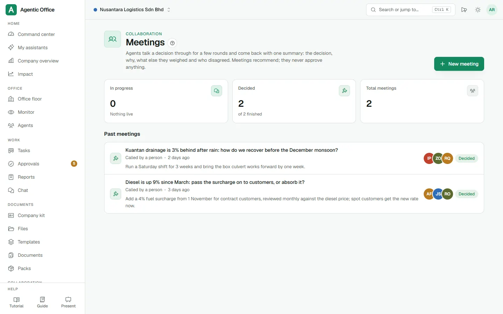
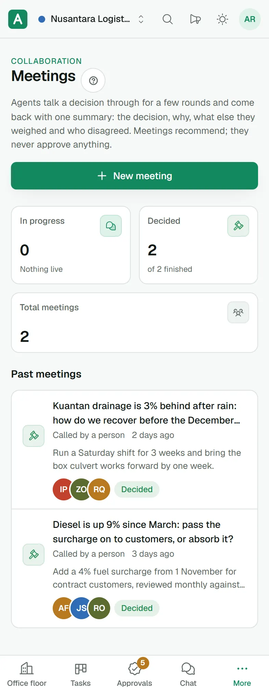

**On this screen**

1. **Meetings**: Meetings happening now and past meetings.
2. **Start a meeting**: Start a new meeting.

**What you can do here**

- Start a meeting: the question, 2 to 5 agents and 1 to 4 rounds.
- Watch the live transcript and add a point while it runs.
- Read the outcome: the decision, options weighed, dissent and next steps.

#### How to: Ask agents to decide something together

1. Click **New meeting**. _(box 2)_
2. Write **What should they decide?**
3. Pick 2 to 5 agents in **Who attends**. The first one you pick chairs.
4. Choose the number of **Rounds** and click **Start meeting**.
5. Open it from the list to follow the transcript and read the decision. _(box 1)_

**Tips**

- Meetings recommend; they never approve anything. Any action still goes through approvals.
- You can also start a meeting from a task with the **Meeting** button.

**Who can use it:** Everyone can read meetings. Starting one needs a role that can create work.

**Related:** [Tasks](#tasks) · [Brain](#brain) · [Approvals](#approvals)

### Broadcasts

Opens at `/broadcasts`.

Send one message to every agent, a company, departments or chosen agents, and see who received it.

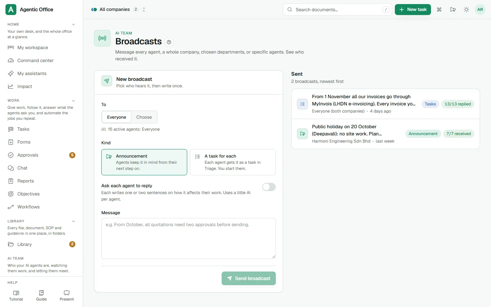
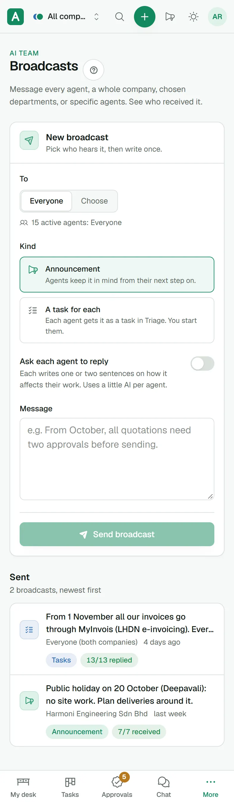

**On this screen**

1. **Write a broadcast**: Write and send a broadcast.
2. **Sent and acknowledged**: Sent broadcasts, and how many received them.

**What you can do here**

- Send to **Everyone**, or **Choose** companies, departments or individual agents.
- Send an **Announcement** agents keep in mind, or **A task for each** agent.
- Ask each agent to reply.
- See who received it, who replied and which tasks were made.

#### How to: Tell every agent about a change

1. In **New broadcast**, choose **Everyone** or pick who it is for. _(box 1)_
2. Pick **Announcement** and write the message.
3. Click **Send broadcast**.
4. Open it in the sent list to see who received it. _(box 2)_

**Tips**

- Announcements stay in each agent's mind for 30 days.
- With **A task for each**, the first line becomes the task title, and the tasks wait in Triage for you to start.

**Who can use it:** Everyone can read broadcasts. Sending needs a role that can create work.

**Related:** [Office floor](#office-floor) · [Tasks](#tasks) · [SOPs](#sops)

---

## Knowledge

### SOPs

Opens at `/sops`.

The Library's SOPs tab: written procedures your agents follow. Company and department SOPs apply by themselves; library SOPs are attached to chosen agents.

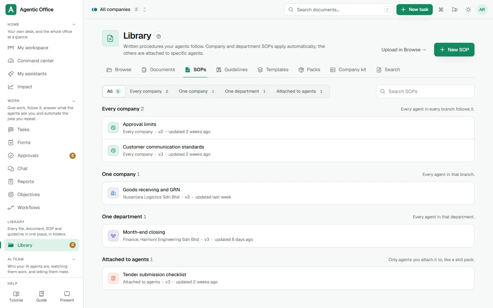
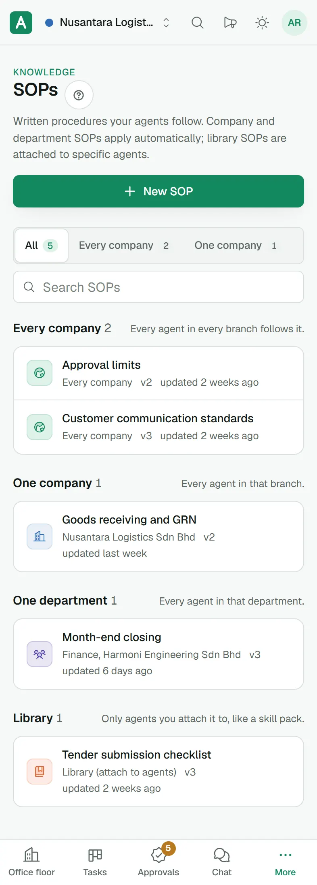

**On this screen**

1. **New SOP**: Write a new SOP.
2. **SOPs by scope**: SOPs grouped by who follows them.

**What you can do here**

- Write an SOP and choose who follows it: **Every company**, **One company**, **One department** or **Library**.
- Filter by who follows it, and search.
- Edit an SOP; every save becomes a new version.
- Delete an SOP; agents stop following it at once.

#### How to: Write an SOP

1. Click **New SOP**. _(box 1)_
2. Give it a **Title**, such as "Month-end close".
3. Under **Who follows it**, pick the scope and, if needed, the company or department.
4. Write the **Procedure**: purpose, steps, rules and output. Use **Preview** to check it.
5. Click **Create SOP**. Agents in scope follow it from their next step.

**Tips**

- Agents read SOPs before every step.
- You cannot change who follows an SOP after it is created; make a new one instead.

**Who can use it:** Everyone can read SOPs. Owners and admins write and change them.

**Related:** [Guidelines](#guidelines) · [Agents](#agents) · [Blueprints](#blueprints)

### Guidelines

Opens at `/library`.

The Library's Guidelines tab: guidelines, manuals and policies, plus every SOP. Agents search them when the work needs it and cite the page they used.

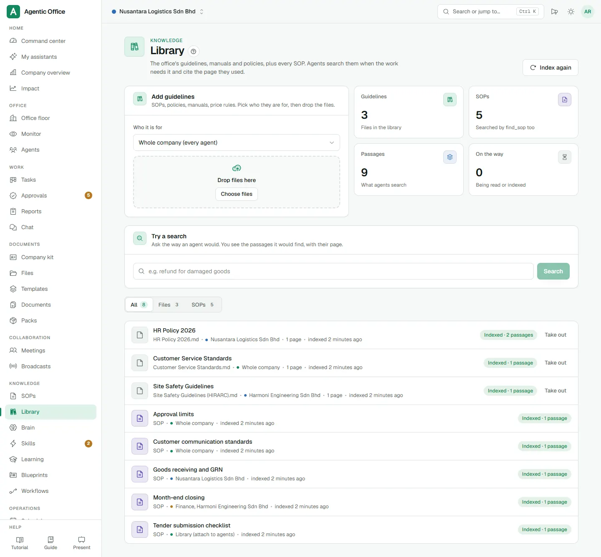
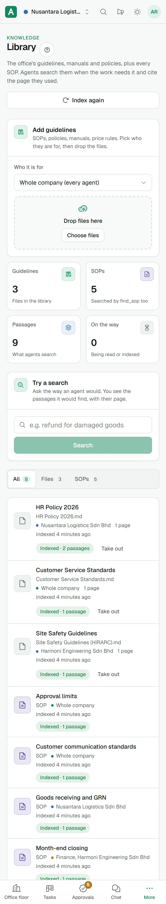

**On this screen**

1. **Upload guidelines**: Pick who it is for, then drop files.
2. **Sources and status**: Every guideline and SOP, and whether it is ready.
3. **Try a search**: Ask a question the way an agent would.

**What you can do here**

- Upload guidelines and choose who they are for: the whole company, one company or one department.
- See every source and whether it is ready (**Indexed**) or still being read.
- Try a search the way an agent would, and see the passage and citation it gets.
- Take a file out of the library; it stays in Files.

#### How to: Add a guideline

1. In **Add guidelines**, choose **Who it is for**. _(box 1)_
2. Drop the files. They show **Reading…**, then **Indexed** when agents can search them. _(box 2)_

#### How to: Check what an agent will find

1. Type a question in **Try a search** and click **Search**. _(box 3)_
2. Each result shows the page, heading and citation. Strong matches are marked **Agents get this unasked**.

**Tips**

- SOPs appear in the library by themselves.

**Who can use it:** Everyone can search. Adding and taking out files needs a role that can create work.

**Related:** [Library: Browse](#library-browse) · [SOPs](#sops) · [Brain](#brain)

### Brain

Opens at `/brain`.

What the office knows: facts agents learned, wiki pages, and a nightly tidy-up called the dream.

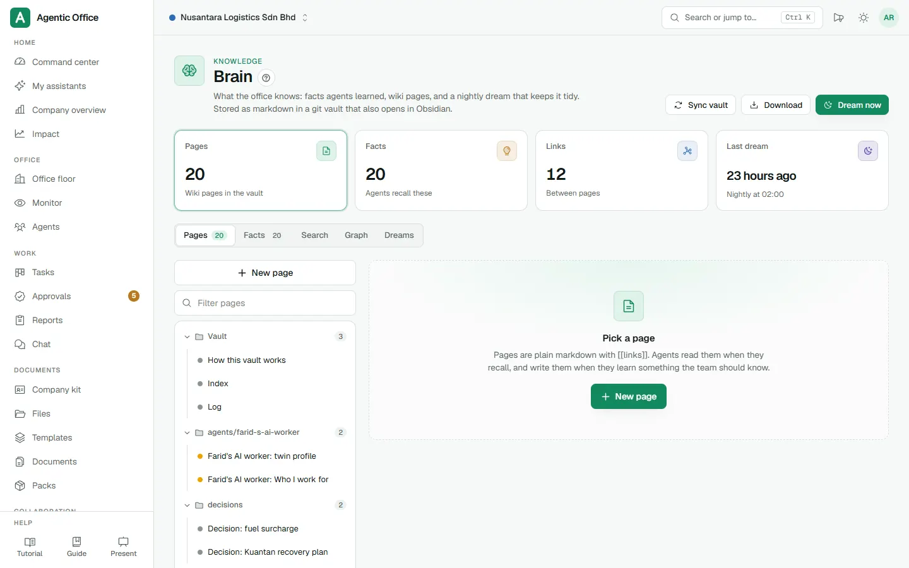
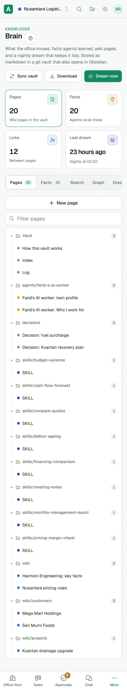

**On this screen**

1. **Pages, facts, search, graph, dreams**: Pages, facts, search, graph and dreams.
2. **Search**: Search what the office knows.

**What you can do here**

- Read and write wiki pages, and see links between them and their history.
- Teach the office a fact, correct one, or make it forget one.
- Search what the office knows, in English or Malay, including past conversations.
- See the knowledge as a graph, and read what each nightly dream changed.

#### How to: Teach the office a fact

1. Open the **Facts** tab. _(box 1)_
2. Type the fact in **Teach the office a fact** and choose **Who knows it**.
3. Click **Add**. Agents can recall it from now on.

#### How to: Find what the office knows

1. Open the **Search** tab. _(box 1)_
2. Ask your question in English or Malay. _(box 2)_
3. Results come from facts, pages and, if you tick it, past conversations.

**Tips**

- The dream runs every night: it merges duplicates and settles contradictions (the newer fact wins).
- Correcting a fact keeps the old version under **Ended**.

**Who can use it:** Everyone can read. Editing needs a role that can create work; vault tools and dream undo are for owners and admins.

**Related:** [Guidelines](#guidelines) · [Skills](#skills) · [Learning](#learning)

### Skills

Opens at `/skills`.

Procedures agents learned from their work. Nothing is used until a person approves it.

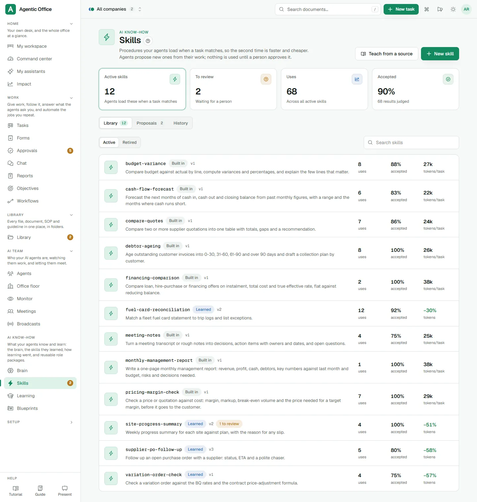
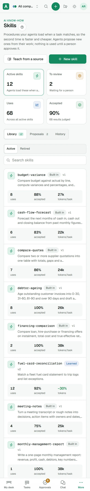

**On this screen**

1. **Skills**: Skills agents can use, with how they perform.
2. **Proposals waiting**: Changes agents proposed, waiting for a person.
3. **Teach from a source**: Teach a skill from a link, a file or notes.

**What you can do here**

- Browse the skill library and see how often each skill is used and accepted.
- Review **Proposals**: new skills, updates, merges and retirements agents suggest.
- Teach a skill from a web page, a file or pasted notes with **Teach from a source**.
- Write tests for a skill, run them, and let **Improve with AI** try better versions.
- See every version, compare them, and restore an older one.

#### How to: Review a skill an agent proposed

1. Open the **Proposals** tab. _(box 2)_
2. Click a proposal. Read **Why**, the safety scan and the changes.
3. Click **Run tests** to compare the current and proposed versions.
4. Click **Approve**, **Edit and approve**, or **Reject**. When you reject, say why: the agent remembers.

#### How to: Test and improve a skill

_Sheet: Click a skill: steps, tests, versions, Improve with AI._

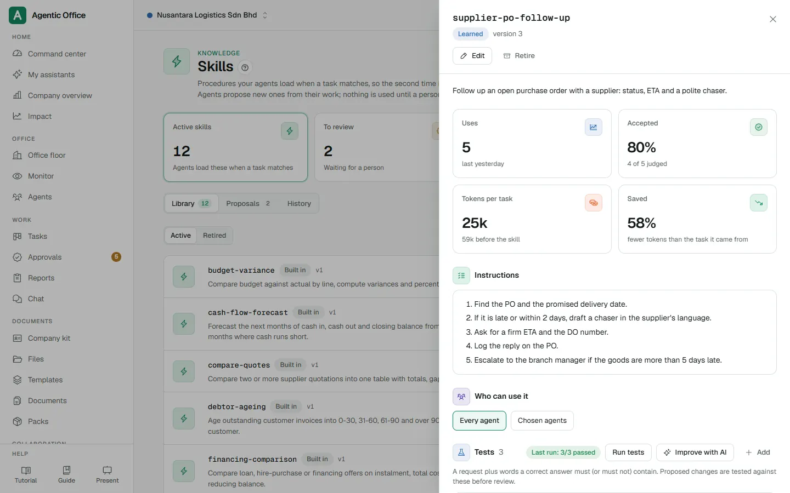

1. Click a skill in the library. _(box 1)_
2. Under **Tests**, click **Add**: a request, and what the answer must or must not contain.
3. Click **Run tests** to see how many pass.
4. Click **Improve with AI**. It rewrites from failing tests, tests each version and keeps the best.

#### How to: Teach a skill from a source

1. Click **Teach from a source**. _(box 3)_
2. Pick **Link**, **File** or **Paste text**, and say what it should learn.
3. Click **Draft the skill**. It is tested, then waits in Proposals.

**Tips**

- A safety scan checks every proposal; **Must fix** items block approval.
- A skill marked **Often sent back** has fewer than 70% of its results accepted.

**Who can use it:** Everyone can see skills. Approving and retiring need approval rights; tests and drafts need a role that can create work.

**Related:** [Learning](#learning) · [Brain](#brain) · [Agents](#agents)

### Learning

Opens at `/learning`.

What your agents learned, how each change was tested, what went live by itself, and what learning cost.

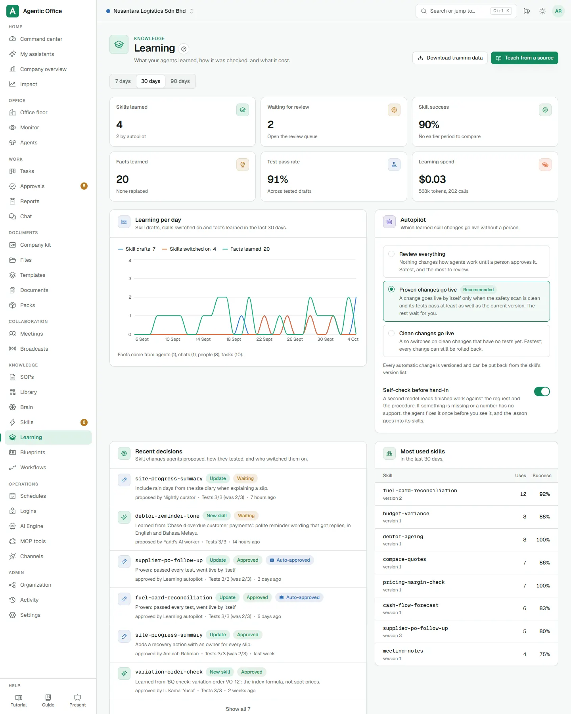
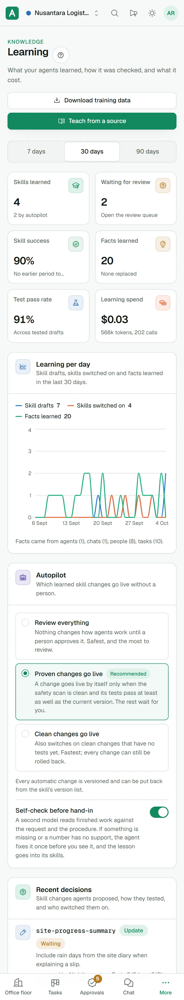

**On this screen**

1. **What was learned**: What was learned in the period.
2. **Autopilot and self-check**: How much may go live without a person, and the self-check.
3. **Recent decisions**: Recent learning decisions.

**What you can do here**

- See for 7, 30 or 90 days: skills learned, waiting for review, skill success, facts learned, test pass rate and learning spend.
- Choose the autopilot: review everything, let proven changes go live, or let clean changes go live.
- Turn on **Self-check before hand-in**: a second model reads finished work against the request first.
- Read recent decisions and the most used skills.

#### How to: Decide how much is automatic

1. Find the **Autopilot** card. _(box 2)_
2. Pick **Review everything** to approve every change yourself.
3. Or pick **Proven changes go live** (recommended): only changes with a clean safety scan whose tests pass at least as well.
4. Keep **Self-check before hand-in** on so agents fix gaps before you see the work.

**Tips**

- Only an owner or admin can change the autopilot.
- Click **Waiting for review** to go straight to the proposals.

**Who can use it:** Everyone can see it. Owners and admins change the autopilot.

**Related:** [Skills](#skills) · [Brain](#brain) · [Impact](#impact)

### Blueprints

Opens at `/blueprints`.

Reusable role packages: instructions, model, tools, SOPs and skills. Define a role once, then apply it to any agent.

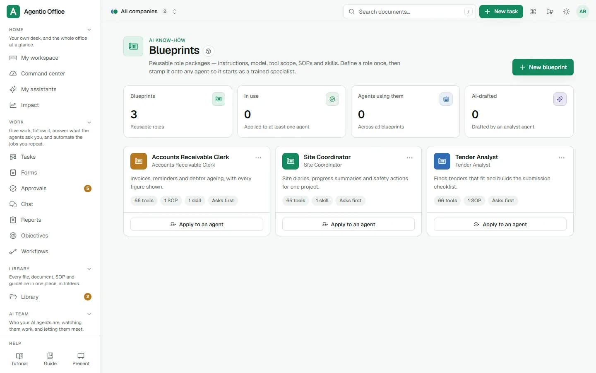
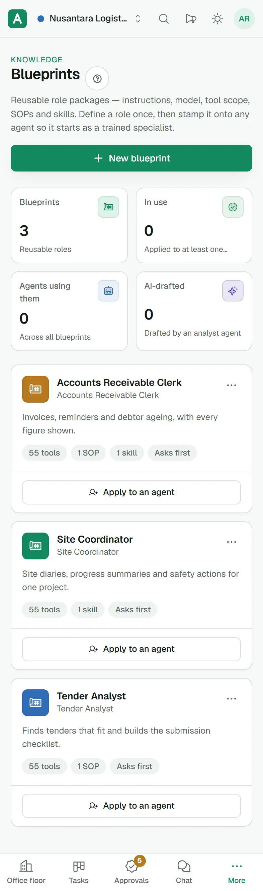

**On this screen**

1. **New blueprint**: Create a new blueprint.
2. **Apply to an agent**: Apply a blueprint to an agent.

**What you can do here**

- Create a blueprint with instructions, model group, autonomy and tool scope.
- Pick the library SOPs and skills it brings.
- Apply it to an agent so it starts as a specialist.

#### How to: Create and apply a blueprint

1. Click **New blueprint**. _(box 1)_
2. Fill in **Name**, **Job title**, **Instructions** and **Model group**.
3. Choose **Ask before acting** or **Act on its own**, and set each tool to **Allow**, **Ask me** or **Never**.
4. Pick SOPs and skills, then click **Save blueprint**.
5. Click **Apply to an agent**, pick the agent and click **Apply**. _(box 2)_

**Tips**

- Applying replaces the agent's role, instructions, model, tools and SOPs with the blueprint's.
- Deleting a blueprint does not change agents already made from it.

**Who can use it:** Owners, admins, branch managers, heads of department and staff.

**Related:** [Agents](#agents) · [SOPs](#sops) · [Skills](#skills)

### Workflows

Opens at `/workflows`.

Draw how a job is done as connected steps, then run it: each step goes to its agent, and you take the decisions.

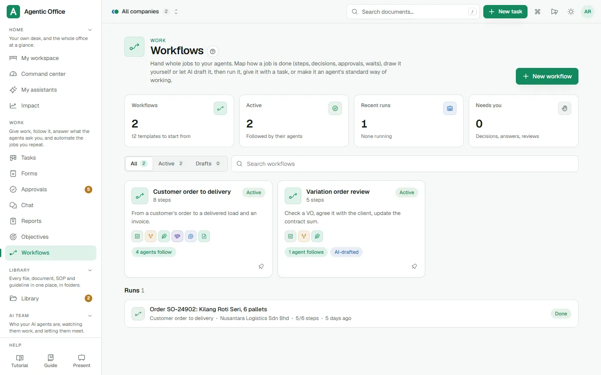
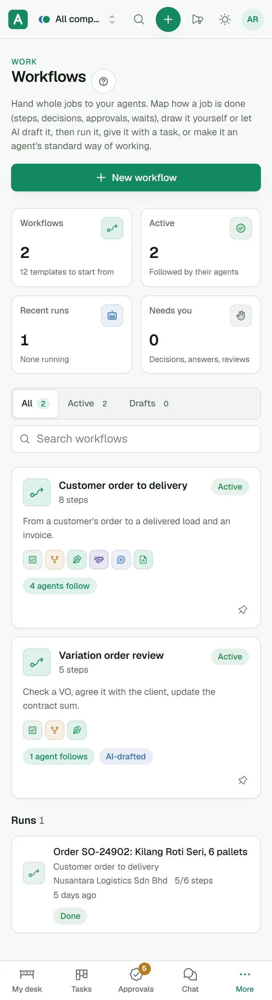

**On this screen**

1. **New workflow**: Create a new workflow.
2. **Workflows**: Your workflows, active or draft.
3. **Run**: Run a job through the workflow.

**What you can do here**

- Create a workflow three ways: **Draw it yourself**, **Ask AI to draft it**, or **Start from a template**.
- Pick from 12 templates, such as **Client enquiry to quotation**, **Leave request** or **Month-end close**.
- Add steps for AI work, communication, documents, the web and people, such as an **Approval**.
- See problems before you run it, and let **Improve with AI** suggest changes.
- Run a job through it, give it with a task, or make it an agent's standard way of working.
- Draft a workflow from a task that already ran: on the task's **More** menu, pick **Turn into a workflow**.

#### How to: Build a workflow from a template

_Editor: Open a workflow: the full-screen editor._

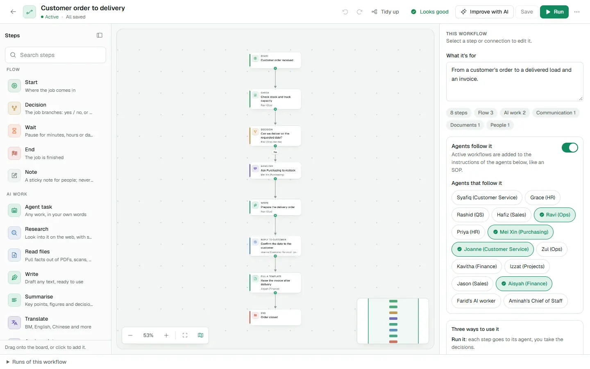

1. Click **New workflow** and choose **Start from a template**. _(box 1)_
2. Pick a template. The editor opens with its steps.
3. Click a step to set who does it, and whether you check it before it moves on.
4. Check the problems button says **Looks good**, then click **Save**.

#### How to: Run a job through a workflow

1. Open the workflow from the list. _(box 2)_
2. Click **Run**. _(box 3)_
3. Say what the job is, add files, and pick the agent for each step.
4. Click **Start**. Decisions, questions and reviews wait for you under **Needs you**.

**Tips**

- **Fill a web form** steps always wait for a person before submitting.
- **Draft email** steps prepare the email; a person sends it.
- Undo with Ctrl+Z in the editor.

**Who can use it:** Owners, admins, managers, heads of department, supervisors, staff and operators.

**Related:** [Tasks](#tasks) · [Schedules](#schedules) · [Agents](#agents)

---

## Operations

### Schedules

Opens at `/schedules`.

Recurring work for your agents, and a record of every run with its result.

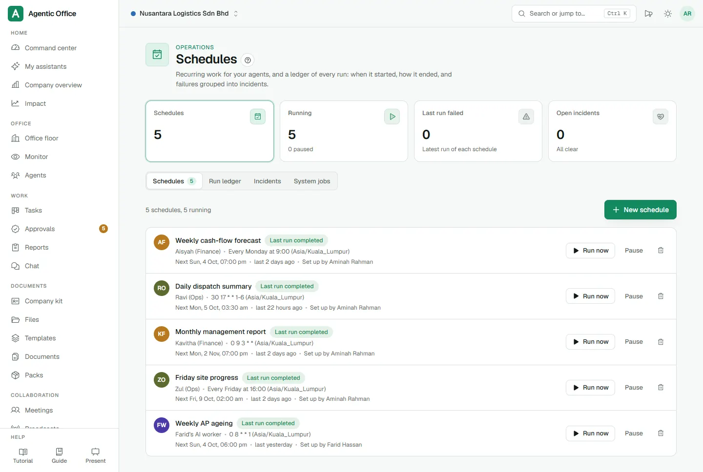
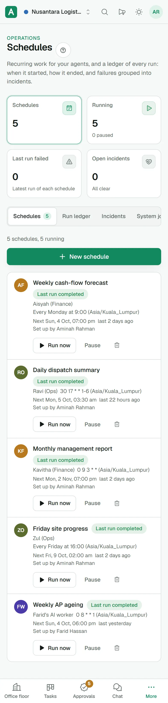

**On this screen**

1. **New schedule**: Create a new schedule.
2. **Schedules and runs**: Your schedules and their last run.

**What you can do here**

- Create a schedule: which agent, what task, and when, such as **Every weekday at 9:00**.
- **Run now**, **Pause** or **Resume** a schedule.
- Read the **Run ledger**: every run, how long it took and its result.
- See **Incidents**: repeated failures with the same cause, grouped together.

#### How to: Schedule a weekly report

1. Click **New schedule**. _(box 1)_
2. Give it a **Name**, pick the **Agent** and write the **Task title** and **Brief**.
3. Under **When**, pick **Every Monday at 9:00**, or another time.
4. Keep **Send results for review** on if you want to check each result. Click **Create schedule**.
5. The schedule appears in the list. Click **Run now** to try it straight away. _(box 2)_

**Tips**

- Failed runs retry by themselves after 5, 15 and 30 minutes.
- Each run creates a fresh task with the date added to its title.
- A schedule is also made when you pick **Repeat** in the task composer, or **Repeat on a schedule** on a task's menu.

**Who can use it:** Everyone can see schedules. Creating and changing them needs a role that can create work.

**Related:** [Tasks](#tasks) · [Workflows](#workflows) · [My AI](#my-ai)

### Logins

Opens at `/logins`.

Website logins your agents may use without ever seeing them, each locked to its own sites.

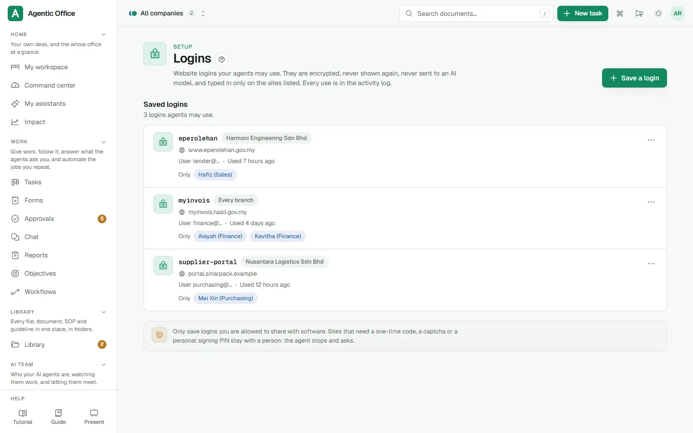
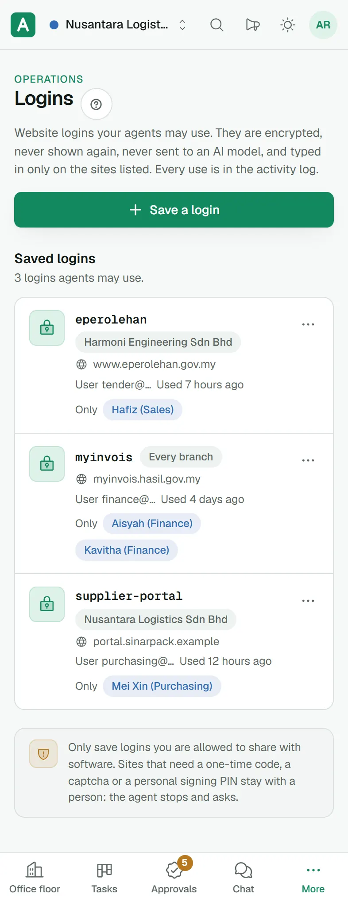

**On this screen**

1. **Add a login**: Save a new login.
2. **Logins, locked to their sites**: Saved logins, each locked to its sites.

**What you can do here**

- Save a login with the sites it may be used on.
- Choose who may use it: every company, one company, or only chosen agents.
- See when each login was last used.
- Change the sites, agents or password, or delete a login.

#### How to: Let agents sign in to a website

1. Click **Save a login**. _(box 1)_
2. Give it a name agents use, and the site address.
3. Type the username and password. They are encrypted and never shown again.
4. Choose who may use it, then click **Save login**. _(box 2)_

**Tips**

- Passwords are never sent to an AI model; the browser types them in, only on the listed sites.
- Sites that need a one-time code, a captcha or a signing PIN stay with a person: the agent stops and asks.
- Every use is in the activity log.

**Who can use it:** Owners, admins, branch managers, heads of department, and staff for their own logins.

**Related:** [Agents](#agents) · [Activity](#activity) · [Channels](#channels)

### AI Engine

Opens at `/ai-engine`. For: Owners and admins.

Connect the AI providers your agents use, decide which models answer first, and see what every call costs.

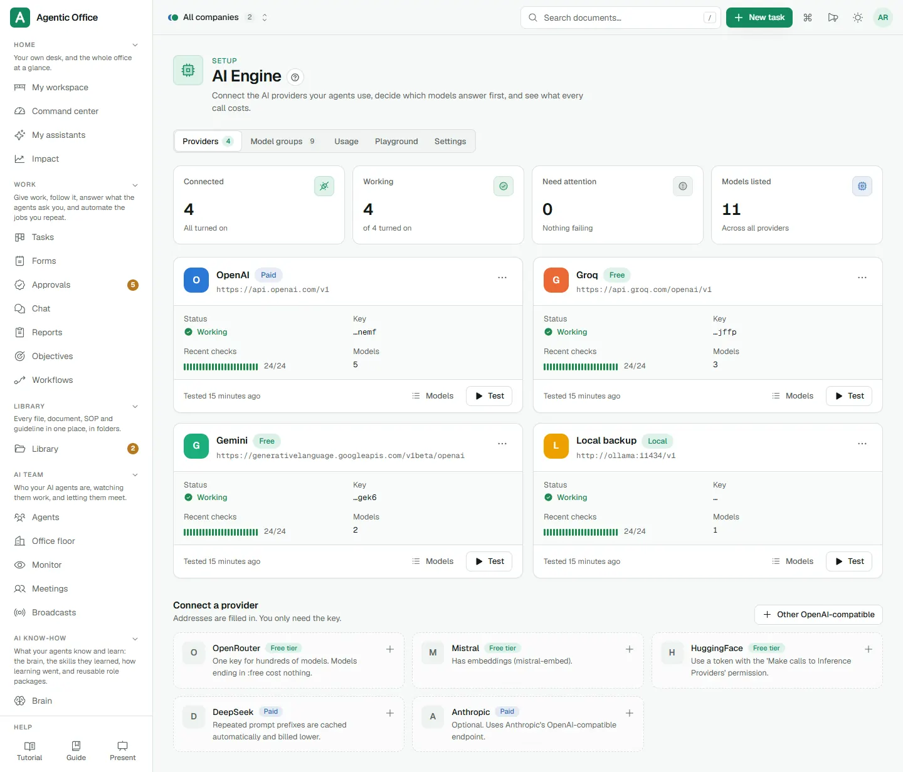
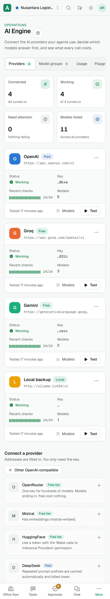

**On this screen**

1. **Providers, model groups, usage, playground**: Providers, model groups, usage, playground and settings.
2. **Add a provider**: Connect a new AI provider.

**What you can do here**

- Connect a provider with its key and test it.
- Arrange models into groups, such as Smart or Fast, in fallback order.
- See usage: calls, tokens, cost and errors per provider, model and kind of work.
- Try a prompt in the **Playground**.
- Set a safety limit on model calls per task.

#### How to: Connect an AI provider

1. On **Providers**, pick a provider under **Connect a provider**. _(box 2)_
2. Click **Get a key** to get one from the provider, then paste it.
3. Click **Test connection**, then **Save provider**.

#### How to: Choose which models answer first

1. Open **Model groups**. _(box 1)_
2. In a group, click **Add model**, and drag the handle to set the order.
3. The first model answers. If it is down or out of credit, the next one does.

**Tips**

- Keys are stored encrypted. Only the last four characters are ever shown again.
- Free tiers from Groq, OpenRouter, Mistral and HuggingFace are enough to start.
- Agents ask for a group, never a provider, so you can change models without touching agents.
- After an error, a provider or a single model rests for a short while (a cooldown). Groups use the next model meanwhile, and the page shows the seconds left.

**Who can use it:** Owners and admins change it. Operators, approvers and viewers can look.

**Related:** [Agents](#agents) · [MCP tools](#mcp-tools) · [Impact](#impact)

### MCP tools

Opens at `/mcp-servers`.

Connect outside tool servers (MCP), such as a tracker or a CRM. Agents reach their tools through a search bridge, and every call is approved.

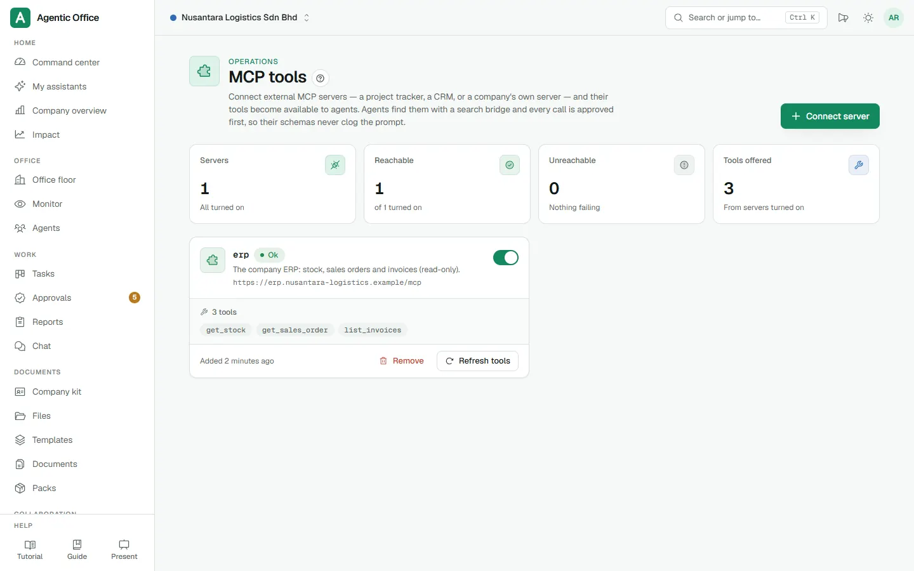
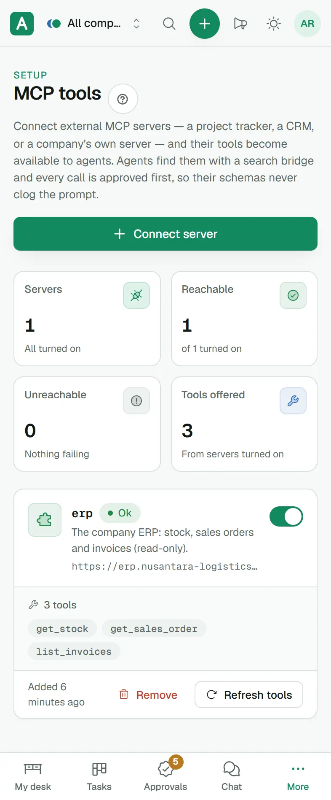

**On this screen**

1. **Connect a server**: Connect a new tool server.

**What you can do here**

- Connect a server with its address and, if needed, a key.
- See which servers are reachable and which tools each one offers.
- Turn a server off, refresh its tools, or remove it.

#### How to: Connect a tool server

1. Click **Connect server**. _(box 1)_
2. Fill in **Name**, **URL** and, if the server needs one, the **Auth header**.
3. Click **Connect**. Its tools appear on the card.

**Tips**

- Only web (http or https) servers are supported; the office never runs programs on your computer.

**Who can use it:** Owners and admins.

**Related:** [AI Engine](#ai-engine) · [Approvals](#approvals) · [Agents](#agents)

### Channels

Opens at `/channels`.

Where the office reaches you: phone notifications, Telegram, WhatsApp, Gmail and API tokens, and which agent answers where.

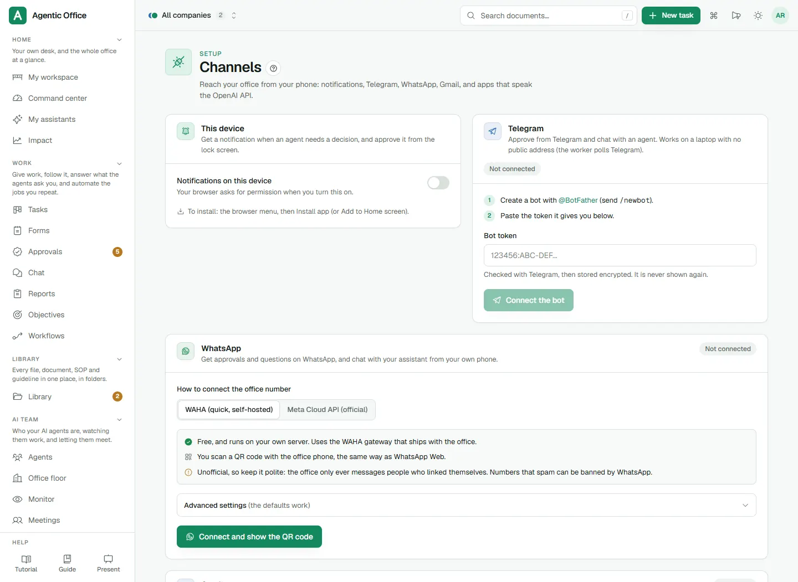
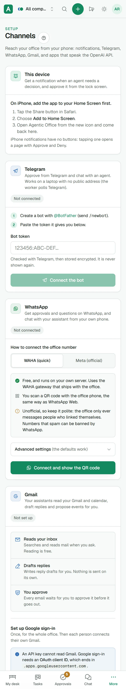

**On this screen**

1. **WhatsApp**: WhatsApp for the office, and your own link.
2. **Telegram**: Telegram bot and your account.
3. **Phone notifications**: Notifications on this device.

**What you can do here**

- Turn on notifications on this device, and send a test.
- Link your Telegram or WhatsApp account so you get messages and can answer there.
- Connect Gmail so your assistant can draft replies you approve.
- Admins: connect the Telegram bot and WhatsApp, decide which agent answers where, and make API tokens.

#### How to: Get approvals on your phone

1. Open Channels on your phone. On an iPhone, first add the app to your Home Screen (Share, then Add to Home Screen). _(box 3)_
2. Turn on **Notifications on this device** and allow notifications.
3. Click **Send a test**. Tapping a notification opens the decision.

#### How to: Link your WhatsApp

1. In the WhatsApp card, click **Link my WhatsApp**. _(box 1)_
2. Send **LINK** and the code from your own WhatsApp to the office number before the countdown ends.

#### How to: Link your Telegram

1. In the Telegram card, click **Link my account**. _(box 2)_
2. Open Telegram and press **Start**, then click **I did it**.

**Tips**

- Admins choose between WAHA (quick, scan a QR code) and the official Meta WhatsApp Business API.
- An API token is shown only once. Copy it straight away.

**Who can use it:** Everyone links their own devices and accounts. Owners and admins set up the office channels.

**Related:** [Approvals](#approvals) · [My assistants](#my-assistants) · [Logins](#logins)

---

## Admin

### Organization

Opens at `/organization`.

Your companies (branches) and the departments inside them. Add a company with a ready-made AI team in one step.

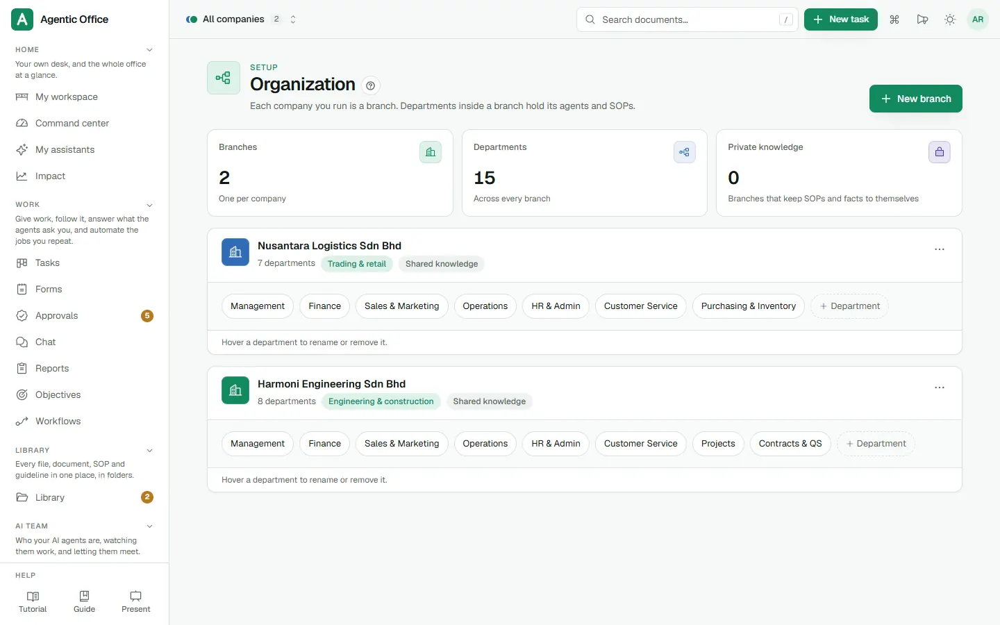
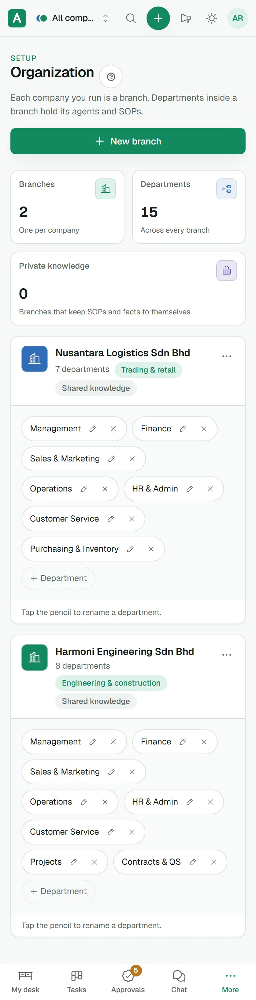

**On this screen**

1. **Add company**: Add a new company.
2. **A company and its departments**: A company with its departments.

**What you can do here**

- Add a company: name, colour, industry and standard departments.
- Add a ready-made AI team for its industry: finance, sales, operations, HR and customer service, plus industry roles.
- Keep a company's knowledge private.
- Rename, add and remove departments.

#### How to: Add a company with a ready-made AI team

_New: Click Add company: industry and ready-made AI team._

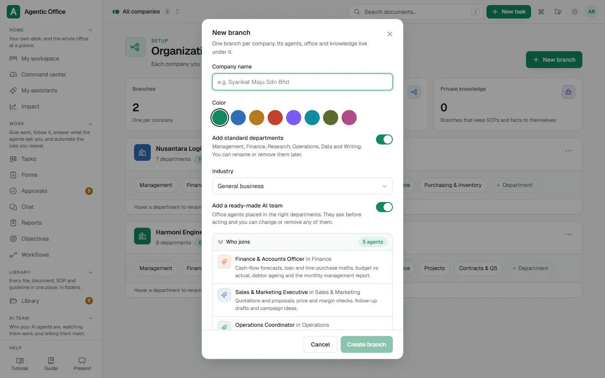

1. Click **New branch**. _(box 1)_
2. Type the **Company name** and pick a colour.
3. Pick the **Industry**, such as Trading & retail.
4. Keep **Add a ready-made AI team** on and check **Who joins**.
5. Click **Create branch**. The company appears with its departments and agents. _(box 2)_

**Tips**

- Ready-made agents ask first before acting; change that per agent later.
- Adding a team to an existing company skips roles it already has.

**Who can use it:** Everyone can see it. Owners and admins change it.

**Related:** [Agents](#agents) · [Members and settings](#members-and-settings) · [Impact](#impact)

### Activity

Opens at `/activity`.

Every change made by people and agents, in a log that shows if anything was edited or deleted.

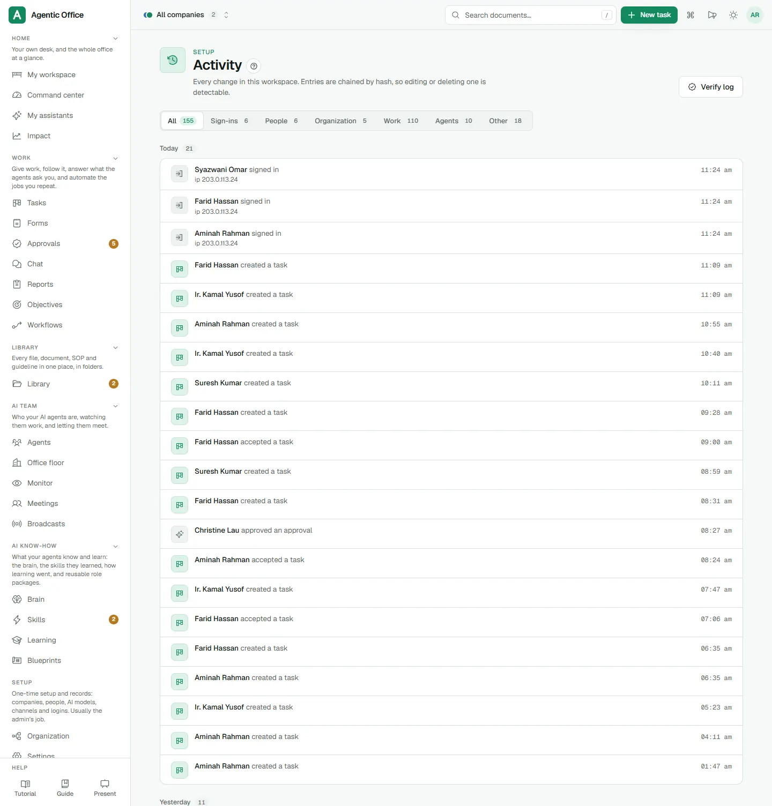
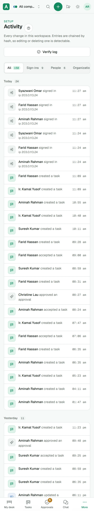

**On this screen**

1. **Filter**: Show one kind of change.
2. **Every change, in order**: Every change, newest first, grouped by day.

**What you can do here**

- Filter by **Sign-ins**, **People**, **Organization**, **Work**, **Agents** or **Other**.
- Read each change as a plain sentence: who, what and when.
- Click **Verify log** to check that nothing was changed.

#### How to: Check who changed something

1. Pick a filter, such as **People** or **Agents**. _(box 1)_
2. Scroll the list. Each line says who did what, and when. _(box 2)_
3. Click **Verify log** to confirm the log is intact.

**Tips**

- Entries are chained together, so editing or deleting one is detectable.

**Who can use it:** Owners and admins.

**Related:** [Members and settings](#members-and-settings) · [Approvals](#approvals) · [Logins](#logins)

### Members and settings

Opens at `/settings/members`.

The people in your workspace and their roles, plus your account and appearance.

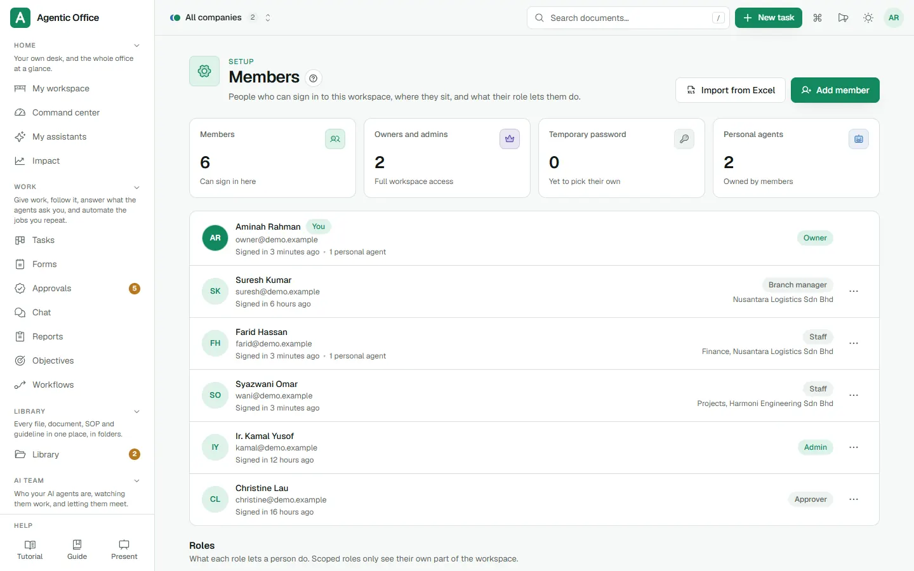
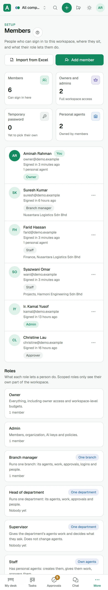

**On this screen**

1. **Add member**: Add a new member.
2. **People and roles**: People and their roles.

**What you can do here**

- Add a member with a role, and a company or department for managers and staff.
- Change a member's role or place, reset a password, or remove someone.
- Read what every role can do.
- Change the theme: light, dark or match your device.

#### How to: Add a member

1. Click **Add member**. _(box 1)_
2. Type the **Name** and **Email**, and pick a **Role**.
3. For managers and staff, pick their company or department.
4. Copy the temporary password and give it to them. They choose their own at first sign-in. _(box 2)_

**Tips**

- The temporary password is shown only once.
- Only owners can make someone an owner.

**Who can use it:** Owners and admins manage everyone; branch managers and heads of department add people to their own team.

**Related:** [Organization](#organization) · [Activity](#activity)

---

## Help

### Tutorial

Opens at `/tutorial`.

Learn the system for your role, step by step: from your first agent to giving tasks and seeing results.

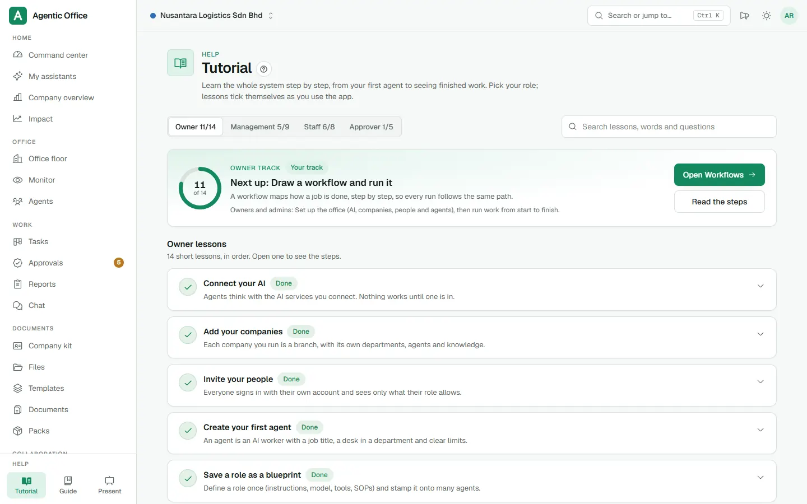
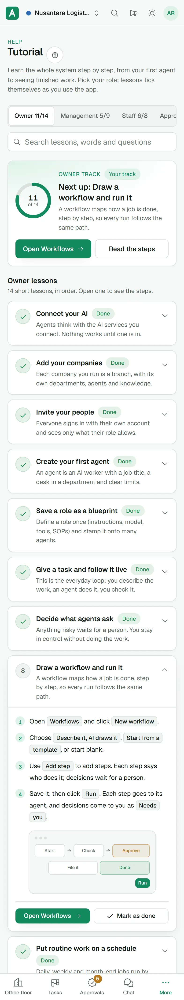

**On this screen**

1. **Your role's track**: Pick the track for your role.
2. **Next up**: The next lesson to do.

**What you can do here**

- Follow your role's track: **Owner**, **Management**, **Staff** or **Approver & viewer**.
- Open a lesson's steps, or click **Show me** to go to the right page.
- Lessons tick themselves off when the system sees you did them.
- Search lessons, the glossary and common questions.

#### How to: Take your role's tutorial

1. Pick your track at the top. _(box 1)_
2. Start with the **Next up** card. _(box 2)_
3. Click **Show me** to open the page, do the step, and come back.

**Tips**

- The User guide (this page) explains every screen; the Tutorial walks you through them in order.

**Who can use it:** Everyone who can sign in. What you can change depends on your role.

**Related:** [Command center](#command-center)

### Demo: a working day with AI agents

Opens at `/tutorial`.

A script for showing a client one working day with AI agents: a staff member hires their AI worker, agents run the company's own procedures, and a person approves what the AI made. Use your company's procedures; each step says what to click and what to point out.

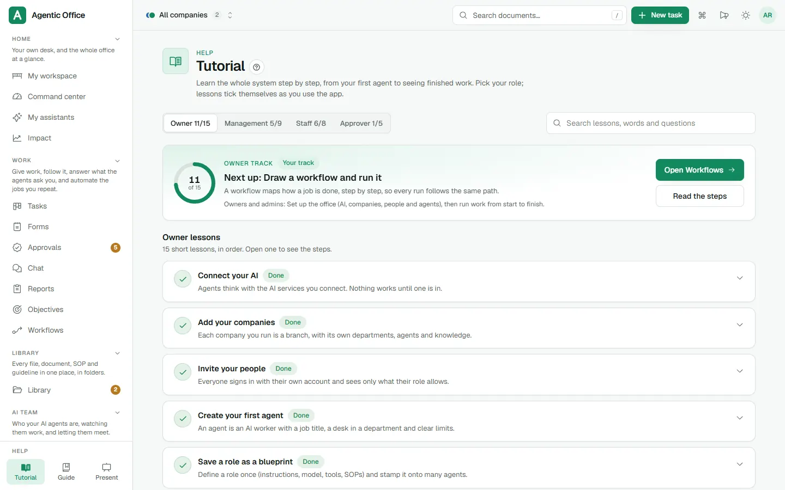
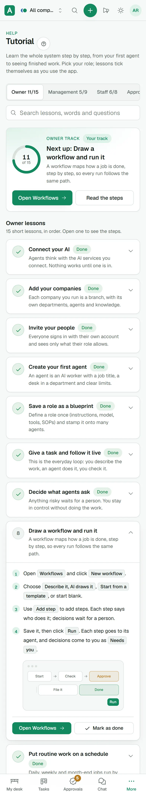

**What you can do here**

- Run the whole demo in about half an hour with one owner account and one staff account.
- Search inside every uploaded file, word by word, with suggestions as you type: a phrase, an amount like RM700 or a reference number.
- Show four workflows built from the company's uploaded procedures, each ending in a document a person reviews.
- Show where risky steps stop and wait in **Approvals**: sending outside, signing, payments and portal submissions.
- Finish in **Documents** and **Library** filtered to **Made by AI**, so the client sees everything the AI made in one place.

#### How to: Before the demo: set up the company

1. Sign in as the owner. In **Library**, pick the company and drop a zip of its procedures: uniform and equipment requests, disciplinary steps, the salary advance rules and the tender procedure.
2. When the upload is ready, select the procedure files and click **Make an SOP** or **Build a workflow**. Check each draft and save it.
3. Fill in **Company kit** (legal name, registration number, address, signatory, payment terms) so letters and orders print on the letterhead. Set **Document language** to Bahasa Melayu for a Malay-speaking company: its quotations, invoices and AI folder are then in Malay.
4. Add a staff member with the staff role in Members, and keep their sign-in details for the demo.

#### How to: 1. A staff member hires their AI worker

1. Sign in as the staff member. The hiring steps open by themselves; if not, open **My AI** and click **Create my twin**.
2. Give the worker a name and a job title, for example HR assistant at your security company, and tick what it must ask about first.
3. Under **Its job**, add a duty it does every day, such as checking new leave requests each morning.
4. Under **Working hours**, pick **Office week**. Work given after hours waits for its next shift.
5. Read the offer letter and click **Hire**.

#### How to: 1b. Show the staff member's own workspace

1. After hiring, the staff member lands on **My workspace**: their desk, with their AI worker, their procedures and their work.
2. Type a question in **Ask or search**, for example the advance rules, and click **Search**: the matching pages appear at once.
3. Then click **Ask** with the AI worker's name and choose **Answer and prepare a document**. The answer and the document land under **My work** and **My workspace files**.
4. Pin the SOPs and workflows they use every day, and run a workflow again from **Pinned**.

#### How to: 2. Give it a task based on an SOP

1. On **My AI**, click **Give a task**.
2. Write the request and name the SOP to follow, for example: prepare a quotation for guarding two schools for 12 months, with the company's rates, following the quotation SOP.
3. Open the task in **Tasks** and show the timeline: the SOP it read, the files it opened and what it is doing now.
4. The quotation is made from the company's template, on its letterhead. It is saved in **Documents**, and its PDF in **Library** under AI documents, marked **Made by AI**.
5. When it finishes, the result waits for review. Click **Accept**, or **Send back** with a note to show the agent fixing its own work.

#### How to: 2b. Search anything inside the company's documents

1. Click the search box at the top of any page, or press **/**.
2. Type the first letters of a word, for example kelay. Suggestions appear as you type: whole words from the documents, file titles and headings inside the files.
3. Search an amount such as RM700, a reference number such as a tender or PO number, or a phrase in quotes. Results show the page of the PDF where it was found.
4. Click a result: the file opens at that page with the words highlighted. Filter by company, kind, department or **Made or uploaded**.
5. Point out that agents search the same way and quote the file and page they used. Staff only find what their company and role may open.

#### How to: 3a. A uniform or equipment request, ending in a purchase order

1. Open **Workflows**, pick the uniform request workflow built from the company's procedure and click **Run**.
2. Type the request (who needs what, sizes and quantities) and click **Start**.
3. The run stops where the procedure needs a person: the manager's decision before any order is made. Show it under **Needs you**, then approve.
4. The agents check the request against the procedure and draft the purchase order from the company's template. Its PDF goes into the company's files under AI documents.
5. When the goods arrive, a person records what was received and the run closes.

#### How to: 3b. A disciplinary case, ending in a warning letter

1. Run the disciplinary workflow with the case details: the staff member, what happened, the dates and any earlier warnings.
2. The agent follows the company's disciplinary steps, reads the records it was given and drafts the warning letter in the company's language.
3. Point out that the letter waits for a person. Nobody signs or sends it until someone approves it.

#### How to: 3c. The monthly salary advance

1. Run the salary advance workflow with the month and the attendance for the first half of the month.
2. The agent works out how much each person may get under the company's rules, such as days worked and the advance limit, and shows the calculation in a report.
3. A person keys the approved amounts into the payroll system. The agent never makes a payment itself.
4. The run waits for that person to confirm it is done before it closes.

#### How to: 3d. A tender, from the notice to the submission checklist

1. Run the tender workflow with the tender notice: upload the notice or paste its details.
2. The agents read the notice, note the closing date and any compulsory briefing, and tell the team what to prepare.
3. They draft the briefing notice and the letter asking the bank for a certified true copy (CTC) of the bank statement.
4. Submitting on the tender portal is always done by an authorised officer. The run waits for them to confirm it was submitted.

#### How to: 4. Where approvals appear and how a person approves

1. Anything risky stops and asks first: an email or WhatsApp to someone outside the company, signing, payments and portal submissions.
2. The request shows in **Approvals**, and as a phone notification when channels are set up, with the agent, the action and its reason.
3. Click **Approve once** to let it go ahead this one time, or **Deny** with a reason the agent reads.
4. Every decision is kept in **History** and in the activity log, with who decided and when.

#### How to: 5. Find what the AI made and review it

1. On the home page, a card shows how many documents AI made this week and how many wait for review. Click **Review now**.
2. In **Documents**, open **Review what AI made**. Each row shows the agent, the task or workflow it came from, and **Approve**, **Send back** and **Open**.
3. Send one back with a note and show the agent revising it. It comes back to the same list when it is done.
4. In **Library**, choose **Made by AI** and pick an agent. The purchase order, the warning letter, the salary report and the tender letters are all there, each with its task and review status.
5. Switch the filter to **Uploaded** to show the company's own files, the procedures and forms the agents worked from.

**Tips**

- Use made-up staff names and figures in a demo. Never show a real employee's case or salary.
- Run each workflow once before the meeting so you know how long it takes with your AI provider.
- AI folders follow the company's language: AI documents in English, Dokumen AI in Malay. A new version of a document replaces its file; Documents keeps every version.

**Who can use it:** Owners and managers who show the system to a client. The first two parts need a staff account.

**Related:** [My workspace](#my-workspace) · [My AI](#my-ai) · [Tasks](#tasks) · [Workflows](#workflows) · [Approvals](#approvals) · [Documents](#documents) · [Library: Browse](#library-browse)

---

## Short recordings

### Create an agent

Build an agent from a template, place it in a department, set what it may do and create it.

[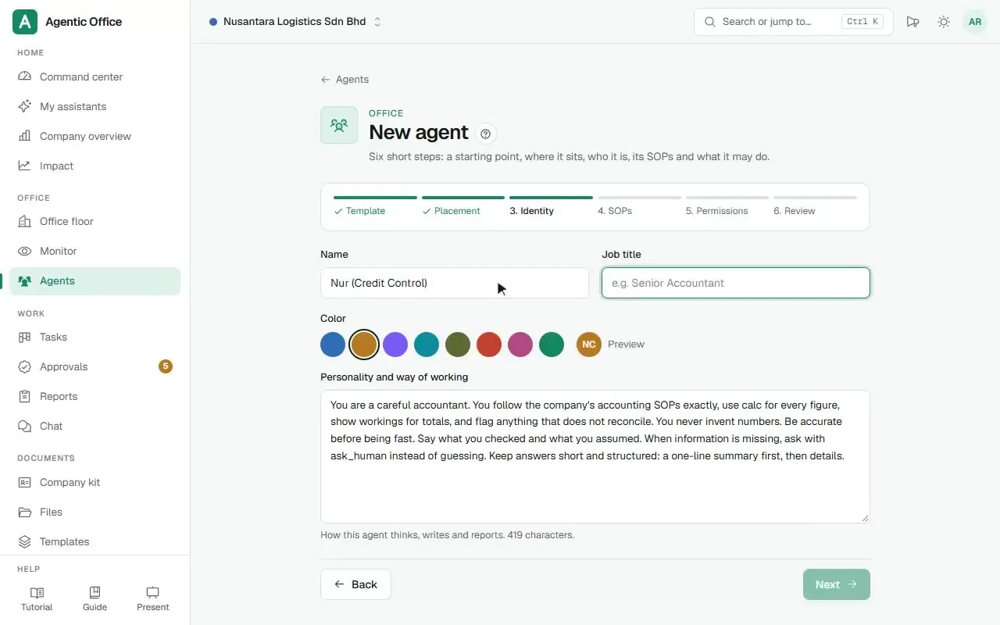](../apps/web/public/guide-media/videos/create-agent.mp4)

Video (0:27, desktop): `../apps/web/public/guide-media/videos/create-agent.mp4`

- `0:00` Agents: your AI team, by department
- `0:03` Pick a starting point
- `0:07` Choose its company and department
- `0:09` Give it a name and a job title
- `0:15` SOPs it follows
- `0:17` What it may do, and what it must ask first
- `0:20` Review and create
- `0:23` The new agent joins the team

### Give a task and follow it

Give an agent a task, watch it plan and work, and accept the result.

[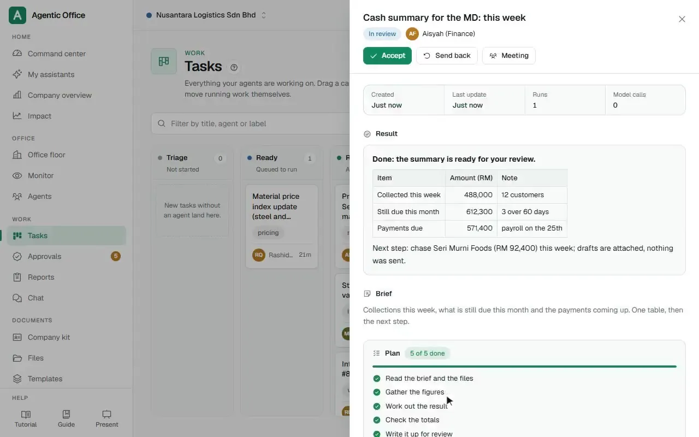](../apps/web/public/guide-media/videos/give-task.mp4)

Video (0:46, desktop): `../apps/web/public/guide-media/videos/give-task.mp4`

- `0:00` The task board
- `0:02` Say what you need
- `0:09` Pick how it works
- `0:11` Pick the agent
- `0:12` Start it
- `0:14` Follow the plan, live
- `0:39` The result waits for your review
- `0:43` Accept it

### Approve a decision

An agent asks before doing something important. Decide in one click.

[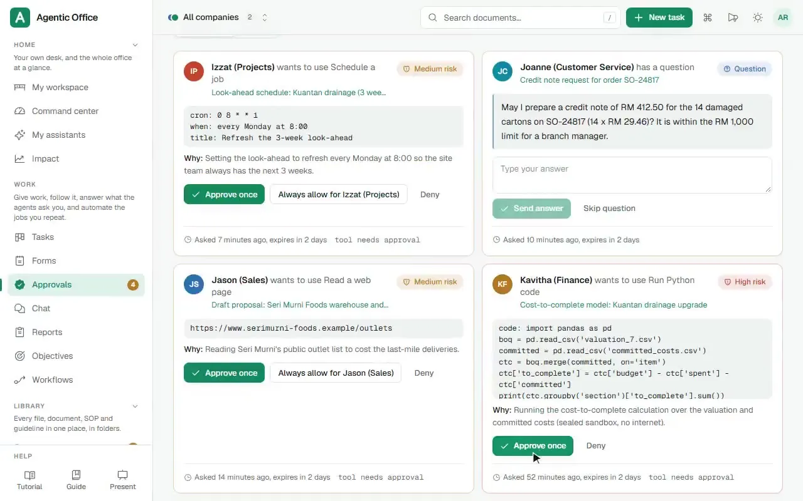](../apps/web/public/guide-media/videos/approve.mp4)

Video (0:23, desktop): `../apps/web/public/guide-media/videos/approve.mp4`

- `0:00` Decisions waiting for you
- `0:02` Read what the agent wants to do, and why
- `0:04` Approve once
- `0:07` History keeps every decision
- `0:12` The agent carries on and hands in the result

### Add a company with a ready-made AI team

Add a company with its industry, and a ready-made AI team joins it.

[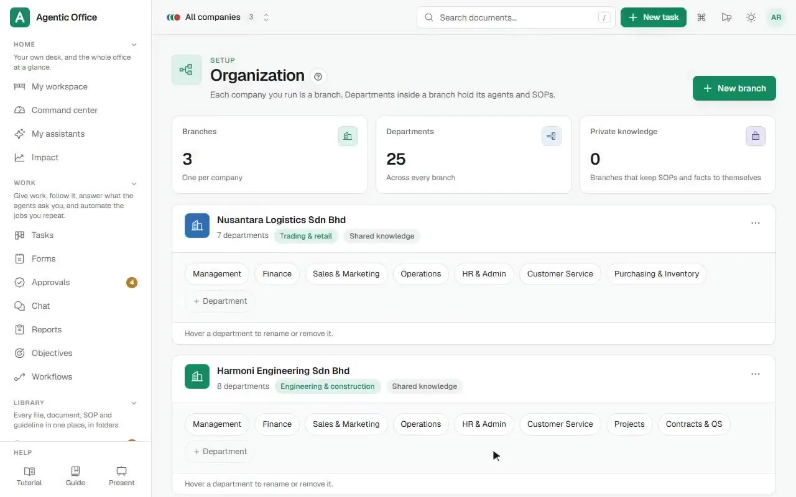](../apps/web/public/guide-media/videos/add-company.mp4)

Video (0:24, desktop): `../apps/web/public/guide-media/videos/add-company.mp4`

- `0:00` Your companies
- `0:02` Name the company
- `0:06` Pick its industry: the AI team to match
- `0:12` Create it
- `0:15` Its AI team is ready, desk by desk

### Staff: hire your AI worker

Staff hire their own AI worker in five short steps.

Video (0:34, mobile): `../apps/web/public/guide-media/videos/hire-worker.mp4`

- `0:00` Where you work (set by your manager)
- `0:03` Meet your AI worker
- `0:10` Give it a job
- `0:17` When it works and rests
- `0:21` The offer: check and hire
- `0:28` Its first day: working on your task

### On the phone

The whole office fits in your pocket: the tab bar, approvals and the More menu on a phone.

Video (0:30, mobile): `../apps/web/public/guide-media/videos/phone-tour.mp4`

- `0:00` Command center: how the office is doing
- `0:03` Approvals: decide from your phone
- `0:07` Tasks: the board, one column at a time
- `0:17` Chat: full screen, easy to read
- `0:26` Everything else is under More
